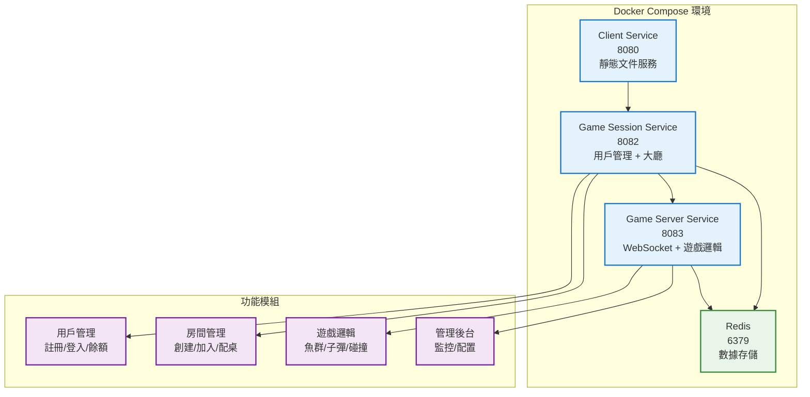
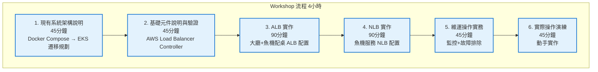
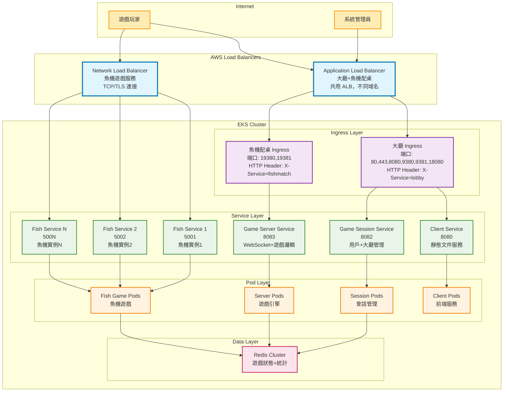

# EKS ALB/NLB Workshop 設計文檔

## 概述

EKS ALB/NLB Workshop 是一個 4 小時的實作課程，基於現有的魚遊戲微服務系統，教授學員如何將 Docker Compose 環境遷移到 Amazon EKS，並配置原生的 Application Load Balancer (ALB) 和 Network Load Balancer (NLB)。

### 現有系統架構

**魚遊戲微服務系統包含三個核心服務：**

1. **Client Service (端口 8080)**
   - 提供遊戲前端靜態文件服務
   - 支援配置注入 (API_BASE, GAME_SERVER)
   - 健康檢查端點

2. **Game Session Service (端口 8082)**
   - 用戶管理：註冊、登入、餘額管理
   - 大廳管理：房間創建、加入、離開
   - 配桌系統：智能房間推薦
   - Web 管理後台：用戶和房間管理

3. **Game Server Service (端口 8083)**
   - WebSocket 即時遊戲通訊
   - 遊戲邏輯：魚群生成、子彈發射、碰撞檢測
   - 即時統計和配置管理
   - Web 管理後台：遊戲監控和參數調整

4. **Redis (端口 6379)**
   - 遊戲狀態存儲
   - 統計數據緩存
   - 配置管理

## 架構

### 現有 Docker Compose 架構



### Workshop 學習路徑



### 目標 EKS 架構 - ALB/NLB 配置



## 組件和介面

### Workshop 模組設計

#### 模組 1: 現有系統架構說明 (45分鐘)

**學習目標**：
- 理解現有魚遊戲微服務系統的完整功能
- 掌握從 Docker Compose 到 EKS 的遷移策略
- 了解 ALB 和 NLB 在魚遊戲系統中的具體應用場景

**1.1 ALB 架構**

**大廳(Lobby)和魚機配桌(Fishmatch)共用的 ALB：**
- 使用同一個 ALB 但綁定不同 domain
- 透過 http header 區分流量
- 使用 AWS Load Balancer Controller 管理

**監聽端口配置：**

大廳：
- 80 (HTTP)
- 443 (HTTPS)
- 8080
- 9380, 9381
- 18080

魚機配桌：
- 19380
- 19381

**1.2 NLB 架構**

**魚機服務的 NLB 設計：**
- 每個魚機對應一個 port (從 5001 開始)
- 共用同一個 NLB
- 使用 TCP/TLS 連接

**現有服務功能分析**：
```yaml
# 現有 Docker Compose 服務對應到 EKS 的規劃
Services_Mapping:
  client-service:8080:
    target: ALB
    function: "靜態文件服務，遊戲前端"
    
  game-session-service:8082:
    target: ALB
    function: "用戶管理、大廳管理、配桌系統、管理後台"
    apis:
      - "/api/v1/users/*"      # 用戶註冊登入
      - "/api/v1/wallet/*"     # 餘額管理
      - "/api/v1/lobby/*"      # 房間管理
      - "/api/v1/matching/*"   # 配桌系統
      - "/admin"               # 管理後台
      
  game-server-service:8083:
    target: NLB
    function: "WebSocket 遊戲通訊、遊戲邏輯、即時統計"
    features:
      - "WebSocket 即時通訊"
      - "魚群生成和移動"
      - "子彈發射和碰撞檢測"
      - "即時統計收集"
      - "遊戲配置管理"
      - "管理後台監控"
```

#### 模組 2: 基礎元件說明與驗證 (45分鐘)

**學習目標**：
- 驗證 EKS 集群中 ALB/NLB 部署的必要元件
- 檢查 AWS Load Balancer Controller 和 External DNS 狀態
- 確認權限配置和現有資源狀態

**2.1 確認必要元件**

```bash
# 檢查 AWS Load Balancer Controller
kubectl get deployment -n kube-system aws-load-balancer-controller -o wide

# 檢查 external-dns
kubectl get deployment -n kube-system external-dns -o wide

# 檢視現有 ingress
kubectl get ingress -n test

# 檢視現有 service
kubectl get service -n test
```

**2.2 權限確認**

```bash
# 確認 service account
kubectl get serviceaccount -n kube-system aws-load-balancer-controller

# 檢查 RBAC 配置
kubectl get clusterrole aws-load-balancer-controller
kubectl get clusterrolebinding aws-load-balancer-controller
```

**驗證檢查清單**：
- [ ] AWS Load Balancer Controller 運行正常
- [ ] External DNS 服務狀態健康
- [ ] ServiceAccount 權限配置正確
- [ ] RBAC 角色綁定完整
- [ ] IAM 權限 (如使用 IRSA) 設置正確
- [ ] 子網標籤配置完整
- [ ] 安全組規則允許流量

#### 模組 3: ALB 實作 (90分鐘)

**學習目標**：
- 實作大廳(Lobby)服務的 ALB Ingress 配置
- 配置多端口監聽和 HTTP Header 路由
- 實現 Canary 部署和流量分割

**3.1 基本 ALB Ingress 配置**

```yaml
# 大廳 Ingress 配置
apiVersion: networking.k8s.io/v1
kind: Ingress
metadata:
  name: lobby-ingress
  annotations:
    kubernetes.io/ingress.class: alb
    alb.ingress.kubernetes.io/scheme: internet-facing
    alb.ingress.kubernetes.io/target-type: ip
    alb.ingress.kubernetes.io/listen-ports: '[{"HTTP": 80}, {"HTTPS": 443}, {"HTTP": 8080}, {"HTTP": 9380}, {"HTTP": 9381}, {"HTTP": 18080}]'
    alb.ingress.kubernetes.io/conditions.lobby-rule: >-
      [{"field":"http-header","httpHeaderConfig":{"httpHeaderName": "X-Service","values":["lobby"]}}]
spec:
  rules:
  - host: lobby.example.com
    http:
      paths:
      - path: /
        pathType: Prefix
        backend:
          service:
            name: lobby-service
            port:
              number: 80
```

**3.2 Canary 部署配置**

```yaml
# Canary Deployment
apiVersion: apps/v1
kind: Deployment
metadata:
  name: lobby-canary
spec:
  replicas: 1
  selector:
    matchLabels:
      app: lobby
      version: canary
  template:
    metadata:
      labels:
        app: lobby
        version: canary
    spec:
      containers:
      - name: lobby
        image: lobby:canary
---
# Canary Service
apiVersion: v1
kind: Service
metadata:
  name: lobby-canary
spec:
  selector:
    app: lobby
    version: canary
  ports:
  - port: 80
    targetPort: 8080
```

**3.3 ALB 流量切分配置**

```yaml
# ALB Ingress with traffic splitting
metadata:
  annotations:
    alb.ingress.kubernetes.io/actions.weighted-routing: >
      {
        "Type":"forward",
        "ForwardConfig":{
          "TargetGroups":[
            {
              "ServiceName":"lobby-stable",
              "ServicePort":"80",
              "Weight":80
            },
            {
              "ServiceName":"lobby-canary",
              "ServicePort":"80",
              "Weight":20
            }
          ]
        }
      }
```

**實作重點**：
- 基於現有的 game-session-service (8082) 和 client-service (8080)
- 支援多端口監聽以適應不同的遊戲功能
- HTTP Header 路由區分大廳和魚機配桌流量
- Canary 部署支援安全的版本發布

#### 模組 4: NLB 實作 (90分鐘)

**學習目標**：
- 實作魚機服務的 NLB Service 配置
- 配置多端口 TCP/TLS 支援 (從端口 5001 開始)
- 使用 Target Group Binding 進階配置

**4.1 基本 NLB Service 配置**

```yaml
# Fish Service with NLB
apiVersion: v1
kind: Service
metadata:
  name: fish-service
  annotations:
    service.beta.kubernetes.io/aws-load-balancer-type: "nlb"
    service.beta.kubernetes.io/aws-load-balancer-nlb-target-type: "ip"
    service.beta.kubernetes.io/aws-load-balancer-cross-zone-load-balancing-enabled: "true"
spec:
  type: LoadBalancer
  ports:
  - name: fish-5001
    port: 5001
    protocol: TCP
    targetPort: 5001
  selector:
    app: fish-5001
```

**4.2 Target Group Binding 配置**

```yaml
apiVersion: elbv2.k8s.aws/v1beta1
kind: TargetGroupBinding
metadata:
  name: fish-tgb
spec:
  serviceRef:
    name: fish-service
    port: 5001
  targetGroupARN: arn:aws:elasticloadbalancing:region:account-id:targetgroup/fish-tg/1234567890
```

**4.3 TCP 轉 TLS 配置**

```yaml
metadata:
  annotations:
    service.beta.kubernetes.io/aws-load-balancer-ssl-cert: "arn:aws:acm:region:account:certificate/certificate-id"
    service.beta.kubernetes.io/aws-load-balancer-ssl-ports: "5001"
```

**實作重點**：
- 基於現有的 game-server-service (8083) WebSocket 功能
- 支援多個魚機實例的端口分配 (5001, 5002, 5003...)
- TCP 協議支援 WebSocket 連接
- TLS 加密保護遊戲通訊安全

#### 模組 5: 維運操作實務 (45分鐘)

**學習目標**：
- 掌握新增魚機服務的標準化流程
- 學習監控和日誌配置
- 掌握故障排除技能

**5.1 新增魚機服務**

標準化流程：
1. 建立新的 Deployment
2. 建立對應的 Service
3. 設定 Target Group Binding
4. 更新 DNS 記錄

**5.2 監控與日誌**

1. 設定 Access Log：
   - ALB logs 到 S3
   - NLB logs 到 S3

2. 監控指標：
   - Target Group 健康狀態
   - 請求延遲
   - 錯誤率

**5.3 故障排除**

1. 常見問題：
   - Load Balancer 健康檢查失敗
   - 連線超時
   - DNS 解析問題

2. 排查方法：
   - 檢查 Service 設定
   - 檢查 Target Group 狀態
   - 檢查安全組設定

**實際場景**：
- 基於現有的遊戲統計和監控功能 (game-server-service 的管理後台)
- 利用現有的健康檢查端點 (/health)
- 整合現有的 Redis 統計數據收集

#### 模組 6: 實際操作演練 (45分鐘)

**演練場景 1: 部署新魚機服務**
- 基於現有 game-server-service 創建新魚機實例
- 配置端口 5002 的完整 NLB 設置
- 驗證 WebSocket 連接功能

**演練場景 2: Canary 部署實作**
- 基於現有 game-session-service 執行 Canary 部署
- 配置流量分割 (80% stable, 20% canary)
- 監控和回滾操作

**演練場景 3: 故障模擬和排除**
- 模擬健康檢查失敗
- 診斷網路連通性問題
- 使用現有的 /health 端點進行故障排除

## 數據模型

### 現有系統數據結構

基於你現有的系統，主要使用：
- **內存存儲**: 用戶數據 (Map)、房間數據 (Map)
- **Redis 存儲**: 遊戲統計、配置管理
- **WebSocket 狀態**: 遊戲房間、玩家連接

### Workshop 配置模板

```yaml
# ALB 配置模板
ALBTemplate:
  metadata:
    name: "fish-game-alb-template"
    version: "1.0"
  spec:
    ingress:
      className: "alb"
      annotations:
        scheme: "internet-facing"
        targetType: "ip"
        listenPorts: []
      rules: []

# NLB 配置模板
NLBTemplate:
  metadata:
    name: "fish-game-nlb-template"
    version: "1.0"
  spec:
    service:
      type: "LoadBalancer"
      annotations:
        loadBalancerType: "nlb"
        targetType: "ip"
        crossZoneLoadBalancing: true
      ports: []
```

## 錯誤處理

### 常見錯誤和解決方案

#### 1. ALB 相關錯誤

**健康檢查失敗**：
- 檢查現有的 /health 端點
- 驗證 Pod 狀態和端口配置
- 確認安全組規則

**Ingress 創建失敗**：
- 檢查子網標籤
- 驗證 AWS Load Balancer Controller 狀態
- 確認 IAM 權限

#### 2. NLB 相關錯誤

**Service 無法創建 LoadBalancer**：
- 檢查 IAM 權限
- 驗證子網配置
- 確認配額限制

**Target Group 健康檢查失敗**：
- 檢查 WebSocket 服務狀態
- 驗證端口配置
- 確認網路連通性

## 測試策略

### Workshop 驗證方法

#### 1. 功能驗證
- 測試現有的三個微服務在 EKS 中的功能
- 驗證 ALB 多端口和 Header 路由
- 測試 NLB WebSocket 連接

#### 2. 配置驗證
- 檢查 Kubernetes 資源配置正確性
- 驗證負載均衡器創建和狀態
- 測試健康檢查和故障轉移

#### 3. 演練評估
- 學員實作能力評估
- 故障排除技能測試
- 最佳實踐應用檢查

這個設計文檔專注於將你現有的魚遊戲系統遷移到 EKS 並配置 ALB/NLB，不涉及不必要的 AWS 服務或安全配置。