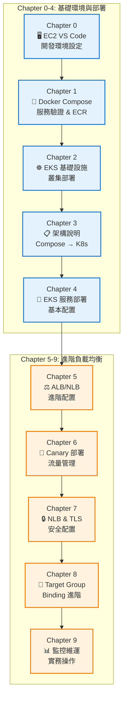
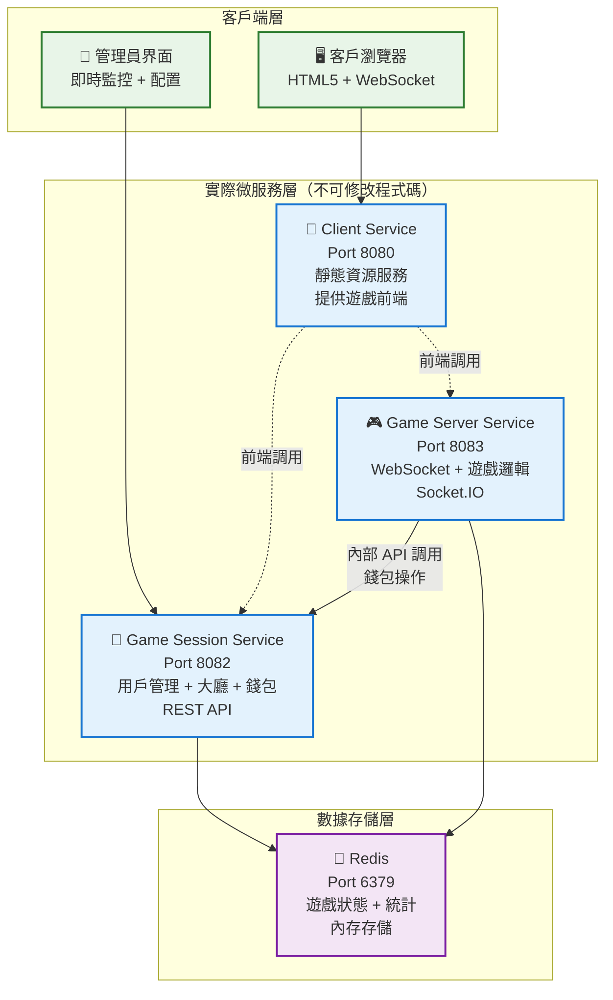
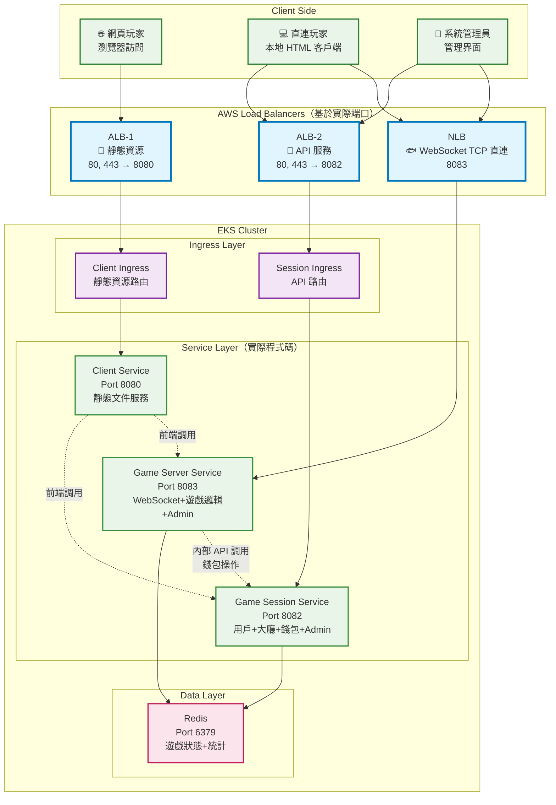
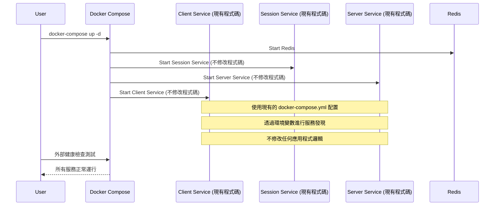
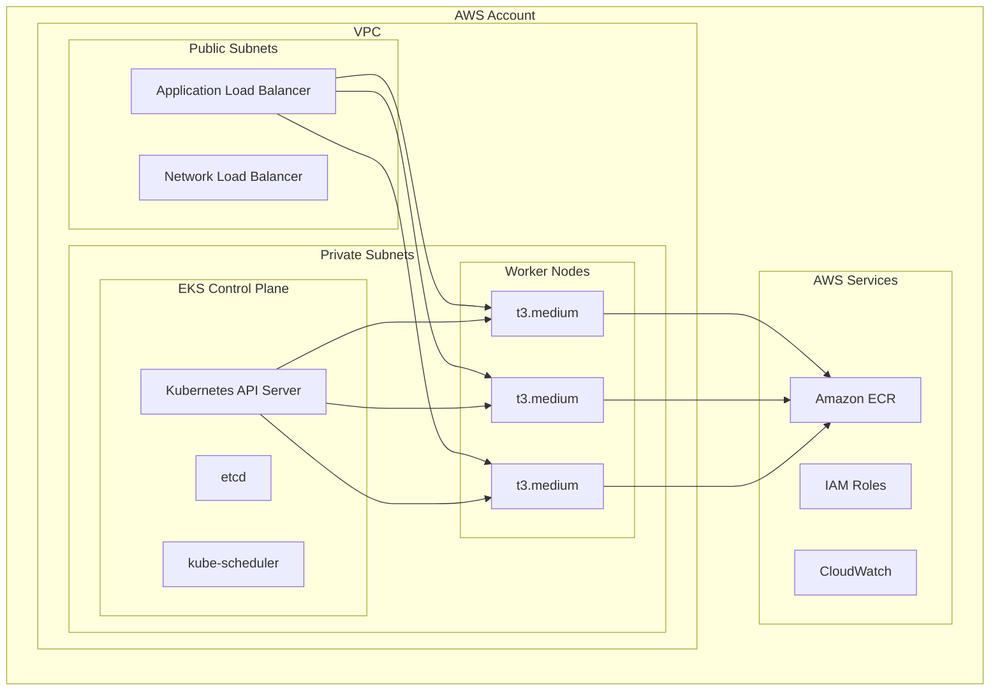
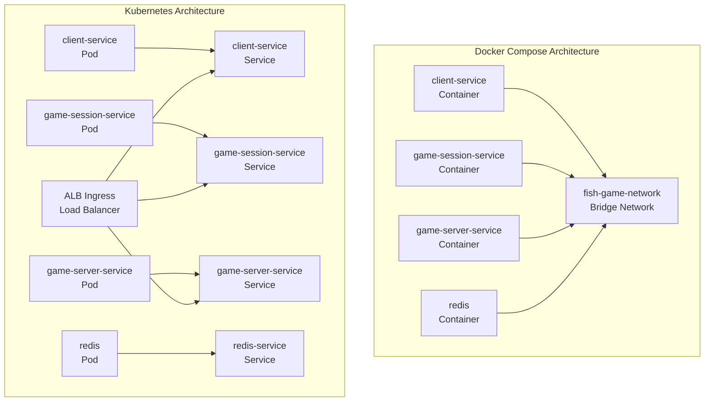
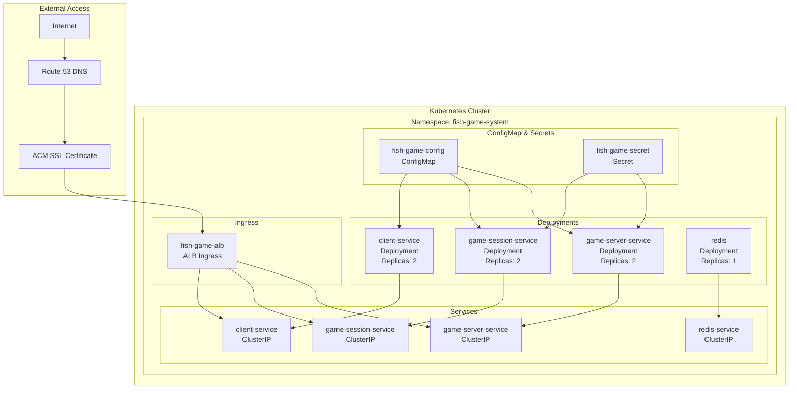

# 魚機遊戲 EKS Workshop 設計文檔

## 概述

魚機遊戲 EKS Workshop 是一個完整的微服務系統從開發環境到生產部署的實戰教學。基於現有的魚機遊戲微服務系統，引導學員從 EC2 VS Code 開發環境開始，逐步完成 Docker Compose 本地驗證、ECR 映像管理、EKS 基礎設施部署，最終實現進階的 ALB/NLB 負載均衡配置。

整個系統採用模組化設計，分為十個獨立的章節（0-9），每個章節都有專門的目錄結構和腳本，確保學員能夠循序漸進地完成整個開發到部署的流程。

## 架構

### 整體 Workshop 流程架構



### 現有魚機遊戲系統架構（基於實際程式碼）



### 目標 EKS 負載均衡架構（基於實際程式碼端口）



## Components and Interfaces

### 重要約束條件
**客戶服務程式碼不可修改** - 所有的配置、部署和整合都必須基於現有的服務程式碼，不能對應用程式邏輯進行任何修改。所有的環境配置、健康檢查、服務發現等都必須透過外部配置（環境變數、ConfigMap、Service 等）來實現。

### Chapter 0: 開發環境設定

#### EC2 Instance Configuration
- **Instance Type**: t3.large (2 vCPU, 8GB RAM)
- **Operating System**: Amazon Linux 2 或 Ubuntu 20.04 LTS
- **Storage**: 50GB EBS gp3
- **Security Groups**: 
  - SSH (22): 限制來源 IP
  - VS Code (8443): 限制來源 IP
  - Development Ports (8080-8083): 限制來源 IP

#### VS Code Server Setup
```bash
# VS Code Server 安裝腳本
curl -fsSL https://code-server.dev/install.sh | sh
sudo systemctl enable --now code-server@$USER

# 配置檔案 ~/.config/code-server/config.yaml
bind-addr: 0.0.0.0:8443
auth: password
password: your-secure-password
cert: false
```

#### Development Tools Installation
```bash
# Docker 安裝
curl -fsSL https://get.docker.com -o get-docker.sh
sh get-docker.sh
sudo usermod -aG docker $USER

# AWS CLI v2 安裝
curl "https://awscli.amazonaws.com/awscli-exe-linux-x86_64.zip" -o "awscliv2.zip"
unzip awscliv2.zip
sudo ./aws/install

# kubectl 安裝
curl -o kubectl https://s3.us-west-2.amazonaws.com/amazon-eks/1.32.9/2025-09-19/bin/linux/amd64/kubectl
chmod +x ./kubectl
sudo mv ./kubectl /usr/local/bin

# eksctl 安裝
curl --location "https://github.com/eksctl-io/eksctl/releases/latest/download/eksctl_$(uname -s)_amd64.tar.gz" | tar xz -C /tmp
sudo mv /tmp/eksctl /usr/local/bin
```

### Chapter 1: 服務驗證和 ECR 推送

#### Docker Compose Validation Flow


#### ECR Push Automation
```bash
# ECR 推送腳本架構
#!/bin/bash
set -e

# 環境變數設定
export AWS_REGION=${AWS_REGION:-ap-northeast-2}
export AWS_ACCOUNT_ID=$(aws sts get-caller-identity --query Account --output text)
export ECR_REGISTRY=${AWS_ACCOUNT_ID}.dkr.ecr.${AWS_REGION}.amazonaws.com
export IMAGE_TAG=${1:-latest}

# ECR 登入
aws ecr get-login-password --region ${AWS_REGION} | docker login --username AWS --password-stdin ${ECR_REGISTRY}

# 建立 ECR repositories
create_ecr_repositories() {
    repositories=("fish-game-client" "fish-game-session" "fish-game-server")
    for repo in "${repositories[@]}"; do
        aws ecr describe-repositories --repository-names ${repo} --region ${AWS_REGION} || \
        aws ecr create-repository --repository-name ${repo} --region ${AWS_REGION}
    done
}

# 建構和推送
build_and_push() {
    local service_name=$1
    local service_dir=$2
    local image_name=$3
    
    cd ${service_dir}
    docker build -t ${image_name}:${IMAGE_TAG} .
    docker tag ${image_name}:${IMAGE_TAG} ${ECR_REGISTRY}/${image_name}:${IMAGE_TAG}
    docker push ${ECR_REGISTRY}/${image_name}:${IMAGE_TAG}
    cd - > /dev/null
}
```

### Chapter 2: EKS 基礎設施部署

#### EKS Cluster Architecture


### Chapter 3: 架構說明文件

#### Architecture Comparison


### Chapter 4: EKS 服務部署

#### Kubernetes Deployment Architecture


### Chapter 5-9: 進階 ALB/NLB 配置

#### ALB 基於實際端口的配置
```yaml
# Client Service Ingress 配置（靜態資源）
apiVersion: networking.k8s.io/v1
kind: Ingress
metadata:
  name: client-ingress
  annotations:
    kubernetes.io/ingress.class: alb
    alb.ingress.kubernetes.io/scheme: internet-facing
    alb.ingress.kubernetes.io/target-type: ip
    alb.ingress.kubernetes.io/listen-ports: '[{"HTTP": 80}, {"HTTPS": 443}]'
spec:
  rules:
  - host: game.example.com
    http:
      paths:
      - path: /
        pathType: Prefix
        backend:
          service:
            name: client-service
            port:
              number: 8080

---
# Game Session Service Ingress 配置（API 服務）
apiVersion: networking.k8s.io/v1
kind: Ingress
metadata:
  name: session-ingress
  annotations:
    kubernetes.io/ingress.class: alb
    alb.ingress.kubernetes.io/scheme: internet-facing
    alb.ingress.kubernetes.io/target-type: ip
    alb.ingress.kubernetes.io/listen-ports: '[{"HTTP": 80}, {"HTTPS": 443}]'
spec:
  rules:
  - host: api.game.example.com
    http:
      paths:
      - path: /api
        pathType: Prefix
        backend:
          service:
            name: game-session-service
            port:
              number: 8082
      - path: /admin
        pathType: Prefix
        backend:
          service:
            name: game-session-service
            port:
              number: 8082


```

#### NLB WebSocket 服務配置（基於實際程式碼）
```yaml
# Game Server Service with NLB (WebSocket TCP 直連)
apiVersion: v1
kind: Service
metadata:
  name: game-server-nlb
  annotations:
    service.beta.kubernetes.io/aws-load-balancer-type: "nlb"
    service.beta.kubernetes.io/aws-load-balancer-nlb-target-type: "ip"
    service.beta.kubernetes.io/aws-load-balancer-cross-zone-load-balancing-enabled: "true"
spec:
  type: LoadBalancer
  ports:
  - name: websocket-tcp
    port: 8083
    protocol: TCP
    targetPort: 8083
  selector:
    app: game-server-service
```

#### Canary 部署配置
```yaml
# ALB Ingress with traffic splitting
metadata:
  annotations:
    alb.ingress.kubernetes.io/actions.weighted-routing: >
      {
        "Type":"forward",
        "ForwardConfig":{
          "TargetGroups":[
            {
              "ServiceName":"game-stable",
              "ServicePort":"80",
              "Weight":80
            },
            {
              "ServiceName":"game-canary",
              "ServicePort":"80",
              "Weight":20
            }
          ]
        }
      }
```

## Data Models

### Environment Configuration Model
```yaml
# ConfigMap 資料模型
apiVersion: v1
kind: ConfigMap
metadata:
  name: fish-game-config
  namespace: fish-game-system
data:
  # Redis Configuration
  REDIS_HOST: "redis-service"
  REDIS_PORT: "6379"
  
  # Service Discovery
  GAME_SESSION_SERVICE_HOST: "game-session-service"
  GAME_SESSION_SERVICE_PORT: "8082"
  GAME_SERVER_SERVICE_HOST: "game-server-service"
  GAME_SERVER_SERVICE_PORT: "8083"
  CLIENT_SERVICE_PORT: "8080"
  
  # Game Configuration
  GAME_ROOM_MAX_PLAYERS: "4"
  GAME_FISH_SPAWN_INTERVAL: "2000"
  FISH_HIT_RATE_SMALL: "0.8"
  FISH_HIT_RATE_MEDIUM: "0.6"
  FISH_HIT_RATE_LARGE: "0.4"
  FISH_HIT_RATE_BOSS: "0.2"
  
  # Environment
  NODE_ENV: "production"
```

### Service Deployment Model
```yaml
# Deployment 資料模型（不修改客戶程式碼）
apiVersion: apps/v1
kind: Deployment
metadata:
  name: game-session-service
  namespace: fish-game-system
spec:
  replicas: 2
  selector:
    matchLabels:
      app: game-session-service
  template:
    metadata:
      labels:
        app: game-session-service
    spec:
      containers:
      - name: game-session-service
        image: ${ECR_REGISTRY}/fish-game-session:latest
        ports:
        - containerPort: 8082
        envFrom:
        - configMapRef:
            name: fish-game-config
        - secretRef:
            name: fish-game-secret
        resources:
          requests:
            memory: "512Mi"
            cpu: "500m"
          limits:
            memory: "1Gi"
            cpu: "1000m"
        # 使用 TCP 探針，不依賴程式碼內的健康檢查端點
        livenessProbe:
          tcpSocket:
            port: 8082
          initialDelaySeconds: 30
          periodSeconds: 10
        readinessProbe:
          tcpSocket:
            port: 8082
          initialDelaySeconds: 5
          periodSeconds: 5
```

### Directory Structure Model
```
.kiro/specs/fish-game-eks-workshop/
├── requirements.md
├── design.md
├── tasks.md
├── 0.dev-environment-setup/
│   ├── README.md
│   ├── ec2-setup.sh
│   ├── vscode-install.sh
│   ├── tools-install.sh
│   └── git-setup.sh
├── 1.service-validation-and-ecr/
│   ├── README.md
│   ├── compose-validation.sh
│   ├── build-and-push.sh
│   └── ecr-setup.sh
├── 2.eks-infrastructure-deployment/
│   ├── README.md
│   ├── eks-cluster-setup.sh
│   ├── addons-install.sh
│   └── cluster-validation.sh
├── 3.compose-to-eks-architecture/
│   ├── README.md
│   ├── architecture-comparison.md
│   ├── migration-guide.md
│   └── best-practices.md
├── 4.eks-service-deployment/
│   ├── README.md
│   ├── k8s-manifests/
│   │   ├── configmap.yaml
│   │   ├── secrets.yaml
│   │   ├── deployments.yaml
│   │   ├── services.yaml
│   │   └── ingress.yaml
│   ├── deploy-services.sh
│   └── validation-tests.sh
├── 5.alb-nlb-advanced-config/
│   ├── README.md
│   ├── alb-multi-port.yaml
│   ├── nlb-fish-services.yaml
│   └── header-routing.yaml
├── 6.canary-deployment/
│   ├── README.md
│   ├── canary-deployment.yaml
│   ├── traffic-splitting.yaml
│   └── rollback-scripts.sh
├── 7.nlb-tls-config/
│   ├── README.md
│   ├── tls-certificates.yaml
│   ├── nlb-tls-config.yaml
│   └── security-setup.sh
├── 8.target-group-binding/
│   ├── README.md
│   ├── target-group-binding.yaml
│   ├── custom-health-checks.yaml
│   └── advanced-routing.yaml
└── 9.monitoring-operations/
    ├── README.md
    ├── monitoring-setup.yaml
    ├── logging-config.yaml
    └── troubleshooting-guide.md
```

## Error Handling

### 客戶程式碼約束條件處理策略

#### 不可修改的程式碼元件
1. **服務應用邏輯** - 所有 services/ 目錄下的程式碼
2. **Dockerfile** - 現有的容器建構配置
3. **package.json** - 依賴和腳本配置
4. **應用程式端點** - 不能新增健康檢查端點

#### 可配置的外部元件
1. **docker-compose.yml** - 服務編排配置
2. **環境變數** - .env 檔案和 ConfigMap
3. **Kubernetes 資源** - Deployment、Service、Ingress
4. **網路配置** - 服務發現和負載平衡
5. **基礎設施腳本** - 部署和管理腳本

#### 適應性設計原則
1. **外部健康檢查** - 使用 TCP 探針而非 HTTP 健康端點
2. **服務發現** - 透過環境變數和 DNS 而非程式碼修改
3. **配置注入** - 使用 ConfigMap 和 Secret 而非程式碼內建配置
4. **監控策略** - 基於容器和網路層面的監控，不依賴應用程式指標

### 各章節錯誤處理

#### Chapter 0: 開發環境設定錯誤處理
```bash
# EC2 連接失敗
check_ec2_connection() {
    if ! ssh -o ConnectTimeout=10 ec2-user@$EC2_IP "echo 'Connection successful'"; then
        echo "ERROR: Cannot connect to EC2 instance"
        echo "Please check:"
        echo "1. Security Group allows SSH (port 22)"
        echo "2. Key pair is correct"
        echo "3. Instance is running"
        exit 1
    fi
}

# VS Code Server 啟動失敗
check_vscode_server() {
    if ! curl -f http://localhost:8443 > /dev/null 2>&1; then
        echo "ERROR: VS Code Server is not running"
        echo "Attempting to restart..."
        sudo systemctl restart code-server@$USER
        sleep 10
        if ! curl -f http://localhost:8443 > /dev/null 2>&1; then
            echo "FAILED: VS Code Server restart failed"
            echo "Check logs: journalctl -u code-server@$USER"
            exit 1
        fi
    fi
}
```

#### Chapter 1: 服務驗證和 ECR 錯誤處理
```bash
# Docker Compose 服務健康檢查失敗（不修改客戶程式碼）
validate_compose_services() {
    local services=("redis" "game-session-service" "game-server-service" "client-service")
    
    for service in "${services[@]}"; do
        if ! docker-compose ps $service | grep -q "Up"; then
            echo "ERROR: Service $service is not running"
            echo "Checking logs..."
            docker-compose logs $service
            echo "Attempting to restart $service..."
            docker-compose restart $service
            sleep 30
            
            if ! docker-compose ps $service | grep -q "Up"; then
                echo "FAILED: Service $service failed to start"
                echo "Note: 不修改客戶程式碼，檢查環境變數和網路配置"
                exit 1
            fi
        fi
    done
    
    # 使用外部方式測試服務可用性（不依賴程式碼內建的健康檢查）
    echo "Testing service connectivity externally..."
    test_service_ports
}
```

#### Chapter 5-9: ALB/NLB 錯誤處理
```bash
# ALB 配置錯誤
validate_alb_configuration() {
    local ingress_name="fish-game-alb"
    local namespace="fish-game-system"
    
    echo "Checking ALB Ingress status..."
    kubectl get ingress $ingress_name -n $namespace
    
    # 檢查多端口配置
    local ports=$(kubectl get ingress $ingress_name -n $namespace -o jsonpath='{.metadata.annotations.alb\.ingress\.kubernetes\.io/listen-ports}')
    
    if [ -z "$ports" ]; then
        echo "ERROR: ALB listen ports not configured"
        echo "Expected ports: 80, 443, 8080, 9380, 9381, 18080, 19380, 19381"
        return 1
    fi
    
    echo "ALB ports configured: $ports"
}

# NLB 魚機服務錯誤處理
validate_nlb_fish_services() {
    local service_name="fish-service"
    local namespace="fish-game-system"
    
    echo "Checking NLB Service status..."
    kubectl get service $service_name -n $namespace
    
    # 檢查魚機端口配置
    local ports=$(kubectl get service $service_name -n $namespace -o jsonpath='{.spec.ports[*].port}')
    
    echo "Fish service ports: $ports"
    
    # 驗證每個魚機端口
    for port in $ports; do
        if [[ $port -lt 5001 || $port -gt 5100 ]]; then
            echo "WARNING: Port $port is outside expected fish service range (5001-5100)"
        fi
    done
}
```

## Testing Strategy

### Workshop 驗證方法

#### 1. 章節驗證測試
每個章節都包含獨立的驗證腳本：

```bash
# Chapter 0: 開發環境測試
test_development_environment() {
    echo "Testing EC2 connectivity..."
    test_ec2_connection
    
    echo "Testing VS Code Server..."
    test_vscode_server
    
    echo "Testing development tools..."
    test_docker_installation
    test_aws_cli_configuration
    test_kubectl_installation
    test_git_configuration
}

# Chapter 1: 服務驗證測試
test_service_validation() {
    echo "Testing Docker Compose services..."
    test_compose_services_health
    
    echo "Testing service connectivity..."
    test_service_communication
    
    echo "Testing ECR push..."
    test_ecr_push_success
    
    echo "Testing image availability..."
    test_ecr_image_availability
}

# Chapter 5-9: ALB/NLB 測試
test_alb_nlb_configuration() {
    echo "Testing ALB multi-port configuration..."
    test_alb_multi_port
    
    echo "Testing NLB fish services..."
    test_nlb_fish_services
    
    echo "Testing Canary deployment..."
    test_canary_deployment
    
    echo "Testing TLS configuration..."
    test_tls_configuration
}
```

#### 2. 端到端測試
```bash
# 完整 Workshop 端到端測試
run_workshop_e2e_tests() {
    echo "Starting Workshop end-to-end testing..."
    
    # 基礎環境測試
    test_development_environment || exit 1
    test_service_validation || exit 1
    test_eks_infrastructure || exit 1
    test_eks_deployment || exit 1
    
    # 進階負載均衡測試
    test_alb_nlb_configuration || exit 1
    test_canary_deployment || exit 1
    test_monitoring_operations || exit 1
    
    echo "All Workshop tests passed successfully!"
}
```

#### 3. 學員實作驗證
```bash
# 學員操作能力驗證
validate_student_skills() {
    echo "Validating student practical skills..."
    
    # 基礎技能驗證
    echo "1. Can student deploy new fish service independently?"
    validate_fish_service_deployment
    
    echo "2. Can student configure Canary deployment?"
    validate_canary_configuration
    
    echo "3. Can student troubleshoot ALB/NLB issues?"
    validate_troubleshooting_skills
    
    echo "4. Can student set up monitoring and logging?"
    validate_monitoring_setup
}
```

這個設計文件整合了三個原始 spec 的核心內容，提供了完整的技術架構、元件介面、資料模型、錯誤處理和測試策略，確保整個 Workshop 從開發環境到進階負載均衡配置的可靠性和教學效果。