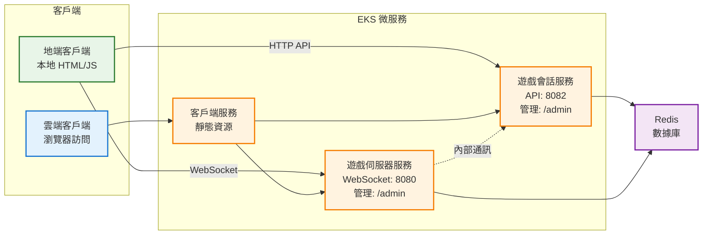
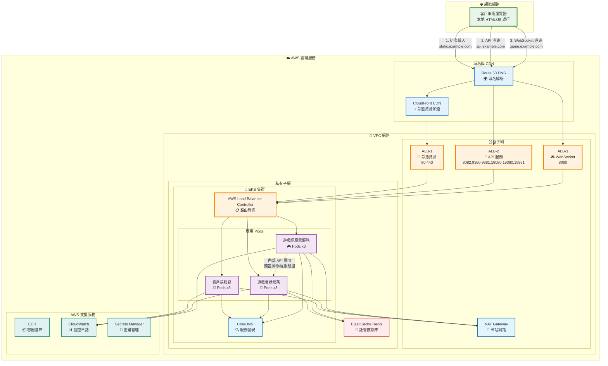
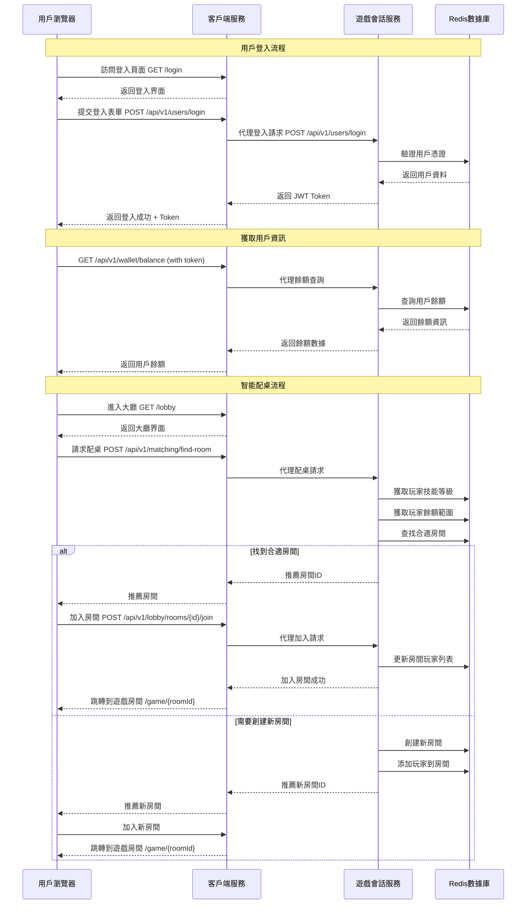
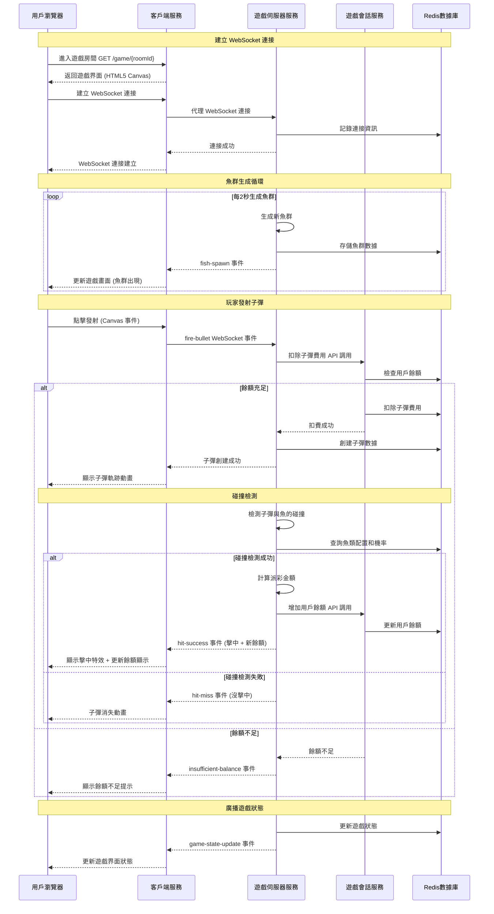
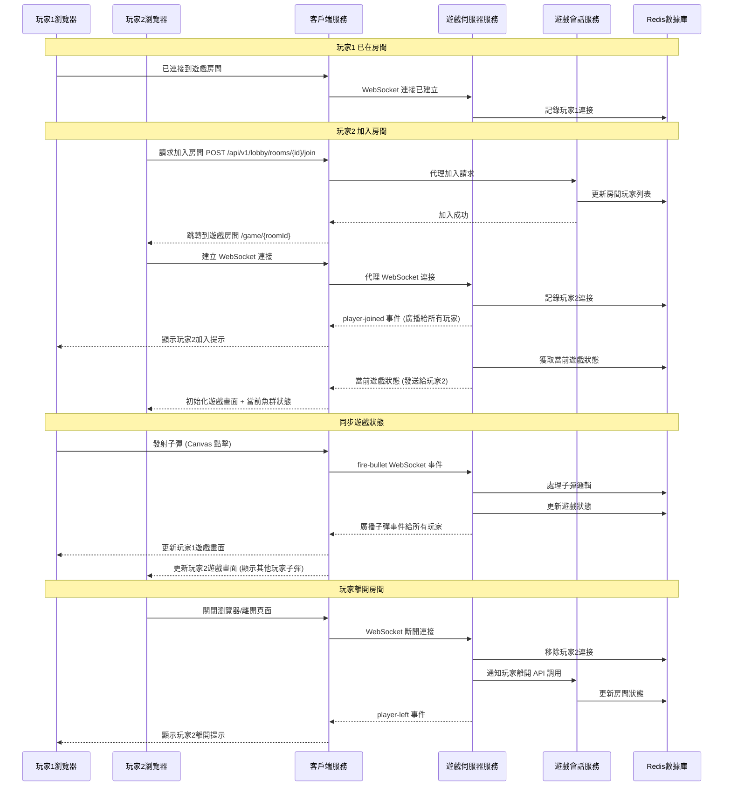

# 電子捕魚機微服務系統設計文檔

## 概述

電子捕魚機微服務系統採用容器化架構，透過 Docker Compose 實現本地開發環境的快速部署，並提供完整的 EKS 生產環境遷移方案。系統基於領域驅動設計（DDD）原則，將複雜的遊戲業務邏輯拆分為8個核心微服務，確保高可用性、可擴展性和低延遲的即時遊戲體驗。

## 架構

### 整體架構圖 - 雙模式客戶端設計



### 雙模式客戶端詳細說明

#### 🏠 地端客戶端 (本地運行)
**部署位置**：客戶筆電本地
**運行方式**：
- 本地開啟 HTML 文件 (file:// 協議)
- 或本地啟動簡單 HTTP 服務器 (如 `python -m http.server`)
- 不依賴外部 ALB 或雲端 client-service

**直連雲端服務**：
```javascript
// 直連遊戲會話服務 API
fetch('http://api.example.com:8082/api/v1/users/login', {
  method: 'POST',
  body: JSON.stringify({username, password})
});

// 直連遊戲伺服器 WebSocket
const ws = new WebSocket('ws://game.example.com:8080');

// 直連魚機 TCP 服務
const fishSocket = new WebSocket('ws://game.example.com:5001');
```

**優勢**：
- 完全獨立運行，不依賴雲端前端服務
- 直接調用後端 API 和 WebSocket
- 適合開發測試和客戶端部署
- 可以離線開發，只需連接後端服務

#### ☁️ 雲端客戶端 (ALB 訪問)
**部署位置**：EKS 集群中的 client-service
**運行方式**：
- 透過 ALB 訪問 `https://game.example.com`
- 提供完整的遊戲用戶界面
- 標準的 Web 應用訪問模式

**透過 client-service 代理**：
- client-service 提供靜態資源和遊戲界面
- 透過內部網路調用後端服務
- 提供給一般用戶的完整 Web 體驗

**優勢**：
- 標準 Web 應用體驗
- 透過 CDN 加速靜態資源
- 適合一般用戶訪問
- 統一的域名和 SSL 證書

### 架構設計詳細說明

#### 🔒 為什麼需要內部通訊？

**安全性考量**：
```
❌ 不安全的設計 (無內部通訊)：
1. 客戶端發射子彈 → 直接調用 game-session-service 扣費
2. 客戶端擊中魚 → game-server-service 返回獎勵 → 客戶端調用 game-session-service 加錢

問題：客戶端可能被篡改，繞過扣費或偽造獎勵
```

```
✅ 安全的設計 (有內部通訊)：
1. 客戶端發射子彈 → game-server-service 
2. game-server-service → 內部調用 game-session-service 扣費
3. 扣費成功 → 執行遊戲邏輯
4. 擊中魚 → game-server-service 內部調用 game-session-service 加錢

優勢：所有金錢操作都在後端進行，客戶端無法篡改
```

**內部通訊的具體場景**：
- 🎯 **發射子彈**：game-server-service → game-session-service (扣除子彈費用)
- 💰 **擊中獎勵**：game-server-service → game-session-service (增加獎勵金額)
- 🔐 **權限驗證**：game-server-service → game-session-service (驗證玩家房間權限)
- 📊 **統計更新**：game-server-service → game-session-service (更新玩家統計)

#### 📊 各服務職責分工

**🏠 地端客戶端**：
- 遊戲界面渲染和用戶交互
- 發送遊戲指令 (發射、移動等)
- 接收遊戲狀態更新
- **不處理金錢邏輯** (安全性)

**👤 遊戲會話服務**：
- 用戶認證和授權
- 錢包餘額管理 (扣費/加錢)
- 房間權限控制
- 玩家統計和排行榜

**🎮 遊戲伺服器服務**：
- 遊戲邏輯執行
- 碰撞檢測和物理計算
- WebSocket 即時通訊
- **透過內部 API 處理金錢操作**

### 雙模式客戶端連接方式

#### 🏠 地端客戶端連接方式
**本地運行環境**：
```bash
# 方式1: 直接開啟 HTML 文件
open index.html  # 使用 file:// 協議

# 方式2: 本地 HTTP 服務器
python -m http.server 3000
# 然後訪問 http://localhost:3000
```

**直連雲端服務的 JavaScript 代碼**：
```javascript
// 1. 直連遊戲會話服務 HTTP API
const sessionAPI = 'http://api.example.com:8082';
fetch(`${sessionAPI}/api/v1/users/login`, {
  method: 'POST',
  headers: {'Content-Type': 'application/json'},
  body: JSON.stringify({username: 'player1', password: 'pass123'})
});

// 2. 直連遊戲伺服器 WebSocket
const gameWS = new WebSocket('ws://game.example.com:8080');
gameWS.onmessage = (event) => {
  const gameData = JSON.parse(event.data);
  // 處理遊戲狀態更新
};

// 3. 魚機遊戲數據也透過同一個 WebSocket
gameWS.send(JSON.stringify({
  action: 'fire-bullet',
  x: 300, y: 200,
  fishId: 'fish_123'
}));
```

**地端客戶端優勢**：
- ✅ 完全本地運行，不依賴雲端 client-service
- ✅ 直接調用後端 API，無代理延遲
- ✅ 可以離線開發和測試
- ✅ 適合客戶端部署和開發環境

#### ☁️ 雲端客戶端連接方式
**透過 ALB 訪問**：
```
用戶瀏覽器 → https://game.example.com → ALB → client-service
```

**client-service 內部代理**：
```javascript
// client-service 內部代理邏輯
app.post('/api/v1/users/login', (req, res) => {
  // 代理到 game-session-service
  const response = await fetch('http://game-session-service:8082/api/v1/users/login', {
    method: 'POST',
    body: JSON.stringify(req.body)
  });
  res.json(await response.json());
});
```

**雲端客戶端優勢**：
- ✅ 標準 Web 應用體驗
- ✅ 透過 CDN 加速靜態資源
- ✅ 統一域名和 SSL 證書
- ✅ 適合一般用戶訪問

### 各方框詳細功能說明

#### 🖥️ 客戶地端
**客戶筆電瀏覽器**：
- 本地運行的 HTML5 遊戲界面
- JavaScript 遊戲邏輯和 UI 控制
- Canvas 渲染魚群和子彈動畫
- 直接調用後端 API，無需代理
- WebSocket 客戶端，直連遊戲伺服器

**管理員瀏覽器**：
- 本地運行的管理後台界面
- 即時監控儀表板
- 配置調整界面
- 直接調用後端管理 API

#### ⚙️ 微服務層 (EKS)
**客戶端服務 (Client Service)**：
- **唯一功能**：靜態資源服務器
- 提供 HTML、CSS、JavaScript 文件下載
- 提供圖片、音效等媒體資源
- **不做 API 代理**，僅文件服務

**遊戲會話服務 (Game Session Service)**：
- 用戶註冊、登入、登出 API
- 錢包餘額、交易記錄 API
- 大廳房間列表、創建房間 API
- 智能配桌和玩家匹配 API
- 管理後台用戶管理 API
- **直接暴露給瀏覽器**，無需代理

**遊戲伺服器服務 (Game Server Service)**：
- 魚群生成、移動軌跡計算
- 子彈軌跡和碰撞檢測
- WebSocket 即時通訊服務
- 魚機 TCP/TLS 直連服務
- 遊戲狀態管理和同步
- 管理後台遊戲監控 API
- **直接暴露給瀏覽器**，無需代理

#### 💾 數據存儲層
**Redis 數據庫**：
- 用戶資料和會話存儲
- 遊戲狀態和房間資訊
- 魚群和子彈數據緩存
- 即時統計數據存儲

### 完整微服務架構說明

**🌐 客戶端架構 - 雙層客戶端設計**

#### 1. 客戶地端瀏覽器 (Client Browser)
- **位置**: 客戶筆電上的瀏覽器
- **訪問方式**: 透過網頁訪問遊戲
- **技術**: HTML5, JavaScript, WebSocket, Canvas
- **功能**:
  - 遊戲界面渲染：HTML5 Canvas 遊戲畫面
  - 用戶交互：滑鼠點擊、鍵盤操作
  - 即時通訊：WebSocket 連接到遊戲伺服器
  - 管理後台：系統管理員操作界面
- **連接方式**:
  - HTTP/HTTPS → ALB → client-service (網頁內容)
  - TCP/TLS → NLB → game-server-service (魚機直連)

#### 為什麼需要客戶端服務？

**客戶端服務的重要性**：
1. **靜態資源提供者**：瀏覽器需要從某個地方下載 HTML、CSS、JavaScript、圖片等文件
2. **API 統一入口**：避免瀏覽器直接調用多個後端服務，提供統一的 API 接口
3. **安全隔離**：後端服務（game-session-service:8082）不直接暴露給外網
4. **負載均衡**：在前端層面分發請求到不同的後端服務
5. **跨域處理**：處理 CORS 問題，統一域名訪問

**重新設計的流量路徑**：
```
1. 初次網頁載入（僅一次）：
   瀏覽器 → CDN → ALB-1:443 → client-service → 下載 HTML/CSS/JS 文件
   
2. 用戶 API 直連（登入、錢包、大廳）：
   瀏覽器本地 JS → ALB-2:8082,9380,9381,18080,19380,19381 → game-session-service
   
3. WebSocket 直連（即時通訊）：
   瀏覽器本地 JS → ALB-3:8080 → game-server-service
   
4. 魚機遊戲數據（透過 WebSocket）：
   瀏覽器本地 JS → ALB-3:8080 → game-server-service (同一個 WebSocket 連接)
```

**新架構的優勢**：
- ✅ 客戶端 HTML/JS 本地運行，不依賴雲端代理
- ✅ API 調用直連後端，減少延遲
- ✅ WebSocket 直連，提升即時性
- ✅ 魚機 TCP 直連，最低延遲
- ✅ 靜態資源透過 CDN 加速
- ✅ 各服務職責清晰，易於維護

**客戶端服務的簡化角色**：
- 僅提供靜態文件下載服務
- 不做任何 API 代理
- 透過 CDN 提升下載速度
- 支援版本更新和緩存控制

#### 2. 客戶端服務 (Client Service) - EKS 中的前端服務器
- **位置**: 部署在 EKS 集群中
- **端口配置**: 
  - **80**: 標準 HTTP 端口，重新導向至 HTTPS
  - **443**: 標準 HTTPS 端口，用於加密連接
  - **8080**: WebSocket 連接端口，用於即時通訊
  - **9380, 9381**: 遊戲服務專用端口，用於玩家連線
  - **18080**: 後台管理界面端口
  - **19380**: 魚機配桌主要服務端口
  - **19381**: 魚機配桌備用/擴展端口
- **狀態**: 健康運行 ✅
- **技術棧**: Node.js + Express + EJS + Socket.io Client
- **核心功能**: 
  - **靜態資源服務**：提供 HTML、CSS、JavaScript、圖片資源給瀏覽器
  - **網頁模板渲染**：EJS 模板引擎渲染遊戲界面
  - **API 代理**：轉發瀏覽器請求到後端服務
  - **WebSocket 代理**：處理瀏覽器與遊戲伺服器的連接
  - **負載均衡**：分發流量到不同的後端服務
- **域名路由**：
  - `lobby.example.com` → 導向大廳服務
  - `fishmatch.example.com` → 導向魚機配桌服務

**🎯 遊戲會話服務 (Game Session Service)**
- **端口**: 8082 (內部服務，不對外暴露)
- **狀態**: 健康運行 ✅
- **技術棧**: Node.js + Express + Redis Client + EJS
- **整合功能**: 
  - 用戶管理：註冊、登入、資料管理
  - 錢包系統：餘額管理、交易記錄
  - 大廳管理：房間列表、房間創建
  - 智能配桌：玩家匹配、技能評級
  - Web 管理後台 API：即時監控、規則調整

**🎮 遊戲伺服器服務 (Game Server Service) - 魚機服務**
- **端口配置**: 
  - **5001**: 魚機-1 專屬端口
  - **5002**: 魚機-2 專屬端口
  - **5003**: 魚機-3 專屬端口
  - **...**: 依此類推，每個魚機一個專屬端口
  - **8083**: 內部 HTTP API 端口
- **狀態**: 健康運行 ✅
- **技術棧**: Node.js + Express + Socket.io + Redis Client + EJS
- **整合功能**:
  - 遊戲邏輯：魚群生成、移動軌跡
  - 碰撞檢測：物理碰撞、派彩計算
  - TCP/TLS 連接：每個魚機獨立的直接連接
  - WebSocket 通訊：即時雙向通訊
  - Web 管理後台 API：遊戲監控、參數調整

**💾 數據存儲 - Redis**
- **端口**: 6379
- **狀態**: 健康運行 ✅
- **用途**: 統一的數據存儲和緩存

**🔧 共用程式模組 (Shared Utils)**
- **性質**: 程式代碼層面的共享模組，不是獨立服務
- **功能**: 日誌記錄、配置管理、Redis 客戶端、錯誤處理、健康檢查
- **使用方式**: 被三個微服務引用和使用

### 完整容器配置說明

**總共 4 個 Docker 容器：**

1. **redis** (Redis 數據庫容器)
   - 技術棧：Redis 7.x
   - 端口：6379
   - 數據：所有服務的共享數據存儲
   - 持久化：內存存儲，不持久化（開發環境）

2. **client-service** (客戶端服務容器 - EKS 中的前端服務器)
   - **定位**: 部署在 EKS 集群中，為客戶地端瀏覽器提供前端服務
   - 技術棧：Node.js + Express + EJS + Socket.io Client
   - **多端口配置**：
     - **80**: HTTP 端口，重新導向至 HTTPS
     - **443**: HTTPS 端口，SSL/TLS 加密連接
     - **8080**: WebSocket 連接端口，即時通訊
     - **9380, 9381**: 遊戲服務專用端口，玩家連線
     - **18080**: 後台管理界面端口
     - **19380**: 魚機配桌主要服務端口
     - **19381**: 魚機配桌備用/擴展端口
   - **域名路由支援**：
     - `lobby.example.com` → 大廳服務流量
     - `fishmatch.example.com` → 魚機配桌服務流量
   - **服務客戶地端瀏覽器**：
     - **靜態資源服務**：提供 HTML、CSS、JavaScript、圖片、音效資源
     - **網頁模板渲染**：EJS 模板引擎渲染遊戲界面給瀏覽器
     - **API 代理**：轉發瀏覽器請求到 game-session-service 和 game-server-service
     - **WebSocket 代理**：處理瀏覽器與遊戲伺服器的即時通訊
     - **管理後台界面**：為管理員瀏覽器提供操作界面和儀表板
   - 數據：無直接數據存儲，作為前端服務器代理後端 API

3. **game-session-service** (遊戲會話服務容器)
   - 技術棧：Node.js + Express + Redis Client + EJS
   - 端口：8082 (內部 API，不對外暴露)
   - 整合功能：
     - 用戶註冊、登入、資料管理
     - 錢包餘額管理、交易記錄
     - 大廳管理和房間列表
     - 智能配桌和玩家匹配
     - 房間創建、銷毀和狀態管理
     - 玩家技能評級和平衡
     - **Web 管理後台 API**：即時房間監控、配桌規則調整、玩家分佈分析
   - 數據：Redis 存儲用戶資料、錢包資訊、房間狀態、配桌資訊

4. **game-server-service** (遊戲伺服器服務容器 - 魚機服務)
   - 技術棧：Node.js + Express + Socket.io + Redis Client + EJS
   - **多魚機端口配置**：
     - **5001**: 魚機-1 專屬 TCP/TLS 端口
     - **5002**: 魚機-2 專屬 TCP/TLS 端口
     - **5003**: 魚機-3 專屬 TCP/TLS 端口
     - **...**: 依此類推，每個魚機一個專屬端口
     - **8083**: 內部 HTTP API 端口（不對外暴露）
   - **魚機服務特點**：
     - 每個魚機是獨立的遊戲實例
     - 需要直接的 TCP/TLS 連接
     - 便於個別魚機的監控和管理
   - 整合功能：
     - 遊戲邏輯：魚群生成、子彈軌跡、內建機率控制
     - 碰撞檢測：物理碰撞計算和派彩處理
     - TCP/TLS 即時通訊：每個魚機獨立連接管理
     - **Web 管理後台 API**：即時遊戲監控、機率調整、魚群配置、連接狀態
   - 數據：Redis 存儲遊戲狀態、連接資訊和碰撞結果

### EKS 生產環境架構圖 - 完整部署設計



### EKS 架構詳細說明

#### 🌐 域名分離設計
- **static.example.com** → 靜態資源 (HTML/CSS/JS 下載)
- **api.example.com** → API 服務 (用戶/錢包/大廳)
- **game.example.com** → WebSocket 服務 (即時通訊)
- **魚機直連** → NLB TCP/TLS (遊戲數據)

#### ⚖️ 負載均衡器分工
**ALB-1 (靜態資源)**：
- 僅處理 HTML/CSS/JS 文件下載
- 透過 CloudFront CDN 加速
- 端口：80, 443

**ALB-2 (API 服務)**：
- 處理所有 API 調用
- 用戶登入、錢包、大廳管理
- 端口：8082, 9380, 9381, 18080, 19380, 19381

**ALB-3 (WebSocket)**：
- 處理 WebSocket 即時通訊
- 遊戲狀態同步
- 端口：8080

**NLB (魚機直連)**：
- 處理魚機 TCP/TLS 連接
- 每個魚機獨立端口
- 端口：5001, 5002, 5003...

#### 🔄 流量路徑
1. **初次載入**：瀏覽器 → CDN → ALB-1 → client-service → 下載文件
2. **API 調用**：瀏覽器 → ALB-2 → game-session-service → 直接處理
3. **WebSocket**：瀏覽器 → ALB-3 → game-server-service → 直接處理
4. **魚機遊戲**：瀏覽器 → NLB → game-server-service → 直接處理

### 網路架構

#### Docker Compose 本地開發環境
系統採用 Docker Compose 內部網路通訊：

1. **應用網路（fish-game-network）**：所有微服務透過 service name 進行內部通訊
2. **對外端口配置**：
   - **client-service 多端口**：
     - 80, 443 - HTTP/HTTPS 標準端口
     - 8080 - WebSocket 連接端口
     - 9380, 9381 - 遊戲服務專用端口
     - 18080 - 後台管理界面端口
     - 19380, 19381 - 魚機配桌服務端口
   - **game-server-service 魚機端口**：
     - 5001, 5002, 5003... - 每個魚機專屬 TCP/TLS 端口
   - **內部服務端口**：
     - game-session-service:8082 - API 服務（內部通訊）
     - game-server-service:8083 - HTTP API（內部通訊）
3. **服務發現**：透過 Docker Compose 的內建 DNS 解析服務名稱

#### EKS 生產環境網路架構

**🌐 外部流量入口**
- **Route 53 DNS**：域名解析，支援健康檢查和故障轉移
  - `game.example.com` → 遊戲前端界面
  - `admin.example.com` → 管理後台界面
  - `ws.game.example.com` → WebSocket 連接
- **CloudFront CDN**：全球內容分發，靜態資源加速，降低延遲
- **SSL/TLS 終止**：在 ALB 層面處理 HTTPS 加密

**⚖️ 負載均衡策略**
- **ALB (Application Load Balancer) - 大廳和魚機配桌共用**：
  - 處理 HTTP/HTTPS 流量
  - **多端口監聽**：
    - 80 → 重新導向至 443
    - 443 → HTTPS 加密連接
    - 8080 → WebSocket 連接
    - 9380, 9381 → 遊戲服務專用端口
    - 18080 → 後台管理界面
    - 19380, 19381 → 魚機配桌服務
  - **域名路由**：
    - `lobby.example.com` → 大廳服務流量
    - `fishmatch.example.com` → 魚機配桌服務流量
  - **HTTP Header 區分**：
    - `X-Service: lobby` → 導向大廳服務
    - `X-Service: fishmatch` → 導向魚機配桌服務
  - SSL 終止和證書管理
  - 健康檢查和自動故障轉移

- **NLB (Network Load Balancer) - 魚機服務專用**：
  - 處理 TCP/TLS 連接
  - **魚機端口分配**：
    - 5001 → 魚機-1
    - 5002 → 魚機-2
    - 5003 → 魚機-3
    - ...依此類推
  - **特點**：
    - 超低延遲（< 100μs）
    - 保持客戶端 IP
    - 支援百萬級並發連接
    - 每個魚機獨立的直接 TCP/TLS 連接
    - 便於個別魚機的監控和管理

**🔒 網路安全層級**
- **Public Subnets**：只放置負載均衡器和 NAT Gateway
- **Private Subnets**：所有應用服務和數據庫
- **Security Groups**：細粒度的防火牆規則
- **Network ACLs**：子網級別的網路控制

**📡 服務發現和路由**
- **AWS Load Balancer Controller**：自動管理 ALB/NLB 配置
- **Kubernetes Ingress**：定義路由規則和 SSL 配置
- **CoreDNS**：集群內部服務發現
- **Service Mesh (可選)**：Istio 提供進階流量管理
                    subgraph "Ingress Controller"
                        Ingress[AWS Load Balancer<br/>Controller<br/>路由規則管理]
                    end
                    
                    subgraph "Application Pods"
                        GameSessionPods[遊戲會話服務<br/>Pods x3<br/>:8082<br/>🎯 用戶管理/錢包/配桌]
                        GameServerPods[遊戲伺服器服務<br/>Pods x3<br/>:8083<br/>🎮 遊戲引擎/WebSocket]
                    end
                    
                    subgraph "System Pods"
                        CoreDNS[CoreDNS<br/>服務發現]
                        Metrics[Metrics Server<br/>監控指標]
                    end
                end
                
                subgraph "Data Layer"
                    ElastiCache[ElastiCache Redis<br/>託管 Redis 集群<br/>高可用性]
                    RDS[RDS (可選)<br/>關聯式數據庫<br/>持久化存儲]
                end
            end
        end
        
        subgraph "AWS Services"
            ECR[ECR<br/>容器映像倉庫]
            CloudWatch[CloudWatch<br/>日誌和監控]
            SecretsManager[Secrets Manager<br/>敏感資訊管理]
            IAM[IAM<br/>身份和訪問管理]
        end
    end
    
    %% 用戶流量路由
    Users --> DNS
    DNS --> CDN
    CDN --> ALB
    
    %% 管理員流量路由
    Admins --> DNS
    DNS --> ALB
    
    %% WebSocket 流量路由 (低延遲)
    Users -.->|WebSocket| NLB
    
    %% 負載均衡器到服務
    ALB --> Ingress
    NLB --> Ingress
    
    %% Ingress 路由
    Ingress --> GameSessionPods
    Ingress --> GameServerPods
    
    %% 服務間通訊
    GameSessionPods <--> GameServerPods
    
    %% 數據存取
    GameSessionPods --> ElastiCache
    GameServerPods --> ElastiCache
    GameSessionPods -.-> RDS
    
    %% 系統服務
    GameSessionPods --> CoreDNS
    GameServerPods --> CoreDNS
    
    %% AWS 服務整合
    GameSessionPods --> CloudWatch
    GameServerPods --> CloudWatch
    GameSessionPods --> SecretsManager
    GameServerPods --> SecretsManager
    
    %% 出站網路
    GameSessionPods --> NAT
    GameServerPods --> NAT
    
    %% 樣式定義
    classDef userStyle fill:#e3f2fd,stroke:#1976d2,stroke-width:2px
    classDef awsStyle fill:#fff3e0,stroke:#f57c00,stroke-width:2px
    classDef lbStyle fill:#e8f5e8,stroke:#388e3c,stroke-width:3px
    classDef eksStyle fill:#f3e5f5,stroke:#7b1fa2,stroke-width:2px
    classDef dataStyle fill:#ffebee,stroke:#d32f2f,stroke-width:2px
    classDef serviceStyle fill:#e0f2f1,stroke:#00796b,stroke-width:2px
    
    class Users,Admins userStyle
    class DNS,CDN,ECR,CloudWatch,SecretsManager,IAM awsStyle
    class ALB,NLB,Ingress lbStyle
    class GameSessionPods,GameServerPods,CoreDNS,Metrics eksStyle
    class ElastiCache,RDS dataStyle
    class NAT serviceStyle
```

### 網路架構

#### Docker Compose 本地開發環境
系統採用 Docker Compose 內部網路通訊：

1. **應用網路（fish-game-network）**：所有微服務透過 service name 進行內部通訊
2. **對外端口**：只有 WebSocket 服務和用戶服務對外暴露端口
3. **服務發現**：透過 Docker Compose 的內建 DNS 解析服務名稱

#### EKS 生產環境網路架構

**🌐 外部流量入口**
- **Route 53 DNS**：域名解析，支援健康檢查和故障轉移
- **CloudFront CDN**：全球內容分發，靜態資源加速，降低延遲
- **SSL/TLS 終止**：在 ALB 層面處理 HTTPS 加密

**⚖️ 負載均衡策略**
- **ALB (Application Load Balancer)**：
  - 處理 HTTP/HTTPS 流量
  - 基於路徑的路由（/api/v1/users → 遊戲會話服務）
  - SSL 終止和證書管理
  - Web 管理後台流量分發
  - 健康檢查和自動故障轉移

- **NLB (Network Load Balancer)**：
  - 處理 WebSocket TCP 連接
  - 超低延遲（< 100μs）
  - 保持客戶端 IP
  - 支援百萬級並發連接
  - 遊戲即時通訊專用

**🔒 網路安全層級**
- **Public Subnets**：只放置負載均衡器和 NAT Gateway
- **Private Subnets**：所有應用服務和數據庫
- **Security Groups**：細粒度的防火牆規則
- **Network ACLs**：子網級別的網路控制

**📡 服務發現和路由**
- **AWS Load Balancer Controller**：自動管理 ALB/NLB 配置
- **Kubernetes Ingress**：定義路由規則和 SSL 配置
- **CoreDNS**：集群內部服務發現
- **Service Mesh (可選)**：Istio 提供進階流量管理

## 組件和介面

### 完整核心微服務

#### 1. 客戶端服務 (Client Service) - 前端界面
- **技術棧**：Node.js + Express + EJS + Socket.io Client + HTML5 Canvas
- **端口**：8081 (HTTP + 靜態資源 + WebSocket 客戶端)
- **核心職責**：
  - **遊戲前端界面**：HTML5 Canvas 遊戲畫面、用戶操作界面
  - **靜態資源服務**：CSS、JavaScript、圖片、音效資源
  - **API 代理**：轉發用戶請求到 game-session-service 和 game-server-service
  - **WebSocket 客戶端管理**：處理與遊戲伺服器的即時通訊
  - **管理後台界面**：系統管理員操作界面和儀表板
  - **用戶體驗優化**：前端緩存、資源壓縮、響應式設計
- **前端路由**：
  ```
  # 遊戲界面
  GET /                             # 遊戲首頁
  GET /login                        # 用戶登入頁面
  GET /register                     # 用戶註冊頁面
  GET /lobby                        # 遊戲大廳
  GET /game/{roomId}                # 遊戲房間
  
  # 管理後台界面
  GET /admin                        # 管理後台首頁
  GET /admin/users                  # 用戶管理界面
  GET /admin/rooms                  # 房間監控界面
  GET /admin/analytics              # 數據分析界面
  GET /admin/config                 # 系統配置界面
  
  # 靜態資源
  GET /static/css/*                 # CSS 樣式文件
  GET /static/js/*                  # JavaScript 文件
  GET /static/images/*              # 圖片資源
  GET /static/sounds/*              # 音效資源
  ```
- **API 代理路由**：
  ```
  # 代理到 game-session-service
  POST /api/v1/users/*              # 用戶相關 API
  GET /api/v1/wallet/*              # 錢包相關 API
  GET /api/v1/lobby/*               # 大廳相關 API
  POST /api/v1/matching/*           # 配桌相關 API
  
  # 代理到 game-server-service
  POST /api/v1/game/*               # 遊戲邏輯 API
  POST /api/v1/collision/*          # 碰撞檢測 API
  
  # WebSocket 代理
  /socket.io/*                      # WebSocket 連接代理
  ```

#### 2. 遊戲會話服務 (Game Session Service) - 主要服務
- **技術棧**：Node.js + Express + Redis Client + EJS (管理後台)
- **端口**：8082 (API + Web 管理後台)
- **整合職責**：
  - 用戶註冊、登入、登出、資料管理
  - 遊戲幣餘額管理、儲值和提領處理
  - 交易記錄和對帳
  - JWT Token 生成和驗證
  - 遊戲大廳管理和房間列表
  - 智能配桌和玩家匹配（基於技能等級、餘額等）
  - 房間創建、銷毀和狀態管理
  - 玩家技能評級和平衡機制
  - 房間負載均衡和人數控制
  - **Web 管理後台**：用戶管理、錢包監控、即時房間監控、配桌規則調整、玩家分佈分析
- **API 介面**：
  ```
  # 用戶相關
  POST /api/v1/users/register
  POST /api/v1/users/login
  GET /api/v1/users/profile
  PUT /api/v1/users/profile
  
  # 錢包相關
  GET /api/v1/wallet/balance
  POST /api/v1/wallet/deposit
  POST /api/v1/wallet/withdraw
  GET /api/v1/wallet/transactions
  
  # 大廳相關
  GET /api/v1/lobby/rooms
  POST /api/v1/lobby/rooms/create
  POST /api/v1/lobby/rooms/{id}/join
  DELETE /api/v1/lobby/rooms/{id}/leave
  GET /api/v1/lobby/rooms/{id}/status
  
  # 配桌相關
  POST /api/v1/matching/find-room
  GET /api/v1/matching/room-stats
  POST /api/v1/matching/balance-check
  ```
- **Web 管理後台**：
  ```
  GET /admin                        # 管理後台首頁
  GET /admin/rooms                  # 即時房間狀態監控
  GET /admin/matching               # 配桌規則設定
  GET /admin/players                # 玩家分佈和技能統計
  POST /admin/rooms/{id}/close      # 強制關閉房間
  POST /admin/matching/rules        # 更新配桌規則
  GET /admin/analytics              # 房間使用率分析
  ```

#### 2. 遊戲伺服器服務 (Game Server Service) - 遊戲引擎
- **技術棧**：Node.js + Express + Socket.io + Redis Client + EJS (管理後台)
- **端口**：8083 (HTTP + WebSocket + Web 管理後台)
- **整合職責**：
  - 遊戲邏輯：魚群生成、路徑計算、子彈軌跡模擬
  - 碰撞檢測：物理碰撞計算和派彩處理
  - 內建機率控制：擊中率、派彩倍數、簡單 RTP 控制
  - WebSocket 即時通訊：客戶端連接管理和消息廣播
  - 遊戲世界狀態管理和即時同步
  - **Web 管理後台**：即時遊戲監控、機率調整、魚群配置、WebSocket 連接狀態
- **API 介面**：
  ```
  # 遊戲邏輯相關
  POST /api/v1/game/fish/spawn
  GET /api/v1/game/fish/positions
  POST /api/v1/game/bullet/fire
  GET /api/v1/game/hit-rates
  
  # 碰撞檢測相關
  POST /api/v1/collision/check
  GET /api/v1/collision/result/{id}
  ```
- **Web 管理後台**：
  ```
  GET /admin                        # 管理後台首頁（即時統計數據）
  GET /admin/api/stats              # 即時統計數據 API
  POST /admin/api/config/update     # 即時配置更新 API
  GET /admin/api/config             # 獲取當前配置
  GET /admin/game-monitor           # 即時遊戲狀態監控
  GET /admin/fish-config            # 魚群配置管理
  GET /admin/probability            # 機率和 RTP 設定
  GET /admin/websocket              # WebSocket 連接狀態
  POST /admin/fish-config/update    # 更新魚群配置
  POST /admin/probability/update    # 調整擊中率和派彩
  GET /admin/game-analytics         # 遊戲數據分析
  POST /admin/game/emergency-stop   # 緊急停止遊戲
  ```
- **WebSocket 事件**：
  ```javascript
  // 客戶端事件
  'join-room', 'leave-room', 'fire-bullet', 'player-action'
  'game-state-update', 'fish-spawn', 'collision-result', 'player-joined'
  
  // 內部遊戲邏輯事件
  'fish-positions-update', 'bullet-created', 'game-state-changed'
  'collision-check', 'payout-calculated'
  ```

### Web 管理後台功能

系統提供完整的 Web 管理後台，讓管理員可以即時監控和調整系統參數：

#### 遊戲會話服務管理後台 (http://localhost:8082/admin)
- **用戶管理**：查看用戶列表、封禁/解封用戶、查看用戶詳細資料
- **錢包監控**：即時查看所有用戶餘額、餘額變動趨勢圖表
- **交易審核**：查看所有交易記錄、手動調整用戶餘額、交易異常處理
- **房間監控**：即時查看所有房間狀態、玩家分佈、房間使用率
- **配桌規則**：調整智能配桌參數、技能等級範圍、餘額匹配規則
- **玩家分析**：玩家技能評級、勝率統計、遊戲行為分析
- **系統控制**：強制關閉房間、重新平衡房間、緊急疏散玩家

#### 遊戲伺服器服務管理後台 (http://localhost:8083/admin)
- **即時遊戲監控**：
  - 活躍遊戲房間數量（即時更新）
  - 魚群數量統計（即時更新）
  - 子彈數量統計（即時更新）
  - 今日碰撞次數（即時更新）
  - 命中率統計（即時更新）
  - 總派彩金額（即時更新）
- **即時配置調整**：
  - 魚群生成間隔調整（滑桿/輸入框，即時生效）
  - 子彈速度調整（滑桿/輸入框，即時生效）
  - 命中率調整（滑桿/輸入框，即時生效）
  - 配置變更即時通知所有遊戲房間
- **WebSocket 狀態**：查看所有 WebSocket 連接、訊息傳輸統計、連接品質
- **緊急控制**：緊急停止遊戲、清空房間、重置遊戲狀態

### 即時管理面板架構

#### 即時數據更新機制

**1. 前端即時更新**
```javascript
// 管理面板即時數據更新
const AdminDashboard = {
  // 每秒更新統計數據
  updateInterval: 1000,
  
  // 統計數據結構
  stats: {
    activeRooms: 0,
    fishCount: 0,
    bulletCount: 0,
    todayCollisions: 0,
    hitRate: 0,
    totalPayout: 0
  },
  
  // 配置數據結構
  config: {
    fishSpawnInterval: 2000,
    bulletSpeed: 200,
    hitRate: 0.6
  },
  
  // 初始化即時更新
  init() {
    this.startStatsUpdate();
    this.bindConfigControls();
  },
  
  // 開始統計數據更新
  startStatsUpdate() {
    setInterval(() => {
      this.fetchStats();
    }, this.updateInterval);
  },
  
  // 獲取即時統計數據
  async fetchStats() {
    const response = await fetch('/admin/api/stats');
    const data = await response.json();
    this.updateStatsDisplay(data);
  },
  
  // 更新配置
  async updateConfig(configKey, value) {
    const response = await fetch('/admin/api/config/update', {
      method: 'POST',
      headers: { 'Content-Type': 'application/json' },
      body: JSON.stringify({ [configKey]: value })
    });
    
    if (response.ok) {
      this.showSuccessMessage(`${configKey} 已更新為 ${value}`);
    } else {
      this.showErrorMessage('配置更新失敗');
    }
  }
};
```

**2. 後端即時統計收集**
```javascript
// 遊戲統計收集器
class GameStatsCollector {
  constructor(redisClient) {
    this.redis = redisClient;
    this.stats = {
      activeRooms: 0,
      fishCount: 0,
      bulletCount: 0,
      todayCollisions: 0,
      hitRate: 0,
      totalPayout: 0
    };
  }
  
  // 即時統計數據收集
  async collectStats() {
    // 活躍房間數量
    this.stats.activeRooms = await this.redis.scard('rooms:active');
    
    // 魚群總數量
    const rooms = await this.redis.smembers('rooms:active');
    let totalFish = 0;
    for (const roomId of rooms) {
      const fishCount = await this.redis.llen(`game:fishes:${roomId}`);
      totalFish += fishCount;
    }
    this.stats.fishCount = totalFish;
    
    // 子彈總數量
    let totalBullets = 0;
    for (const roomId of rooms) {
      const bulletCount = await this.redis.llen(`game:bullets:${roomId}`);
      totalBullets += bulletCount;
    }
    this.stats.bulletCount = totalBullets;
    
    // 今日碰撞次數
    const today = new Date().toISOString().split('T')[0];
    this.stats.todayCollisions = await this.redis.get(`stats:collisions:${today}`) || 0;
    
    // 命中率計算
    const totalShots = await this.redis.get(`stats:shots:${today}`) || 0;
    const totalHits = await this.redis.get(`stats:hits:${today}`) || 0;
    this.stats.hitRate = totalShots > 0 ? (totalHits / totalShots * 100).toFixed(1) : 0;
    
    // 總派彩
    this.stats.totalPayout = await this.redis.get(`stats:payout:${today}`) || 0;
    
    return this.stats;
  }
  
  // 更新統計數據（當遊戲事件發生時調用）
  async updateStats(eventType, data) {
    const today = new Date().toISOString().split('T')[0];
    
    switch (eventType) {
      case 'collision':
        await this.redis.incr(`stats:collisions:${today}`);
        break;
      case 'shot':
        await this.redis.incr(`stats:shots:${today}`);
        break;
      case 'hit':
        await this.redis.incr(`stats:hits:${today}`);
        break;
      case 'payout':
        await this.redis.incrbyfloat(`stats:payout:${today}`, data.amount);
        break;
    }
  }
}
```

**3. 配置即時更新機制**
```javascript
// 遊戲配置管理器
class GameConfigManager {
  constructor(redisClient, io) {
    this.redis = redisClient;
    this.io = io; // Socket.io 實例
    this.config = {
      fishSpawnInterval: 2000,
      bulletSpeed: 200,
      hitRate: 0.6
    };
  }
  
  // 獲取當前配置
  async getConfig() {
    const config = await this.redis.hgetall('game:config');
    return {
      fishSpawnInterval: parseInt(config.fishSpawnInterval) || 2000,
      bulletSpeed: parseInt(config.bulletSpeed) || 200,
      hitRate: parseFloat(config.hitRate) || 0.6
    };
  }
  
  // 更新配置
  async updateConfig(configKey, value) {
    // 驗證配置值
    if (!this.validateConfig(configKey, value)) {
      throw new Error(`Invalid config value: ${configKey} = ${value}`);
    }
    
    // 更新 Redis 中的配置
    await this.redis.hset('game:config', configKey, value);
    
    // 更新本地配置
    this.config[configKey] = value;
    
    // 廣播配置變更到所有遊戲房間
    this.io.emit('config-update', {
      key: configKey,
      value: value,
      timestamp: new Date().toISOString()
    });
    
    // 記錄配置變更日誌
    console.log(`Config updated: ${configKey} = ${value}`);
    
    return true;
  }
  
  // 配置驗證
  validateConfig(key, value) {
    const validations = {
      fishSpawnInterval: (v) => v >= 500 && v <= 10000,
      bulletSpeed: (v) => v >= 50 && v <= 500,
      hitRate: (v) => v >= 0.1 && v <= 1.0
    };
    
    return validations[key] ? validations[key](value) : false;
  }
}
```

#### 管理面板 UI 組件設計

**1. 即時統計儀表板**
```html
<!-- 遊戲狀態區塊 -->
<div class="stats-section">
  <h3>🎮 遊戲狀態</h3>
  <div class="stats-grid">
    <div class="stat-item">
      <span class="stat-label">活躍遊戲房間:</span>
      <span class="stat-value" id="activeRooms">0</span>
    </div>
    <div class="stat-item">
      <span class="stat-label">魚群數量:</span>
      <span class="stat-value" id="fishCount">0</span>
    </div>
    <div class="stat-item">
      <span class="stat-label">子彈數量:</span>
      <span class="stat-value" id="bulletCount">0</span>
    </div>
  </div>
</div>

<!-- 碰撞檢測區塊 -->
<div class="stats-section">
  <h3>💥 碰撞檢測</h3>
  <div class="stats-grid">
    <div class="stat-item">
      <span class="stat-label">今日碰撞次數:</span>
      <span class="stat-value" id="todayCollisions">0</span>
    </div>
    <div class="stat-item">
      <span class="stat-label">命中率:</span>
      <span class="stat-value" id="hitRate">0%</span>
    </div>
    <div class="stat-item">
      <span class="stat-label">總派彩:</span>
      <span class="stat-value" id="totalPayout">$0.00</span>
    </div>
  </div>
</div>
```

**2. 即時配置調整介面**
```html
<!-- 遊戲配置區塊 -->
<div class="config-section">
  <h3>⚙️ 遊戲配置</h3>
  <div class="config-controls">
    <!-- 魚群生成間隔 -->
    <div class="config-item">
      <label for="fishSpawnInterval">魚群生成間隔:</label>
      <input type="range" id="fishSpawnInterval" 
             min="500" max="10000" step="100" value="2000">
      <span class="config-value">2秒</span>
      <button onclick="updateConfig('fishSpawnInterval')">應用</button>
    </div>
    
    <!-- 子彈速度 -->
    <div class="config-item">
      <label for="bulletSpeed">子彈速度:</label>
      <input type="range" id="bulletSpeed" 
             min="50" max="500" step="10" value="200">
      <span class="config-value">200px/s</span>
      <button onclick="updateConfig('bulletSpeed')">應用</button>
    </div>
    
    <!-- 命中率 -->
    <div class="config-item">
      <label for="hitRate">命中率:</label>
      <input type="range" id="hitRate" 
             min="0.1" max="1.0" step="0.05" value="0.6">
      <span class="config-value">60%</span>
      <button onclick="updateConfig('hitRate')">應用</button>
    </div>
  </div>
</div>

<!-- 配置狀態提示 -->
<div id="configStatus" class="status-message"></div>
```

### 服務間通訊

完整微服務間通訊架構：

#### HTTP API 通訊
- `client-service:8081` → `game-session-service:8082` - 用戶管理、錢包、大廳 API 調用
- `client-service:8081` → `game-server-service:8083` - 遊戲邏輯、碰撞檢測 API 調用
- `game-server-service:8083` ↔ `game-session-service:8082` - 遊戲事件和狀態同步

#### WebSocket 事件通訊
- `client-service:8081` ↔ `game-server-service:8083` - 即時遊戲通訊（透過 WebSocket 代理）
- `admin-panel` (透過 client-service) ↔ `game-server-service:8083` - 管理面板即時數據和配置更新

#### 內部服務發現
所有服務透過 Docker Compose 的內建 DNS 解析服務名稱：
- **client-service 多端口**：
  - `client-service:80,443` - HTTP/HTTPS 服務
  - `client-service:8080` - WebSocket 連接
  - `client-service:9380,9381` - 遊戲服務端口
  - `client-service:18080` - 後台管理界面
  - `client-service:19380,19381` - 魚機配桌服務
- **game-session-service**：
  - `game-session-service:8082` - 內部 API 服務
- **game-server-service 魚機端口**：
  - `game-server-service:5001,5002,5003...` - 魚機專屬端口
  - `game-server-service:8083` - 內部 HTTP API
- **redis**：
  - `redis:6379` - Redis 數據庫

#### EKS 環境服務發現
在 EKS 生產環境中，服務透過 Kubernetes Service 進行通訊：
- **client-service 多端口**：
  - `client-service.default.svc.cluster.local:80,443,8080,9380,9381,18080,19380,19381`
- **game-session-service**：
  - `game-session-service.default.svc.cluster.local:8082`
- **game-server-service 魚機端口**：
  - `game-server-service.default.svc.cluster.local:5001,5002,5003...`
  - `game-server-service.default.svc.cluster.local:8083`
- **redis-service**：
  - `redis-service.default.svc.cluster.local:6379` (ElastiCache 端點)

## 數據模型

### Redis 數據結構

所有服務使用 Redis 作為共享數據存儲，確保數據一致性和支援水平擴展：

#### 用戶服務 Redis 數據結構
```redis
# 用戶基本資料 (Hash)
user:{userId} -> {
  id: "1001",
  username: "player1",
  email: "player1@example.com",
  passwordHash: "hashed_password",
  status: "active",
  nickname: "玩家一",
  avatarUrl: "https://example.com/avatar1.jpg",
  level: "5",
  experience: "1250",
  createdAt: "2024-01-01T00:00:00Z",
  updatedAt: "2024-01-01T12:00:00Z"
}

# 用戶名到用戶ID映射 (String)
username:{username} -> userId

# JWT 會話 (Hash with TTL)
session:{token} -> {
  userId: "1001",
  expiresAt: "2024-01-02T00:00:00Z",
  lastActivity: "2024-01-01T12:00:00Z"
}
# TTL: 24小時

# 在線用戶集合 (Set)
online_users -> Set[userId1, userId2, ...]
```

#### 錢包服務 Redis 數據結構
```redis
# 錢包餘額 (Hash)
wallet:{userId} -> {
  balance: "1000.50",
  frozenBalance: "0.00",
  version: "1",
  updatedAt: "2024-01-01T12:00:00Z"
}

# 交易記錄 (List + Hash)
transactions:{userId} -> List[transactionId1, transactionId2, ...]
transaction:{transactionId} -> {
  id: "tx_123456",
  userId: "1001",
  type: "game_win",
  amount: "50.00",
  balanceBefore: "1000.50",
  balanceAfter: "1050.50",
  referenceId: "game_round_789",
  status: "completed",
  createdAt: "2024-01-01T12:00:00Z"
}

# 每日排行榜 (Sorted Set)
leaderboard:daily -> SortedSet(userId, totalWin)
leaderboard:weekly -> SortedSet(userId, totalWin)
```

#### 大廳服務 Redis 數據結構
```redis
# 房間資料 (Hash)
room:{roomId} -> {
  id: "room_001",
  name: "初級場",
  maxPlayers: "4",
  currentPlayers: "2",
  status: "playing",
  createdAt: "2024-01-01T10:00:00Z",
  updatedAt: "2024-01-01T12:00:00Z"
}

# 房間玩家列表 (List)
room:players:{roomId} -> List[
  '{"userId":1001,"nickname":"玩家一","position":1,"joinedAt":"2024-01-01T10:00:00Z"}',
  '{"userId":1002,"nickname":"玩家二","position":2,"joinedAt":"2024-01-01T10:30:00Z"}'
]

# 玩家房間映射 (String)
player:room:{userId} -> roomId

# 房間列表 (Set)
rooms:active -> Set[roomId1, roomId2, ...]
rooms:waiting -> Set[roomId1, roomId2, ...]
```

#### 遊戲邏輯服務 Redis 數據結構
```redis
# 遊戲狀態 (Hash)
game:state:{roomId} -> {
  roomId: "room_001",
  status: "playing",
  currentRound: "1",
  updatedAt: "2024-01-01T12:00:00Z"
}

# 魚群數據 (List + Hash)
game:fishes:{roomId} -> List[fishId1, fishId2, ...]
fish:{fishId} -> {
  id: "fish_123",
  type: "medium",
  value: "5",
  positionX: "300.5",
  positionY: "200.8",
  speed: "80",
  directionX: "1.0",
  directionY: "0.5",
  spawnedAt: "2024-01-01T12:00:00Z",
  isAlive: "true"
}

# 子彈數據 (List + Hash)
game:bullets:{roomId} -> List[bulletId1, bulletId2, ...]
bullet:{bulletId} -> {
  id: "bullet_456",
  playerId: "1001",
  positionX: "150.0",
  positionY: "400.0",
  directionX: "0.8",
  directionY: "-0.6",
  speed: "200",
  power: "1",
  firedAt: "2024-01-01T12:00:00Z",
  isActive: "true"
}

# 魚類配置 (Hash) - 包含內建機率
fish:config -> {
  small: '{"value":2,"speed":100,"hitRate":0.8,"payout":[2,4,6]}',
  medium: '{"value":5,"speed":80,"hitRate":0.6,"payout":[5,10,15]}',
  large: '{"value":10,"speed":60,"hitRate":0.4,"payout":[10,20,30]}',
  boss: '{"value":50,"speed":40,"hitRate":0.2,"payout":[50,100,200]}'
}
```

#### 配桌服務 Redis 數據結構
```redis
# 玩家技能評級 (Hash)
player:skill:{userId} -> {
  level: "5",
  winRate: "0.65",
  avgBetAmount: "50.00",
  totalGames: "1000",
  recentPerformance: "0.70",
  skillScore: "750",
  lastUpdated: "2024-01-01T12:00:00Z"
}

# 房間匹配資訊 (Hash)
room:matching:{roomId} -> {
  skillRange: "500-800",
  balanceRange: "100-1000",
  avgSkillLevel: "650",
  playerCount: "3",
  isBalanced: "true",
  lastBalanceCheck: "2024-01-01T12:00:00Z"
}

# 等待配桌的玩家隊列 (Sorted Set by skill score)
matching:queue -> SortedSet(userId, skillScore)

# 房間負載統計 (Hash)
room:load:stats -> {
  totalRooms: "50",
  activeRooms: "35",
  avgPlayersPerRoom: "2.8",
  peakHourRooms: "45",
  lastUpdated: "2024-01-01T12:00:00Z"
}

# 玩家匹配歷史 (List with TTL)
player:match:history:{userId} -> List[
  '{"roomId":"room_001","joinTime":"2024-01-01T10:00:00Z","leaveTime":"2024-01-01T11:00:00Z","performance":"win"}',
  '{"roomId":"room_002","joinTime":"2024-01-01T11:30:00Z","leaveTime":"2024-01-01T12:00:00Z","performance":"lose"}'
]
# TTL: 24小時
```

#### WebSocket 服務 Redis 數據結構
```redis
# WebSocket 連接 (Hash)
ws:connection:{socketId} -> {
  socketId: "socket_abc123",
  userId: "1001",
  roomId: "room_001",
  lastPing: "2024-01-01T12:00:00Z",
  isActive: "true",
  connectedAt: "2024-01-01T10:00:00Z"
}

# 房間訂閱 (Set)
ws:room:subscribers:{roomId} -> Set[socketId1, socketId2, ...]

# 用戶連接映射 (String)
ws:user:socket:{userId} -> socketId

# 消息隊列 (List)
ws:message:queue -> List[
  '{"id":"msg_123","type":"game-state-update","roomId":"room_001","data":{},"timestamp":"2024-01-01T12:00:00Z"}',
  '{"id":"msg_124","type":"collision-result","roomId":"room_001","data":{},"timestamp":"2024-01-01T12:00:01Z"}'
]

# 廣播統計 (Hash)
ws:broadcast:stats -> {
  totalMessages: "1000",
  totalConnections: "50",
  messagesPerSecond: "10",
  lastUpdated: "2024-01-01T12:00:00Z"
}
```

#### Redis 配置和優化
```redis
# Redis 配置建議
maxmemory 2gb
maxmemory-policy allkeys-lru
save 900 1
save 300 10
save 60 10000
appendonly yes
appendfsync everysec

# 連接池配置
max_connections: 100
connection_timeout: 5000
retry_attempts: 3
```

## 錯誤處理

### 錯誤分類和處理策略

#### 1. 業務邏輯錯誤
- **用戶錯誤**：餘額不足、重複操作等
- **處理方式**：返回明確的錯誤碼和訊息
- **HTTP 狀態碼**：400 Bad Request

#### 2. 系統錯誤
- **服務不可用**：數據庫連接失敗、第三方服務異常
- **處理方式**：熔斷器、重試機制、降級服務
- **HTTP 狀態碼**：503 Service Unavailable

#### 3. 網路錯誤
- **WebSocket 斷線**：自動重連機制
- **請求超時**：設置合理的超時時間和重試策略

### 統一錯誤響應格式
```json
{
  "success": false,
  "errorCode": "INSUFFICIENT_BALANCE",
  "message": "餘額不足，無法進行此操作",
  "timestamp": "2024-01-01T12:00:00Z",
  "traceId": "abc123def456"
}
```

### 魚機系統完整流程時序圖

#### 1. 用戶登入和智能配桌流程



#### 2. 遊戲進行中的完整流程



#### 3. 房間管理和多玩家同步



## 測試策略

### 測試金字塔

#### 1. 單元測試 (70%)
- **覆蓋範圍**：業務邏輯、工具函數、數據模型
- **工具**：JUnit (Java), Jest (Node.js), pytest (Python), Go test (Go)
- **目標覆蓋率**：80%+

#### 2. 整合測試 (20%)
- **覆蓋範圍**：服務間 API 調用、數據庫操作
- **工具**：TestContainers, Docker Compose for testing
- **測試場景**：
  - 用戶註冊登入流程
  - 錢包交易處理
  - 遊戲會話管理

#### 3. 端到端測試 (10%)
- **覆蓋範圍**：完整的用戶操作流程
- **工具**：Selenium, Cypress
- **測試場景**：
  - 完整遊戲流程
  - 多玩家互動
  - 異常情況處理

### 性能測試
- **工具**：JMeter, K6
- **測試指標**：
  - WebSocket 連接數：10,000+ 並發
  - API 響應時間：< 100ms (P95)
  - 碰撞檢測延遲：< 50ms
  - 系統吞吐量：1000+ TPS

### 混沌工程
- **工具**：Chaos Monkey, Litmus
- **測試場景**：
  - 隨機服務故障
  - 網路分區
  - 資源耗盡

## 部署架構

### Docker Compose 本地部署

#### 環境配置
- **開發環境**：單機部署，所有服務在同一主機
- **測試環境**：模擬生產環境，支援多實例
- **資源配置**：
  - CPU：每個服務 0.5-2 cores
  - 記憶體：每個服務 512MB-2GB
  - 存儲：SSD，支援數據持久化

#### 服務編排
```yaml
# docker-compose.yml 結構概覽
version: '3.8'
services:
  # 基礎設施
  redis
  
  # 微服務
  game-session-service, game-server-service

networks:
  fish-game-network

# 開發環境不使用持久化存儲
```

### EKS 生產部署

#### 集群架構
- **節點組**：
  - 系統節點組：t3.medium (基礎設施服務)
  - 應用節點組：c5.large (微服務)
  - 遊戲節點組：c5.xlarge (遊戲邏輯、碰撞檢測)
- **網路**：VPC + 私有子網 + NAT Gateway
- **存儲**：EBS + EFS (共享存儲)

#### ALB/NLB 配置和 Kubernetes 資源

**1. ALB 配置 - HTTP/HTTPS 流量**
```yaml
# ALB Ingress 配置 - 遊戲會話服務 (API + 管理後台)
apiVersion: networking.k8s.io/v1
kind: Ingress
metadata:
  name: game-session-alb
  annotations:
    kubernetes.io/ingress.class: alb
    alb.ingress.kubernetes.io/scheme: internet-facing
    alb.ingress.kubernetes.io/target-type: ip
    alb.ingress.kubernetes.io/ssl-redirect: '443'
    alb.ingress.kubernetes.io/certificate-arn: arn:aws:acm:region:account:certificate/cert-id
    alb.ingress.kubernetes.io/listen-ports: '[{"HTTP": 80}, {"HTTPS": 443}]'
    alb.ingress.kubernetes.io/healthcheck-path: /health
    alb.ingress.kubernetes.io/healthcheck-interval-seconds: '30'
    alb.ingress.kubernetes.io/healthcheck-timeout-seconds: '5'
    alb.ingress.kubernetes.io/healthy-threshold-count: '2'
    alb.ingress.kubernetes.io/unhealthy-threshold-count: '3'
spec:
  rules:
  - host: api.fishgame.example.com
    http:
      paths:
      - path: /api/v1/users
        pathType: Prefix
        backend:
          service:
            name: game-session-service
            port:
              number: 8082
      - path: /api/v1/wallet
        pathType: Prefix
        backend:
          service:
            name: game-session-service
            port:
              number: 8082
      - path: /api/v1/lobby
        pathType: Prefix
        backend:
          service:
            name: game-session-service
            port:
              number: 8082
      - path: /api/v1/matching
        pathType: Prefix
        backend:
          service:
            name: game-session-service
            port:
              number: 8082
  - host: admin.fishgame.example.com
    http:
      paths:
      - path: /admin
        pathType: Prefix
        backend:
          service:
            name: game-session-service
            port:
              number: 8082
      - path: /admin
        pathType: Prefix
        backend:
          service:
            name: game-server-service
            port:
              number: 8083
```

**2. NLB 配置 - WebSocket 流量**
```yaml
# NLB Service 配置 - 遊戲伺服器服務 (WebSocket)
apiVersion: v1
kind: Service
metadata:
  name: game-server-nlb
  annotations:
    service.beta.kubernetes.io/aws-load-balancer-type: nlb
    service.beta.kubernetes.io/aws-load-balancer-scheme: internet-facing
    service.beta.kubernetes.io/aws-load-balancer-cross-zone-load-balancing-enabled: 'true'
    service.beta.kubernetes.io/aws-load-balancer-backend-protocol: tcp
    service.beta.kubernetes.io/aws-load-balancer-healthcheck-protocol: http
    service.beta.kubernetes.io/aws-load-balancer-healthcheck-path: /health
    service.beta.kubernetes.io/aws-load-balancer-healthcheck-interval: '30'
    service.beta.kubernetes.io/aws-load-balancer-healthcheck-timeout: '6'
    service.beta.kubernetes.io/aws-load-balancer-healthy-threshold: '2'
    service.beta.kubernetes.io/aws-load-balancer-unhealthy-threshold: '3'
spec:
  type: LoadBalancer
  selector:
    app: game-server-service
  ports:
  - name: websocket
    port: 8083
    targetPort: 8083
    protocol: TCP
  sessionAffinity: ClientIP
  sessionAffinityConfig:
    clientIP:
      timeoutSeconds: 3600
```

**3. 遊戲會話服務部署**
```yaml
apiVersion: apps/v1
kind: Deployment
metadata:
  name: game-session-service
spec:
  replicas: 3
  selector:
    matchLabels:
      app: game-session-service
  template:
    metadata:
      labels:
        app: game-session-service
    spec:
      containers:
      - name: game-session
        image: fish-game/game-session:latest
        ports:
        - containerPort: 8082
        resources:
          requests:
            cpu: 500m
            memory: 1Gi
          limits:
            cpu: 2
            memory: 2Gi
        env:
        - name: REDIS_HOST
          value: "redis-cluster.cache.amazonaws.com"
        - name: SERVICE_PORT
          value: "8082"
        - name: NODE_ENV
          value: "production"
        livenessProbe:
          httpGet:
            path: /health
            port: 8082
          initialDelaySeconds: 30
          periodSeconds: 10
        readinessProbe:
          httpGet:
            path: /ready
            port: 8082
          initialDelaySeconds: 5
          periodSeconds: 5
---
apiVersion: v1
kind: Service
metadata:
  name: game-session-service
spec:
  selector:
    app: game-session-service
  ports:
  - port: 8082
    targetPort: 8082
  type: ClusterIP
```

**4. 遊戲伺服器服務部署**
```yaml
apiVersion: apps/v1
kind: Deployment
metadata:
  name: game-server-service
spec:
  replicas: 3
  selector:
    matchLabels:
      app: game-server-service
  template:
    metadata:
      labels:
        app: game-server-service
    spec:
      containers:
      - name: game-server
        image: fish-game/game-server:latest
        ports:
        - containerPort: 8083
        resources:
          requests:
            cpu: 1
            memory: 2Gi
          limits:
            cpu: 4
            memory: 4Gi
        env:
        - name: REDIS_HOST
          value: "redis-cluster.cache.amazonaws.com"
        - name: SERVICE_PORT
          value: "8083"
        - name: NODE_ENV
          value: "production"
        livenessProbe:
          httpGet:
            path: /health
            port: 8083
          initialDelaySeconds: 30
          periodSeconds: 10
        readinessProbe:
          httpGet:
            path: /ready
            port: 8083
          initialDelaySeconds: 5
          periodSeconds: 5
---
apiVersion: v1
kind: Service
metadata:
  name: game-server-service
spec:
  selector:
    app: game-server-service
  ports:
  - port: 8083
    targetPort: 8083
  type: ClusterIP
```

**5. 水平自動擴展配置**
```yaml
# 遊戲會話服務 HPA
apiVersion: autoscaling/v2
kind: HorizontalPodAutoscaler
metadata:
  name: game-session-hpa
spec:
  scaleTargetRef:
    apiVersion: apps/v1
    kind: Deployment
    name: game-session-service
  minReplicas: 3
  maxReplicas: 10
  metrics:
  - type: Resource
    resource:
      name: cpu
      target:
        type: Utilization
        averageUtilization: 70
  - type: Resource
    resource:
      name: memory
      target:
        type: Utilization
        averageUtilization: 80
---
# 遊戲伺服器服務 HPA
apiVersion: autoscaling/v2
kind: HorizontalPodAutoscaler
metadata:
  name: game-server-hpa
spec:
  scaleTargetRef:
    apiVersion: apps/v1
    kind: Deployment
    name: game-server-service
  minReplicas: 3
  maxReplicas: 15
  metrics:
  - type: Resource
    resource:
      name: cpu
      target:
        type: Utilization
        averageUtilization: 60
  - type: Resource
    resource:
      name: memory
      target:
        type: Utilization
        averageUtilization: 70
```

#### AWS 整合服務配置

**🔧 核心 AWS 服務**
- **ElastiCache Redis 集群**：
  - 多 AZ 部署，自動故障轉移
  - 集群模式，支援水平擴展
  - 備份和恢復策略
  - VPC 安全組隔離

- **RDS (可選)**：
  - Multi-AZ 部署，高可用性
  - 自動備份和快照
  - 讀取副本，分離讀寫負載

- **ECR (Elastic Container Registry)**：
  - 私有容器映像倉庫
  - 映像掃描和安全性檢查
  - 生命週期策略管理

**📊 監控和日誌**
- **CloudWatch**：
  - 應用程式日誌收集
  - 自定義指標監控
  - 告警和通知設定
  - Dashboard 視覺化

- **AWS X-Ray (可選)**：
  - 分散式追蹤
  - 性能分析和瓶頸識別

**🔐 安全和合規**
- **Secrets Manager**：
  - 數據庫憑證管理
  - API 金鑰輪換
  - 加密存儲敏感資訊

- **IAM 角色和策略**：
  - Pod 級別的 IAM 角色 (IRSA)
  - 最小權限原則
  - 服務帳戶綁定

**🌐 網路和 DNS**
- **Route 53**：
  - 健康檢查和故障轉移
  - 地理路由和延遲路由
  - 私有 DNS 區域

- **CloudFront**：
  - 全球 CDN 分發
  - 靜態資源快取
  - DDoS 防護

## 安全考量

### 身份驗證和授權
- **JWT Token**：無狀態身份驗證
- **OAuth 2.0**：第三方登入支援
- **RBAC**：基於角色的訪問控制

### 數據安全
- **傳輸加密**：TLS 1.3
- **存儲加密**：AES-256
- **敏感數據脫敏**：日誌和監控中的敏感資訊處理

### 網路安全
- **服務網格**：Istio (可選)
- **網路策略**：Kubernetes NetworkPolicy
- **防火牆規則**：AWS Security Groups

### 合規性
- **數據保護**：GDPR 合規
- **審計日誌**：完整的操作記錄
- **資料備份**：定期備份和災難恢復

這個設計文檔提供了完整的系統架構藍圖，涵蓋了從本地開發到生產部署的所有關鍵技術決策和實現細節。