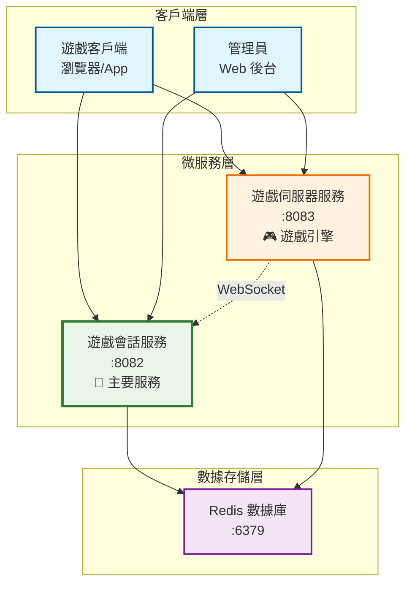
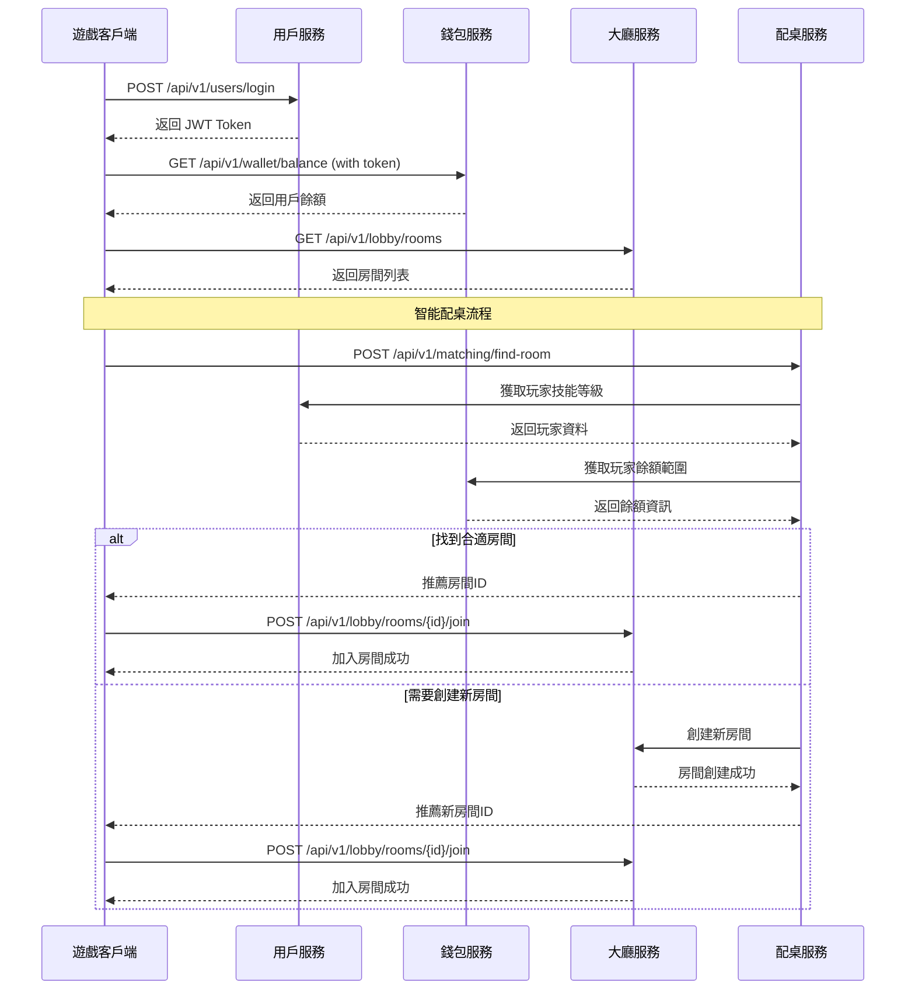
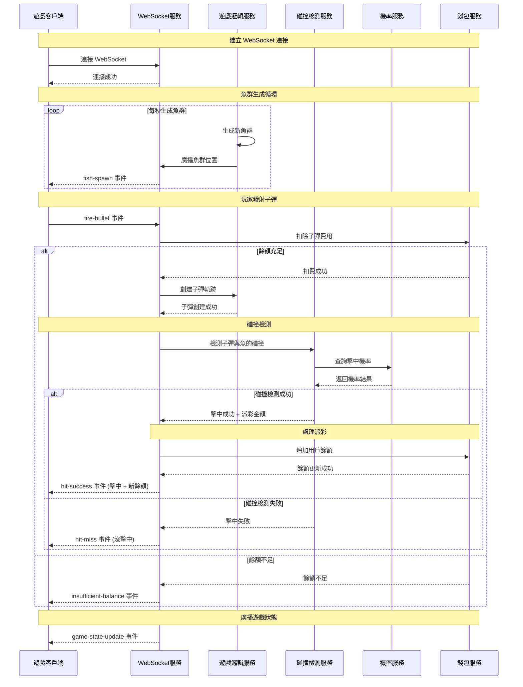
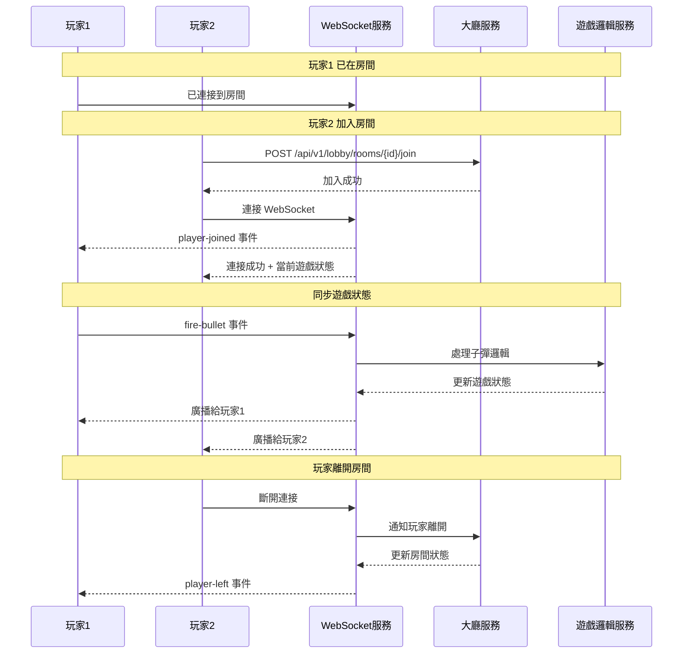

# 電子捕魚機微服務系統設計文檔

## 概述

電子捕魚機微服務系統採用容器化架構，透過 Docker Compose 實現本地開發環境的快速部署，並提供完整的 EKS 生產環境遷移方案。系統基於領域驅動設計（DDD）原則，將複雜的遊戲業務邏輯拆分為8個核心微服務，確保高可用性、可擴展性和低延遲的即時遊戲體驗。

## 架構

### 整體架構圖 - 簡化後的系統架構



### 簡化後的系統架構說明

**🎯 主要服務 - 遊戲會話服務 (Game Session Service)**
- **端口**: 8082
- **狀態**: 健康運行 ✅
- **整合功能**: 
  - 用戶管理：註冊、登入、資料管理
  - 錢包系統：餘額管理、交易記錄
  - 大廳管理：房間列表、房間創建
  - 智能配桌：玩家匹配、技能評級
  - Web 管理後台：即時監控、規則調整

**🎮 遊戲引擎 - 遊戲伺服器服務 (Game Server Service)**
- **端口**: 8083
- **狀態**: 健康運行 ✅
- **整合功能**:
  - 遊戲邏輯：魚群生成、移動軌跡
  - 碰撞檢測：物理碰撞、派彩計算
  - WebSocket 通訊：即時雙向通訊
  - Web 管理後台：遊戲監控、參數調整

**💾 數據存儲 - Redis**
- **端口**: 6379
- **狀態**: 健康運行 ✅
- **用途**: 統一的數據存儲和緩存

**🔧 共用程式模組 (Shared Utils)**
- **性質**: 程式代碼層面的共享模組，不是獨立服務
- **功能**: 日誌記錄、配置管理、Redis 客戶端、錯誤處理、健康檢查
- **使用方式**: 被兩個微服務引用和使用

### 簡化容器配置說明

**總共 3 個 Docker 容器：**

1. **redis** (Redis 數據庫容器)
   - 技術棧：Redis 7.x
   - 端口：6379
   - 數據：所有服務的共享數據存儲
   - 持久化：內存存儲，不持久化（開發環境）

2. **game-session-service** (遊戲會話服務容器)
   - 技術棧：Node.js + Express + Redis Client + EJS
   - 端口：8082 (API + Web 管理後台)
   - 整合功能：
     - 用戶註冊、登入、資料管理
     - 錢包餘額管理、交易記錄
     - 大廳管理和房間列表
     - 智能配桌和玩家匹配
     - 房間創建、銷毀和狀態管理
     - 玩家技能評級和平衡
     - **Web 管理後台**：即時房間監控、配桌規則調整、玩家分佈分析
   - 數據：Redis 存儲用戶資料、錢包資訊、房間狀態、配桌資訊

3. **game-server-service** (遊戲伺服器服務容器)
   - 技術棧：Node.js + Express + Socket.io + Redis Client + EJS
   - 端口：8083 (HTTP + WebSocket + Web 管理後台)
   - 整合功能：
     - 遊戲邏輯：魚群生成、子彈軌跡、內建機率控制
     - 碰撞檢測：物理碰撞計算和派彩處理
     - WebSocket 即時通訊：客戶端連接管理和消息廣播
     - **Web 管理後台**：即時遊戲監控、機率調整、魚群配置、WebSocket 連接狀態
   - 數據：Redis 存儲遊戲狀態、WebSocket 連接和碰撞結果

### 網路架構

系統採用 Docker Compose 內部網路通訊：

1. **應用網路（fish-game-network）**：所有微服務透過 service name 進行內部通訊
2. **對外端口**：只有 WebSocket 服務和用戶服務對外暴露端口
3. **服務發現**：透過 Docker Compose 的內建 DNS 解析服務名稱

## 組件和介面

### 簡化核心微服務

#### 1. 遊戲會話服務 (Game Session Service) - 主要服務
- **技術棧**：Node.js + Express + Redis Client + EJS (管理後台)
- **端口**：8082 (API + Web 管理後台)
- **整合職責**：
  - 用戶註冊、登入、登出、資料管理
  - 遊戲幣餘額管理、儲值和提領處理
  - 交易記錄和對帳
  - JWT Token 生成和驗證
  - 遊戲大廳管理和房間列表
  - 智能配桌和玩家匹配（基於技能等級、餘額等）
  - 房間創建、銷毀和狀態管理
  - 玩家技能評級和平衡機制
  - 房間負載均衡和人數控制
  - **Web 管理後台**：用戶管理、錢包監控、即時房間監控、配桌規則調整、玩家分佈分析
- **API 介面**：
  ```
  # 用戶相關
  POST /api/v1/users/register
  POST /api/v1/users/login
  GET /api/v1/users/profile
  PUT /api/v1/users/profile
  
  # 錢包相關
  GET /api/v1/wallet/balance
  POST /api/v1/wallet/deposit
  POST /api/v1/wallet/withdraw
  GET /api/v1/wallet/transactions
  
  # 大廳相關
  GET /api/v1/lobby/rooms
  POST /api/v1/lobby/rooms/create
  POST /api/v1/lobby/rooms/{id}/join
  DELETE /api/v1/lobby/rooms/{id}/leave
  GET /api/v1/lobby/rooms/{id}/status
  
  # 配桌相關
  POST /api/v1/matching/find-room
  GET /api/v1/matching/room-stats
  POST /api/v1/matching/balance-check
  ```
- **Web 管理後台**：
  ```
  GET /admin                        # 管理後台首頁
  GET /admin/rooms                  # 即時房間狀態監控
  GET /admin/matching               # 配桌規則設定
  GET /admin/players                # 玩家分佈和技能統計
  POST /admin/rooms/{id}/close      # 強制關閉房間
  POST /admin/matching/rules        # 更新配桌規則
  GET /admin/analytics              # 房間使用率分析
  ```

#### 2. 遊戲伺服器服務 (Game Server Service) - 遊戲引擎
- **技術棧**：Node.js + Express + Socket.io + Redis Client + EJS (管理後台)
- **端口**：8083 (HTTP + WebSocket + Web 管理後台)
- **整合職責**：
  - 遊戲邏輯：魚群生成、路徑計算、子彈軌跡模擬
  - 碰撞檢測：物理碰撞計算和派彩處理
  - 內建機率控制：擊中率、派彩倍數、簡單 RTP 控制
  - WebSocket 即時通訊：客戶端連接管理和消息廣播
  - 遊戲世界狀態管理和即時同步
  - **Web 管理後台**：即時遊戲監控、機率調整、魚群配置、WebSocket 連接狀態
- **API 介面**：
  ```
  # 遊戲邏輯相關
  POST /api/v1/game/fish/spawn
  GET /api/v1/game/fish/positions
  POST /api/v1/game/bullet/fire
  GET /api/v1/game/hit-rates
  
  # 碰撞檢測相關
  POST /api/v1/collision/check
  GET /api/v1/collision/result/{id}
  ```
- **Web 管理後台**：
  ```
  GET /admin                        # 管理後台首頁（即時統計數據）
  GET /admin/api/stats              # 即時統計數據 API
  POST /admin/api/config/update     # 即時配置更新 API
  GET /admin/api/config             # 獲取當前配置
  GET /admin/game-monitor           # 即時遊戲狀態監控
  GET /admin/fish-config            # 魚群配置管理
  GET /admin/probability            # 機率和 RTP 設定
  GET /admin/websocket              # WebSocket 連接狀態
  POST /admin/fish-config/update    # 更新魚群配置
  POST /admin/probability/update    # 調整擊中率和派彩
  GET /admin/game-analytics         # 遊戲數據分析
  POST /admin/game/emergency-stop   # 緊急停止遊戲
  ```
- **WebSocket 事件**：
  ```javascript
  // 客戶端事件
  'join-room', 'leave-room', 'fire-bullet', 'player-action'
  'game-state-update', 'fish-spawn', 'collision-result', 'player-joined'
  
  // 內部遊戲邏輯事件
  'fish-positions-update', 'bullet-created', 'game-state-changed'
  'collision-check', 'payout-calculated'
  ```

### Web 管理後台功能

系統提供完整的 Web 管理後台，讓管理員可以即時監控和調整系統參數：

#### 遊戲會話服務管理後台 (http://localhost:8082/admin)
- **用戶管理**：查看用戶列表、封禁/解封用戶、查看用戶詳細資料
- **錢包監控**：即時查看所有用戶餘額、餘額變動趨勢圖表
- **交易審核**：查看所有交易記錄、手動調整用戶餘額、交易異常處理
- **房間監控**：即時查看所有房間狀態、玩家分佈、房間使用率
- **配桌規則**：調整智能配桌參數、技能等級範圍、餘額匹配規則
- **玩家分析**：玩家技能評級、勝率統計、遊戲行為分析
- **系統控制**：強制關閉房間、重新平衡房間、緊急疏散玩家

#### 遊戲伺服器服務管理後台 (http://localhost:8083/admin)
- **即時遊戲監控**：
  - 活躍遊戲房間數量（即時更新）
  - 魚群數量統計（即時更新）
  - 子彈數量統計（即時更新）
  - 今日碰撞次數（即時更新）
  - 命中率統計（即時更新）
  - 總派彩金額（即時更新）
- **即時配置調整**：
  - 魚群生成間隔調整（滑桿/輸入框，即時生效）
  - 子彈速度調整（滑桿/輸入框，即時生效）
  - 命中率調整（滑桿/輸入框，即時生效）
  - 配置變更即時通知所有遊戲房間
- **WebSocket 狀態**：查看所有 WebSocket 連接、訊息傳輸統計、連接品質
- **緊急控制**：緊急停止遊戲、清空房間、重置遊戲狀態

### 即時管理面板架構

#### 即時數據更新機制

**1. 前端即時更新**
```javascript
// 管理面板即時數據更新
const AdminDashboard = {
  // 每秒更新統計數據
  updateInterval: 1000,
  
  // 統計數據結構
  stats: {
    activeRooms: 0,
    fishCount: 0,
    bulletCount: 0,
    todayCollisions: 0,
    hitRate: 0,
    totalPayout: 0
  },
  
  // 配置數據結構
  config: {
    fishSpawnInterval: 2000,
    bulletSpeed: 200,
    hitRate: 0.6
  },
  
  // 初始化即時更新
  init() {
    this.startStatsUpdate();
    this.bindConfigControls();
  },
  
  // 開始統計數據更新
  startStatsUpdate() {
    setInterval(() => {
      this.fetchStats();
    }, this.updateInterval);
  },
  
  // 獲取即時統計數據
  async fetchStats() {
    const response = await fetch('/admin/api/stats');
    const data = await response.json();
    this.updateStatsDisplay(data);
  },
  
  // 更新配置
  async updateConfig(configKey, value) {
    const response = await fetch('/admin/api/config/update', {
      method: 'POST',
      headers: { 'Content-Type': 'application/json' },
      body: JSON.stringify({ [configKey]: value })
    });
    
    if (response.ok) {
      this.showSuccessMessage(`${configKey} 已更新為 ${value}`);
    } else {
      this.showErrorMessage('配置更新失敗');
    }
  }
};
```

**2. 後端即時統計收集**
```javascript
// 遊戲統計收集器
class GameStatsCollector {
  constructor(redisClient) {
    this.redis = redisClient;
    this.stats = {
      activeRooms: 0,
      fishCount: 0,
      bulletCount: 0,
      todayCollisions: 0,
      hitRate: 0,
      totalPayout: 0
    };
  }
  
  // 即時統計數據收集
  async collectStats() {
    // 活躍房間數量
    this.stats.activeRooms = await this.redis.scard('rooms:active');
    
    // 魚群總數量
    const rooms = await this.redis.smembers('rooms:active');
    let totalFish = 0;
    for (const roomId of rooms) {
      const fishCount = await this.redis.llen(`game:fishes:${roomId}`);
      totalFish += fishCount;
    }
    this.stats.fishCount = totalFish;
    
    // 子彈總數量
    let totalBullets = 0;
    for (const roomId of rooms) {
      const bulletCount = await this.redis.llen(`game:bullets:${roomId}`);
      totalBullets += bulletCount;
    }
    this.stats.bulletCount = totalBullets;
    
    // 今日碰撞次數
    const today = new Date().toISOString().split('T')[0];
    this.stats.todayCollisions = await this.redis.get(`stats:collisions:${today}`) || 0;
    
    // 命中率計算
    const totalShots = await this.redis.get(`stats:shots:${today}`) || 0;
    const totalHits = await this.redis.get(`stats:hits:${today}`) || 0;
    this.stats.hitRate = totalShots > 0 ? (totalHits / totalShots * 100).toFixed(1) : 0;
    
    // 總派彩
    this.stats.totalPayout = await this.redis.get(`stats:payout:${today}`) || 0;
    
    return this.stats;
  }
  
  // 更新統計數據（當遊戲事件發生時調用）
  async updateStats(eventType, data) {
    const today = new Date().toISOString().split('T')[0];
    
    switch (eventType) {
      case 'collision':
        await this.redis.incr(`stats:collisions:${today}`);
        break;
      case 'shot':
        await this.redis.incr(`stats:shots:${today}`);
        break;
      case 'hit':
        await this.redis.incr(`stats:hits:${today}`);
        break;
      case 'payout':
        await this.redis.incrbyfloat(`stats:payout:${today}`, data.amount);
        break;
    }
  }
}
```

**3. 配置即時更新機制**
```javascript
// 遊戲配置管理器
class GameConfigManager {
  constructor(redisClient, io) {
    this.redis = redisClient;
    this.io = io; // Socket.io 實例
    this.config = {
      fishSpawnInterval: 2000,
      bulletSpeed: 200,
      hitRate: 0.6
    };
  }
  
  // 獲取當前配置
  async getConfig() {
    const config = await this.redis.hgetall('game:config');
    return {
      fishSpawnInterval: parseInt(config.fishSpawnInterval) || 2000,
      bulletSpeed: parseInt(config.bulletSpeed) || 200,
      hitRate: parseFloat(config.hitRate) || 0.6
    };
  }
  
  // 更新配置
  async updateConfig(configKey, value) {
    // 驗證配置值
    if (!this.validateConfig(configKey, value)) {
      throw new Error(`Invalid config value: ${configKey} = ${value}`);
    }
    
    // 更新 Redis 中的配置
    await this.redis.hset('game:config', configKey, value);
    
    // 更新本地配置
    this.config[configKey] = value;
    
    // 廣播配置變更到所有遊戲房間
    this.io.emit('config-update', {
      key: configKey,
      value: value,
      timestamp: new Date().toISOString()
    });
    
    // 記錄配置變更日誌
    console.log(`Config updated: ${configKey} = ${value}`);
    
    return true;
  }
  
  // 配置驗證
  validateConfig(key, value) {
    const validations = {
      fishSpawnInterval: (v) => v >= 500 && v <= 10000,
      bulletSpeed: (v) => v >= 50 && v <= 500,
      hitRate: (v) => v >= 0.1 && v <= 1.0
    };
    
    return validations[key] ? validations[key](value) : false;
  }
}
```

#### 管理面板 UI 組件設計

**1. 即時統計儀表板**
```html
<!-- 遊戲狀態區塊 -->
<div class="stats-section">
  <h3>🎮 遊戲狀態</h3>
  <div class="stats-grid">
    <div class="stat-item">
      <span class="stat-label">活躍遊戲房間:</span>
      <span class="stat-value" id="activeRooms">0</span>
    </div>
    <div class="stat-item">
      <span class="stat-label">魚群數量:</span>
      <span class="stat-value" id="fishCount">0</span>
    </div>
    <div class="stat-item">
      <span class="stat-label">子彈數量:</span>
      <span class="stat-value" id="bulletCount">0</span>
    </div>
  </div>
</div>

<!-- 碰撞檢測區塊 -->
<div class="stats-section">
  <h3>💥 碰撞檢測</h3>
  <div class="stats-grid">
    <div class="stat-item">
      <span class="stat-label">今日碰撞次數:</span>
      <span class="stat-value" id="todayCollisions">0</span>
    </div>
    <div class="stat-item">
      <span class="stat-label">命中率:</span>
      <span class="stat-value" id="hitRate">0%</span>
    </div>
    <div class="stat-item">
      <span class="stat-label">總派彩:</span>
      <span class="stat-value" id="totalPayout">$0.00</span>
    </div>
  </div>
</div>
```

**2. 即時配置調整介面**
```html
<!-- 遊戲配置區塊 -->
<div class="config-section">
  <h3>⚙️ 遊戲配置</h3>
  <div class="config-controls">
    <!-- 魚群生成間隔 -->
    <div class="config-item">
      <label for="fishSpawnInterval">魚群生成間隔:</label>
      <input type="range" id="fishSpawnInterval" 
             min="500" max="10000" step="100" value="2000">
      <span class="config-value">2秒</span>
      <button onclick="updateConfig('fishSpawnInterval')">應用</button>
    </div>
    
    <!-- 子彈速度 -->
    <div class="config-item">
      <label for="bulletSpeed">子彈速度:</label>
      <input type="range" id="bulletSpeed" 
             min="50" max="500" step="10" value="200">
      <span class="config-value">200px/s</span>
      <button onclick="updateConfig('bulletSpeed')">應用</button>
    </div>
    
    <!-- 命中率 -->
    <div class="config-item">
      <label for="hitRate">命中率:</label>
      <input type="range" id="hitRate" 
             min="0.1" max="1.0" step="0.05" value="0.6">
      <span class="config-value">60%</span>
      <button onclick="updateConfig('hitRate')">應用</button>
    </div>
  </div>
</div>

<!-- 配置狀態提示 -->
<div id="configStatus" class="status-message"></div>
```

### 服務間通訊

簡化後的服務間通訊：

#### WebSocket 事件通訊
- `game-server-service:8083` ↔ `game-session-service:8082` - 遊戲事件和狀態同步
- `admin-panel` ↔ `game-server-service:8083` - 管理面板即時數據和配置更新

#### 內部服務發現
所有服務透過 Docker Compose 的內建 DNS 解析服務名稱：
- `game-session-service:8082` - 遊戲會話服務 (主要服務)
- `game-server-service:8083` - 遊戲伺服器服務 (遊戲引擎)
- `redis:6379` - Redis 數據庫

## 數據模型

### Redis 數據結構

所有服務使用 Redis 作為共享數據存儲，確保數據一致性和支援水平擴展：

#### 用戶服務 Redis 數據結構
```redis
# 用戶基本資料 (Hash)
user:{userId} -> {
  id: "1001",
  username: "player1",
  email: "player1@example.com",
  passwordHash: "hashed_password",
  status: "active",
  nickname: "玩家一",
  avatarUrl: "https://example.com/avatar1.jpg",
  level: "5",
  experience: "1250",
  createdAt: "2024-01-01T00:00:00Z",
  updatedAt: "2024-01-01T12:00:00Z"
}

# 用戶名到用戶ID映射 (String)
username:{username} -> userId

# JWT 會話 (Hash with TTL)
session:{token} -> {
  userId: "1001",
  expiresAt: "2024-01-02T00:00:00Z",
  lastActivity: "2024-01-01T12:00:00Z"
}
# TTL: 24小時

# 在線用戶集合 (Set)
online_users -> Set[userId1, userId2, ...]
```

#### 錢包服務 Redis 數據結構
```redis
# 錢包餘額 (Hash)
wallet:{userId} -> {
  balance: "1000.50",
  frozenBalance: "0.00",
  version: "1",
  updatedAt: "2024-01-01T12:00:00Z"
}

# 交易記錄 (List + Hash)
transactions:{userId} -> List[transactionId1, transactionId2, ...]
transaction:{transactionId} -> {
  id: "tx_123456",
  userId: "1001",
  type: "game_win",
  amount: "50.00",
  balanceBefore: "1000.50",
  balanceAfter: "1050.50",
  referenceId: "game_round_789",
  status: "completed",
  createdAt: "2024-01-01T12:00:00Z"
}

# 每日排行榜 (Sorted Set)
leaderboard:daily -> SortedSet(userId, totalWin)
leaderboard:weekly -> SortedSet(userId, totalWin)
```

#### 大廳服務 Redis 數據結構
```redis
# 房間資料 (Hash)
room:{roomId} -> {
  id: "room_001",
  name: "初級場",
  maxPlayers: "4",
  currentPlayers: "2",
  status: "playing",
  createdAt: "2024-01-01T10:00:00Z",
  updatedAt: "2024-01-01T12:00:00Z"
}

# 房間玩家列表 (List)
room:players:{roomId} -> List[
  '{"userId":1001,"nickname":"玩家一","position":1,"joinedAt":"2024-01-01T10:00:00Z"}',
  '{"userId":1002,"nickname":"玩家二","position":2,"joinedAt":"2024-01-01T10:30:00Z"}'
]

# 玩家房間映射 (String)
player:room:{userId} -> roomId

# 房間列表 (Set)
rooms:active -> Set[roomId1, roomId2, ...]
rooms:waiting -> Set[roomId1, roomId2, ...]
```

#### 遊戲邏輯服務 Redis 數據結構
```redis
# 遊戲狀態 (Hash)
game:state:{roomId} -> {
  roomId: "room_001",
  status: "playing",
  currentRound: "1",
  updatedAt: "2024-01-01T12:00:00Z"
}

# 魚群數據 (List + Hash)
game:fishes:{roomId} -> List[fishId1, fishId2, ...]
fish:{fishId} -> {
  id: "fish_123",
  type: "medium",
  value: "5",
  positionX: "300.5",
  positionY: "200.8",
  speed: "80",
  directionX: "1.0",
  directionY: "0.5",
  spawnedAt: "2024-01-01T12:00:00Z",
  isAlive: "true"
}

# 子彈數據 (List + Hash)
game:bullets:{roomId} -> List[bulletId1, bulletId2, ...]
bullet:{bulletId} -> {
  id: "bullet_456",
  playerId: "1001",
  positionX: "150.0",
  positionY: "400.0",
  directionX: "0.8",
  directionY: "-0.6",
  speed: "200",
  power: "1",
  firedAt: "2024-01-01T12:00:00Z",
  isActive: "true"
}

# 魚類配置 (Hash) - 包含內建機率
fish:config -> {
  small: '{"value":2,"speed":100,"hitRate":0.8,"payout":[2,4,6]}',
  medium: '{"value":5,"speed":80,"hitRate":0.6,"payout":[5,10,15]}',
  large: '{"value":10,"speed":60,"hitRate":0.4,"payout":[10,20,30]}',
  boss: '{"value":50,"speed":40,"hitRate":0.2,"payout":[50,100,200]}'
}
```

#### 配桌服務 Redis 數據結構
```redis
# 玩家技能評級 (Hash)
player:skill:{userId} -> {
  level: "5",
  winRate: "0.65",
  avgBetAmount: "50.00",
  totalGames: "1000",
  recentPerformance: "0.70",
  skillScore: "750",
  lastUpdated: "2024-01-01T12:00:00Z"
}

# 房間匹配資訊 (Hash)
room:matching:{roomId} -> {
  skillRange: "500-800",
  balanceRange: "100-1000",
  avgSkillLevel: "650",
  playerCount: "3",
  isBalanced: "true",
  lastBalanceCheck: "2024-01-01T12:00:00Z"
}

# 等待配桌的玩家隊列 (Sorted Set by skill score)
matching:queue -> SortedSet(userId, skillScore)

# 房間負載統計 (Hash)
room:load:stats -> {
  totalRooms: "50",
  activeRooms: "35",
  avgPlayersPerRoom: "2.8",
  peakHourRooms: "45",
  lastUpdated: "2024-01-01T12:00:00Z"
}

# 玩家匹配歷史 (List with TTL)
player:match:history:{userId} -> List[
  '{"roomId":"room_001","joinTime":"2024-01-01T10:00:00Z","leaveTime":"2024-01-01T11:00:00Z","performance":"win"}',
  '{"roomId":"room_002","joinTime":"2024-01-01T11:30:00Z","leaveTime":"2024-01-01T12:00:00Z","performance":"lose"}'
]
# TTL: 24小時
```

#### WebSocket 服務 Redis 數據結構
```redis
# WebSocket 連接 (Hash)
ws:connection:{socketId} -> {
  socketId: "socket_abc123",
  userId: "1001",
  roomId: "room_001",
  lastPing: "2024-01-01T12:00:00Z",
  isActive: "true",
  connectedAt: "2024-01-01T10:00:00Z"
}

# 房間訂閱 (Set)
ws:room:subscribers:{roomId} -> Set[socketId1, socketId2, ...]

# 用戶連接映射 (String)
ws:user:socket:{userId} -> socketId

# 消息隊列 (List)
ws:message:queue -> List[
  '{"id":"msg_123","type":"game-state-update","roomId":"room_001","data":{},"timestamp":"2024-01-01T12:00:00Z"}',
  '{"id":"msg_124","type":"collision-result","roomId":"room_001","data":{},"timestamp":"2024-01-01T12:00:01Z"}'
]

# 廣播統計 (Hash)
ws:broadcast:stats -> {
  totalMessages: "1000",
  totalConnections: "50",
  messagesPerSecond: "10",
  lastUpdated: "2024-01-01T12:00:00Z"
}
```

#### Redis 配置和優化
```redis
# Redis 配置建議
maxmemory 2gb
maxmemory-policy allkeys-lru
save 900 1
save 300 10
save 60 10000
appendonly yes
appendfsync everysec

# 連接池配置
max_connections: 100
connection_timeout: 5000
retry_attempts: 3
```

## 錯誤處理

### 錯誤分類和處理策略

#### 1. 業務邏輯錯誤
- **用戶錯誤**：餘額不足、重複操作等
- **處理方式**：返回明確的錯誤碼和訊息
- **HTTP 狀態碼**：400 Bad Request

#### 2. 系統錯誤
- **服務不可用**：數據庫連接失敗、第三方服務異常
- **處理方式**：熔斷器、重試機制、降級服務
- **HTTP 狀態碼**：503 Service Unavailable

#### 3. 網路錯誤
- **WebSocket 斷線**：自動重連機制
- **請求超時**：設置合理的超時時間和重試策略

### 統一錯誤響應格式
```json
{
  "success": false,
  "errorCode": "INSUFFICIENT_BALANCE",
  "message": "餘額不足，無法進行此操作",
  "timestamp": "2024-01-01T12:00:00Z",
  "traceId": "abc123def456"
}
```

### 魚機系統完整流程時序圖

#### 1. 用戶登入和智能配桌流程



#### 2. 遊戲進行中的完整流程



#### 3. 房間管理和多玩家同步



## 測試策略

### 測試金字塔

#### 1. 單元測試 (70%)
- **覆蓋範圍**：業務邏輯、工具函數、數據模型
- **工具**：JUnit (Java), Jest (Node.js), pytest (Python), Go test (Go)
- **目標覆蓋率**：80%+

#### 2. 整合測試 (20%)
- **覆蓋範圍**：服務間 API 調用、數據庫操作
- **工具**：TestContainers, Docker Compose for testing
- **測試場景**：
  - 用戶註冊登入流程
  - 錢包交易處理
  - 遊戲會話管理

#### 3. 端到端測試 (10%)
- **覆蓋範圍**：完整的用戶操作流程
- **工具**：Selenium, Cypress
- **測試場景**：
  - 完整遊戲流程
  - 多玩家互動
  - 異常情況處理

### 性能測試
- **工具**：JMeter, K6
- **測試指標**：
  - WebSocket 連接數：10,000+ 並發
  - API 響應時間：< 100ms (P95)
  - 碰撞檢測延遲：< 50ms
  - 系統吞吐量：1000+ TPS

### 混沌工程
- **工具**：Chaos Monkey, Litmus
- **測試場景**：
  - 隨機服務故障
  - 網路分區
  - 資源耗盡

## 部署架構

### Docker Compose 本地部署

#### 環境配置
- **開發環境**：單機部署，所有服務在同一主機
- **測試環境**：模擬生產環境，支援多實例
- **資源配置**：
  - CPU：每個服務 0.5-2 cores
  - 記憶體：每個服務 512MB-2GB
  - 存儲：SSD，支援數據持久化

#### 服務編排
```yaml
# docker-compose.yml 結構概覽
version: '3.8'
services:
  # 基礎設施
  redis
  
  # 微服務
  game-session-service, game-server-service

networks:
  fish-game-network

# 開發環境不使用持久化存儲
```

### EKS 生產部署

#### 集群架構
- **節點組**：
  - 系統節點組：t3.medium (基礎設施服務)
  - 應用節點組：c5.large (微服務)
  - 遊戲節點組：c5.xlarge (遊戲邏輯、碰撞檢測)
- **網路**：VPC + 私有子網 + NAT Gateway
- **存儲**：EBS + EFS (共享存儲)

#### Kubernetes 資源配置
```yaml
# 示例：遊戲會話服務部署
apiVersion: apps/v1
kind: Deployment
metadata:
  name: game-session-service
spec:
  replicas: 3
  selector:
    matchLabels:
      app: game-session-service
  template:
    spec:
      containers:
      - name: game-session
        image: fish-game/game-session:latest
        resources:
          requests:
            cpu: 500m
            memory: 1Gi
          limits:
            cpu: 2
            memory: 2Gi
        env:
        - name: REDIS_HOST
          value: "redis-service"
        - name: SERVICE_PORT
          value: "8082"
---
apiVersion: v1
kind: Service
metadata:
  name: game-session-service
spec:
  selector:
    app: game-session-service
  ports:
  - port: 8082
    targetPort: 8082
---
apiVersion: autoscaling/v2
kind: HorizontalPodAutoscaler
metadata:
  name: game-session-hpa
spec:
  scaleTargetRef:
    apiVersion: apps/v1
    kind: Deployment
    name: game-session-service
  minReplicas: 3
  maxReplicas: 10
  metrics:
  - type: Resource
    resource:
      name: cpu
      target:
        type: Utilization
        averageUtilization: 70
```

#### AWS 整合服務
- **RDS**：託管數據庫服務
- **ElastiCache**：託管 Redis 服務
- **Application Load Balancer**：負載均衡
- **CloudWatch**：監控和日誌
- **Secrets Manager**：敏感資訊管理
- **ECR**：容器映像倉庫

## 安全考量

### 身份驗證和授權
- **JWT Token**：無狀態身份驗證
- **OAuth 2.0**：第三方登入支援
- **RBAC**：基於角色的訪問控制

### 數據安全
- **傳輸加密**：TLS 1.3
- **存儲加密**：AES-256
- **敏感數據脫敏**：日誌和監控中的敏感資訊處理

### 網路安全
- **服務網格**：Istio (可選)
- **網路策略**：Kubernetes NetworkPolicy
- **防火牆規則**：AWS Security Groups

### 合規性
- **數據保護**：GDPR 合規
- **審計日誌**：完整的操作記錄
- **資料備份**：定期備份和災難恢復

這個設計文檔提供了完整的系統架構藍圖，涵蓋了從本地開發到生產部署的所有關鍵技術決策和實現細節。