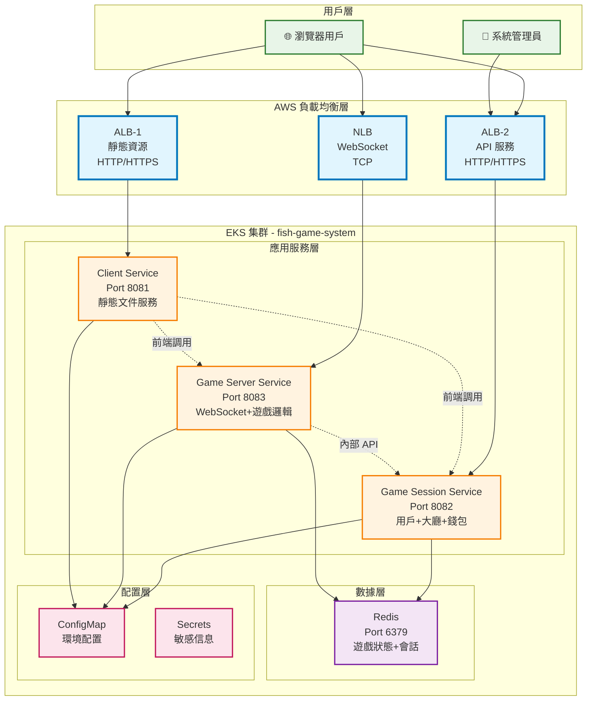

# Design Document

## Overview

魚機遊戲微服務 Workshop 是一個完整的雲原生應用程序，採用微服務架構設計，從本地 Docker Compose 開發環境逐步遷移到 AWS EKS 生產環境。系統設計遵循雲原生十二要素應用原則，實現高可用性、可擴展性和可維護性。

### 核心設計原則

1. **微服務架構**：服務按業務功能拆分，每個服務獨立部署和擴展
2. **容器化優先**：所有服務使用 Docker 容器化，支持一致的部署環境
3. **雲原生設計**：充分利用 Kubernetes 和 AWS 雲服務的優勢
4. **漸進式部署**：從本地開發到雲端生產的平滑遷移路徑
5. **教學導向**：每個設計決策都考慮學習價值和實踐意義

## Architecture

### 系統架構概覽



### 架構決策說明

#### 1. 負載均衡器選擇
- **ALB (Application Load Balancer)**：處理 HTTP/HTTPS 流量，支持基於路徑的路由
- **NLB (Network Load Balancer)**：處理 WebSocket TCP 連接，提供更低延遲

#### 2. 服務拆分策略
- **Client Service**：專注於靜態資源服務，簡化前端部署
- **Session Service**：整合用戶管理、大廳和錢包功能，減少服務間調用
- **Server Service**：專注於遊戲邏輯和 WebSocket 通信，保證遊戲性能

#### 3. 數據存儲選擇
- **Redis**：作為共享狀態存儲，支持高性能讀寫和發布訂閱

## Components and Interfaces

### Client Service (前端服務)

**職責**：
- 提供靜態 HTML、CSS、JavaScript 文件
- 處理前端路由和資源請求
- 配置前端 API 和 WebSocket 端點

**技術棧**：
- Node.js + Express.js
- 靜態文件服務
- 環境變數配置

**接口設計**：
```javascript
// HTTP 端點
GET /                    // 遊戲主頁面
GET /assets/*           // 靜態資源
GET /health             // 健康檢查

// 環境變數配置
FRONTEND_SESSION_URL    // API 服務地址
FRONTEND_GAME_URL       // WebSocket 服務地址
```

### Game Session Service (會話管理服務)

**職責**：
- 用戶註冊、登入和會話管理
- 遊戲大廳和房間管理
- 錢包系統和交易處理
- 管理員界面和統計功能

**技術棧**：
- Node.js + Express.js
- EJS 模板引擎
- Redis 客戶端

**接口設計**：
```javascript
// 用戶管理 API
POST /api/register      // 用戶註冊
POST /api/login         // 用戶登入
GET  /api/profile       // 用戶資料

// 大廳管理 API
GET  /api/rooms         // 獲取房間列表
POST /api/rooms/join    // 加入房間

// 錢包管理 API
GET  /api/wallet        // 獲取錢包餘額
POST /api/wallet/deposit // 充值
POST /api/wallet/withdraw // 提現

// 管理員界面
GET  /admin             // 管理員頁面
GET  /health            // 健康檢查
```

### Game Server Service (遊戲邏輯服務)

**職責**：
- WebSocket 連接管理
- 遊戲邏輯處理和碰撞檢測
- 即時遊戲狀態同步
- 遊戲統計和監控

**技術棧**：
- Node.js + Express.js
- Socket.IO (WebSocket)
- Redis 客戶端
- Axios (HTTP 客戶端)

**接口設計**：
```javascript
// WebSocket 事件
socket.on('join-game')     // 加入遊戲
socket.on('shoot')         // 射擊事件
socket.on('leave-game')    // 離開遊戲

socket.emit('game-state')  // 遊戲狀態更新
socket.emit('score-update') // 分數更新

// HTTP API
GET  /health              // 健康檢查
GET  /admin               // 管理員頁面
POST /api/wallet-update   // 錢包更新 (內部調用)
```

### Redis Data Layer (數據層)

**職責**：
- 用戶會話存儲
- 遊戲狀態緩存
- 房間和玩家信息
- 實時統計數據

**數據結構設計**：
```redis
# 用戶會話
user:session:{userId}     // 用戶會話信息
user:profile:{userId}     // 用戶資料
user:wallet:{userId}      // 錢包餘額

# 遊戲狀態
game:room:{roomId}        // 房間信息
game:players:{roomId}     // 房間玩家列表
game:state:{roomId}       // 遊戲狀態

# 統計數據
stats:daily:{date}        // 每日統計
stats:users:online        // 在線用戶數
```

## Data Models

### 用戶數據模型

```typescript
interface User {
  id: string;
  username: string;
  email: string;
  createdAt: Date;
  lastLoginAt: Date;
  status: 'active' | 'inactive' | 'banned';
}

interface UserSession {
  userId: string;
  sessionId: string;
  loginAt: Date;
  expiresAt: Date;
  ipAddress: string;
}

interface Wallet {
  userId: string;
  balance: number;
  currency: string;
  lastUpdated: Date;
}
```

### 遊戲數據模型

```typescript
interface GameRoom {
  id: string;
  name: string;
  maxPlayers: number;
  currentPlayers: number;
  status: 'waiting' | 'playing' | 'finished';
  createdAt: Date;
}

interface Player {
  userId: string;
  roomId: string;
  position: { x: number; y: number };
  score: number;
  ammunition: number;
  joinedAt: Date;
}

interface GameState {
  roomId: string;
  fishes: Fish[];
  bullets: Bullet[];
  players: Player[];
  startTime: Date;
  duration: number;
}
```

### 配置數據模型

```typescript
interface ServiceConfig {
  // Redis 配置
  redisHost: string;
  redisPort: number;
  
  // 服務發現配置
  sessionServiceHost: string;
  gameServerServiceHost: string;
  
  // 前端配置
  frontendSessionUrl: string;
  frontendGameUrl: string;
  
  // 環境配置
  nodeEnv: 'development' | 'production';
}
```

## Error Handling

### 錯誤處理策略

#### 1. 應用層錯誤處理

```javascript
// 統一錯誤處理中間件
class ErrorHandler {
  static handle(err, req, res, next) {
    const error = {
      status: err.status || 500,
      message: err.message || 'Internal Server Error',
      timestamp: new Date().toISOString(),
      path: req.path
    };
    
    // 記錄錯誤日誌
    console.error('Error:', error);
    
    // 返回錯誤響應
    res.status(error.status).json(error);
  }
}
```

#### 2. 服務間調用錯誤處理

```javascript
// HTTP 客戶端錯誤處理
class ApiClient {
  static async callService(url, options) {
    try {
      const response = await axios(url, {
        ...options,
        timeout: 5000,
        retry: 3
      });
      return response.data;
    } catch (error) {
      if (error.code === 'ECONNREFUSED') {
        throw new ServiceUnavailableError('Service is not available');
      }
      throw error;
    }
  }
}
```

#### 3. WebSocket 錯誤處理

```javascript
// WebSocket 連接錯誤處理
io.on('connection', (socket) => {
  socket.on('error', (error) => {
    console.error('WebSocket error:', error);
    socket.emit('error', { message: 'Connection error occurred' });
  });
  
  socket.on('disconnect', (reason) => {
    console.log('Client disconnected:', reason);
    // 清理用戶狀態
    cleanupPlayerState(socket.userId);
  });
});
```

### Kubernetes 層面錯誤處理

#### 1. 健康檢查配置

```yaml
livenessProbe:
  httpGet:
    path: /health
    port: 8080
  initialDelaySeconds: 30
  periodSeconds: 10
  timeoutSeconds: 5
  failureThreshold: 3

readinessProbe:
  httpGet:
    path: /health
    port: 8080
  initialDelaySeconds: 5
  periodSeconds: 5
  timeoutSeconds: 3
  failureThreshold: 3
```

#### 2. 資源限制和恢復

```yaml
resources:
  requests:
    memory: "256Mi"
    cpu: "250m"
  limits:
    memory: "512Mi"
    cpu: "500m"

# 自動重啟策略
restartPolicy: Always
```

## Testing Strategy

### 測試層級設計

#### 1. 單元測試 (Unit Tests)

**範圍**：個別函數和類別的測試
**工具**：Jest, Mocha
**覆蓋率目標**：80%+

```javascript
// 示例：錢包服務單元測試
describe('WalletService', () => {
  test('should update balance correctly', async () => {
    const wallet = new WalletService();
    const result = await wallet.updateBalance('user123', 100);
    expect(result.balance).toBe(100);
  });
});
```

#### 2. 集成測試 (Integration Tests)

**範圍**：服務間接口和數據庫交互測試
**工具**：Supertest, Redis Mock
**重點**：API 端點和 WebSocket 事件

```javascript
// 示例：API 集成測試
describe('Session API', () => {
  test('POST /api/login should return valid session', async () => {
    const response = await request(app)
      .post('/api/login')
      .send({ username: 'test', password: 'password' });
    
    expect(response.status).toBe(200);
    expect(response.body.sessionId).toBeDefined();
  });
});
```

#### 3. 端到端測試 (E2E Tests)

**範圍**：完整用戶流程測試
**工具**：Playwright, Cypress
**場景**：用戶註冊 → 登入 → 遊戲 → 錢包操作

```javascript
// 示例：E2E 測試
test('complete game flow', async ({ page }) => {
  await page.goto('/');
  await page.click('#register-btn');
  await page.fill('#username', 'testuser');
  await page.fill('#password', 'password');
  await page.click('#submit-btn');
  
  // 驗證登入成功
  await expect(page.locator('#game-lobby')).toBeVisible();
});
```

#### 4. 容器測試 (Container Tests)

**範圍**：Docker 容器和 Kubernetes 部署測試
**工具**：Testcontainers, kubectl
**重點**：容器啟動、健康檢查、服務發現

```bash
# 示例：容器健康檢查測試
kubectl apply -f k8s-manifests/
kubectl wait --for=condition=ready pod -l app=client-service --timeout=60s
kubectl get pods -n fish-game-system
```

### 測試環境配置

#### 1. 本地測試環境

```yaml
# docker-compose.test.yml
version: '3.8'
services:
  redis-test:
    image: redis:alpine
    ports:
      - "6380:6379"
  
  session-service-test:
    build: ./services/game-session-service
    environment:
      - NODE_ENV=test
      - REDIS_HOST=redis-test
    depends_on:
      - redis-test
```

#### 2. CI/CD 測試流水線

```yaml
# .github/workflows/test.yml
name: Test Pipeline
on: [push, pull_request]

jobs:
  test:
    runs-on: ubuntu-latest
    steps:
      - uses: actions/checkout@v2
      - name: Setup Node.js
        uses: actions/setup-node@v2
        with:
          node-version: '18'
      
      - name: Install dependencies
        run: npm ci
      
      - name: Run unit tests
        run: npm test
      
      - name: Run integration tests
        run: npm run test:integration
      
      - name: Build Docker images
        run: docker-compose build
      
      - name: Run container tests
        run: docker-compose -f docker-compose.test.yml up --abort-on-container-exit
```

### 性能測試策略

#### 1. 負載測試

**工具**：Artillery, K6
**目標**：
- 併發用戶：100-500 用戶
- 響應時間：< 200ms (API), < 50ms (WebSocket)
- 錯誤率：< 1%

```javascript
// 示例：負載測試配置
export let options = {
  stages: [
    { duration: '2m', target: 100 },
    { duration: '5m', target: 100 },
    { duration: '2m', target: 200 },
    { duration: '5m', target: 200 },
    { duration: '2m', target: 0 },
  ],
};
```

#### 2. WebSocket 性能測試

**重點**：
- 連接建立時間
- 消息傳輸延遲
- 併發連接數限制
- 內存使用情況

### 測試數據管理

#### 1. 測試數據準備

```javascript
// 測試數據工廠
class TestDataFactory {
  static createUser(overrides = {}) {
    return {
      id: uuid(),
      username: 'testuser',
      email: 'test@example.com',
      createdAt: new Date(),
      ...overrides
    };
  }
  
  static createGameRoom(overrides = {}) {
    return {
      id: uuid(),
      name: 'Test Room',
      maxPlayers: 4,
      currentPlayers: 0,
      status: 'waiting',
      ...overrides
    };
  }
}
```

#### 2. 測試數據清理

```javascript
// 測試後清理
afterEach(async () => {
  await redis.flushdb();
  await cleanupTestUsers();
  await cleanupTestRooms();
});
```