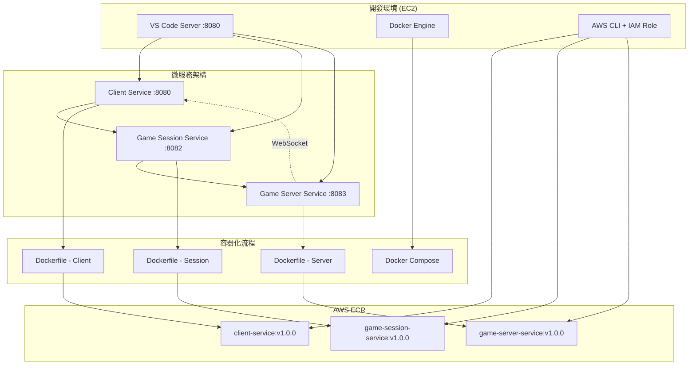

# 服務驗證和容器化設計文檔

## 概述

本設計文檔描述了魚機遊戲微服務系統的驗證、容器化和 ECR 整合的技術架構。基於已建立的開發環境，我們將驗證現有服務功能，將其容器化，並準備部署到 EKS。

## 架構

### 系統架構圖



### 服務端口配置

| 服務 | 端口 | 協議 | 用途 |
|------|------|------|------|
| Client Service | 8080 | HTTP/WebSocket | 客戶端介面和 WebSocket 連接 |
| Game Session Service | 8082 | HTTP | 遊戲會話管理 API |
| Game Server Service | 8083 | HTTP/WebSocket | 遊戲邏輯和實時通信 |
| VS Code Server | 8080 | HTTP | 開發環境 |

## 組件和介面

### 1. 服務驗證組件

#### Client Service 驗證
- **健康檢查端點**: `GET /health`
- **靜態資源**: 提供遊戲客戶端 HTML/JS/CSS
- **WebSocket 端點**: `/ws` 用於實時通信
- **API 端點**: RESTful API 用於遊戲操作

#### Game Session Service 驗證
- **健康檢查端點**: `GET /health`
- **會話管理**: `POST /sessions`, `GET /sessions/:id`
- **玩家管理**: `POST /sessions/:id/players`
- **遊戲狀態**: `GET /sessions/:id/status`

#### Game Server Service 驗證
- **健康檢查端點**: `GET /health`
- **遊戲邏輯**: 處理遊戲規則和狀態更新
- **WebSocket 處理**: 實時遊戲事件廣播
- **積分系統**: 計算和更新玩家積分

### 2. 容器化組件

#### Dockerfile 設計原則
- **多階段構建**: 減少最終映像大小
- **非 root 用戶**: 提高安全性
- **健康檢查**: 內建容器健康檢查
- **環境變數**: 支援配置外部化

#### Docker Compose 編排
- **服務依賴**: 定義服務啟動順序
- **網路配置**: 內部服務通信網路
- **卷掛載**: 持久化數據和日誌
- **環境配置**: 統一環境變數管理

### 3. ECR 整合組件

#### 倉庫結構
```
946430773461.dkr.ecr.ap-northeast-2.amazonaws.com/
├── fish-game/client-service
├── fish-game/game-session-service
└── fish-game/game-server-service
```

#### 映像標籤策略
- **語義化版本**: `v1.0.0`, `v1.0.1`, `v1.1.0`
- **環境標籤**: `dev`, `staging`, `prod`
- **Git 提交**: `git-<commit-hash>`
- **最新標籤**: `latest`

## 數據模型

### 遊戲會話數據模型
```json
{
  "sessionId": "string",
  "players": [
    {
      "playerId": "string",
      "name": "string",
      "score": "number",
      "status": "active|inactive"
    }
  ],
  "gameState": {
    "status": "waiting|playing|finished",
    "currentRound": "number",
    "timeRemaining": "number"
  },
  "createdAt": "timestamp",
  "updatedAt": "timestamp"
}
```

### 容器配置數據模型
```yaml
# docker-compose.yml 結構
version: '3.8'
services:
  client-service:
    image: client-service:latest
    ports: ["8080:8080"]
    environment:
      - NODE_ENV=development
      - SESSION_SERVICE_URL=http://game-session-service:8082
      - GAME_SERVER_URL=http://game-server-service:8083
    healthcheck:
      test: ["CMD", "curl", "-f", "http://localhost:8080/health"]
      interval: 30s
      timeout: 10s
      retries: 3
```

## 錯誤處理

### 服務驗證錯誤處理
1. **連接失敗**: 重試機制，最多 3 次
2. **端口衝突**: 自動檢測並建議替代端口
3. **依賴服務不可用**: 優雅降級和錯誤訊息
4. **健康檢查失敗**: 詳細的診斷資訊

### 容器化錯誤處理
1. **構建失敗**: 詳細的構建日誌和錯誤分析
2. **映像過大**: 建議優化策略
3. **運行時錯誤**: 容器日誌收集和分析
4. **資源不足**: 資源使用監控和警告

### ECR 整合錯誤處理
1. **認證失敗**: IAM 權限檢查和修復建議
2. **推送失敗**: 網路連接和重試機制
3. **映像拉取失敗**: 映像存在性驗證
4. **標籤衝突**: 版本管理策略建議

## 測試策略

### 單元測試
- **服務功能測試**: 每個微服務的核心功能
- **API 端點測試**: 所有 REST API 的輸入輸出驗證
- **WebSocket 測試**: 實時通信功能測試
- **錯誤處理測試**: 異常情況的處理驗證

### 整合測試
- **服務間通信**: 微服務之間的 API 調用
- **端到端流程**: 完整的遊戲流程測試
- **負載測試**: 並發用戶和高負載情況
- **容器編排測試**: Docker Compose 環境測試

### 部署測試
- **容器構建測試**: Dockerfile 構建驗證
- **ECR 推送測試**: 映像推送和拉取驗證
- **健康檢查測試**: 容器健康狀態監控
- **回滾測試**: 部署失敗時的回滾機制

## 安全考量

### 容器安全
- **非 root 用戶**: 所有容器以非特權用戶運行
- **最小化映像**: 只包含必要的依賴和文件
- **安全掃描**: 定期掃描容器映像漏洞
- **秘密管理**: 敏感資訊使用環境變數或 AWS Secrets Manager

### 網路安全
- **內部網路**: 服務間通信使用內部網路
- **端口限制**: 只暴露必要的端口
- **HTTPS/WSS**: 生產環境使用加密連接
- **防火牆規則**: 限制不必要的網路訪問

### AWS 安全
- **IAM 最小權限**: 只授予必要的 AWS 權限
- **ECR 訪問控制**: 限制映像推送和拉取權限
- **VPC 隔離**: 使用私有子網隔離服務
- **日誌監控**: 啟用 CloudTrail 和 CloudWatch 監控

## 效能考量

### 服務效能
- **響應時間**: API 響應時間 < 200ms
- **並發處理**: 支援至少 100 並發用戶
- **WebSocket 連接**: 支援至少 1000 個同時連接
- **記憶體使用**: 每個服務記憶體使用 < 512MB

### 容器效能
- **啟動時間**: 容器啟動時間 < 30 秒
- **映像大小**: 每個映像大小 < 500MB
- **資源限制**: CPU 和記憶體限制配置
- **健康檢查**: 健康檢查間隔和超時優化

### ECR 效能
- **推送速度**: 映像推送時間 < 5 分鐘
- **拉取速度**: 映像拉取時間 < 2 分鐘
- **並行操作**: 支援多個映像同時推送
- **區域優化**: 使用就近的 ECR 區域

## 監控和日誌

### 應用監控
- **健康檢查**: 定期檢查服務健康狀態
- **效能指標**: CPU、記憶體、網路使用率
- **業務指標**: 遊戲會話數、玩家數、錯誤率
- **警報設定**: 關鍵指標異常時的警報

### 容器監控
- **容器狀態**: 運行、停止、重啟次數
- **資源使用**: 容器級別的資源監控
- **日誌收集**: 統一的日誌收集和分析
- **映像掃描**: 定期的安全漏洞掃描

### AWS 監控
- **ECR 使用**: 儲存使用量和推送拉取次數
- **IAM 活動**: 權限使用和異常訪問監控
- **成本監控**: AWS 資源使用成本追蹤
- **合規檢查**: 安全和合規性檢查

## 部署策略

### 開發環境部署
1. **本地驗證**: 在開發環境驗證所有服務
2. **容器構建**: 構建所有服務的 Docker 映像
3. **本地測試**: 使用 Docker Compose 進行整合測試
4. **ECR 推送**: 推送驗證過的映像到 ECR

### 版本管理
- **語義化版本**: 遵循 SemVer 版本規範
- **Git 標籤**: 每個版本對應 Git 標籤
- **變更日誌**: 維護詳細的變更記錄
- **回滾計劃**: 每個版本的回滾策略

### 自動化流程
- **構建腳本**: 自動化的構建和測試腳本
- **部署腳本**: 一鍵部署到不同環境
- **驗證腳本**: 部署後的自動驗證
- **清理腳本**: 舊版本和資源的清理

這個設計為後續的 EKS 部署奠定了堅實的基礎，確保所有服務都經過充分驗證和優化。