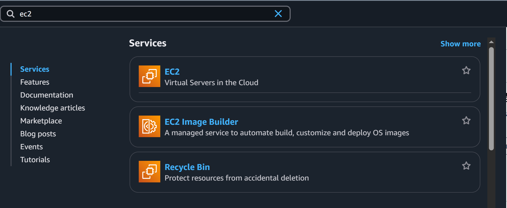
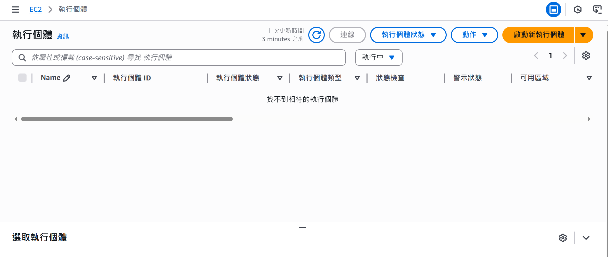
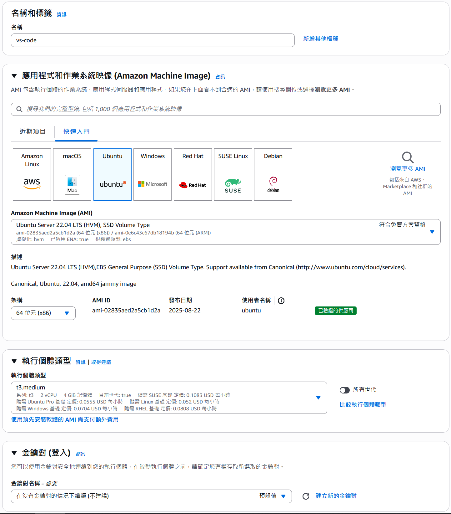
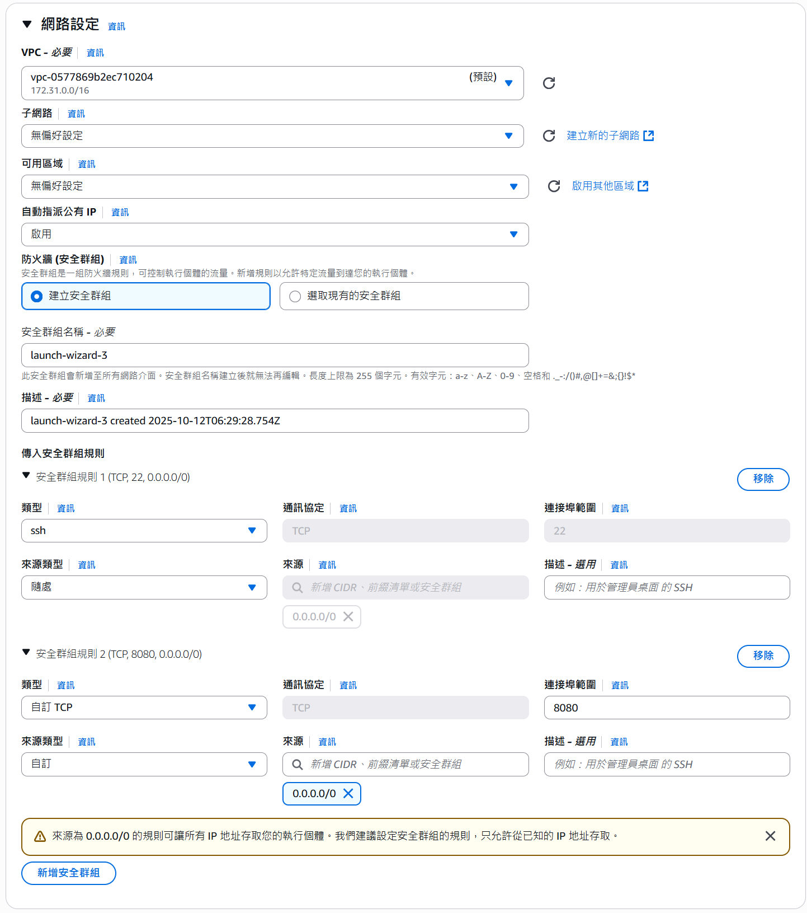
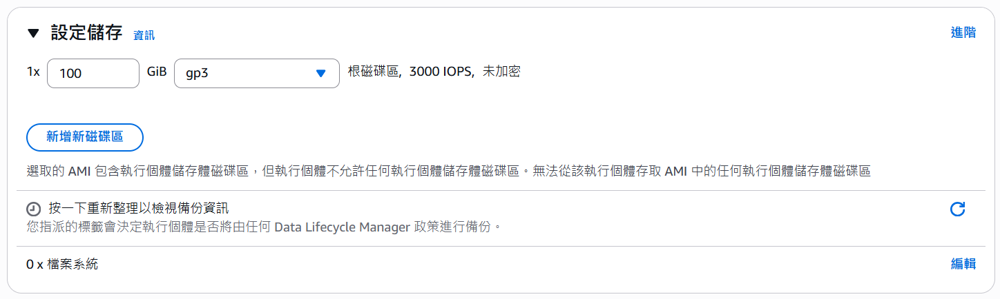
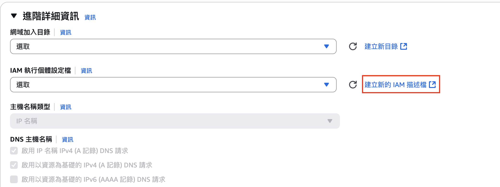
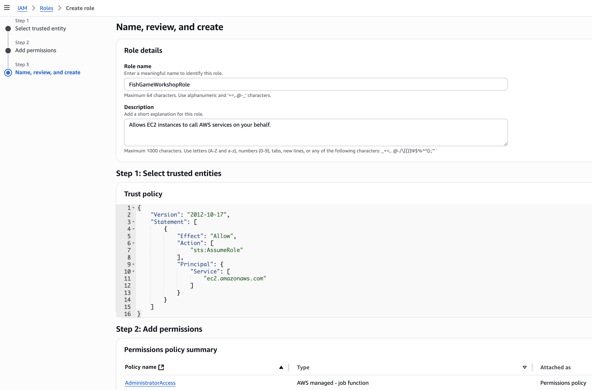
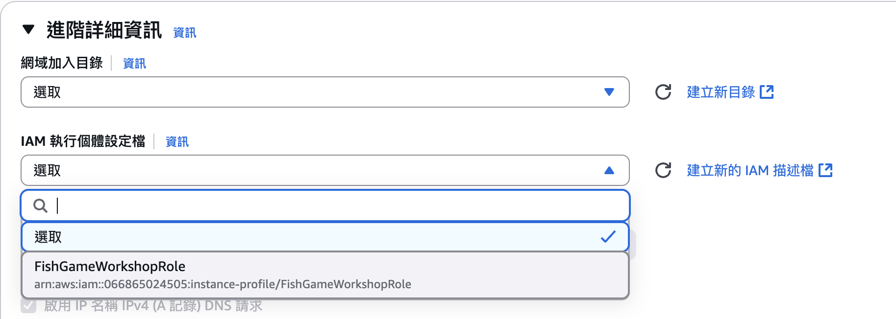
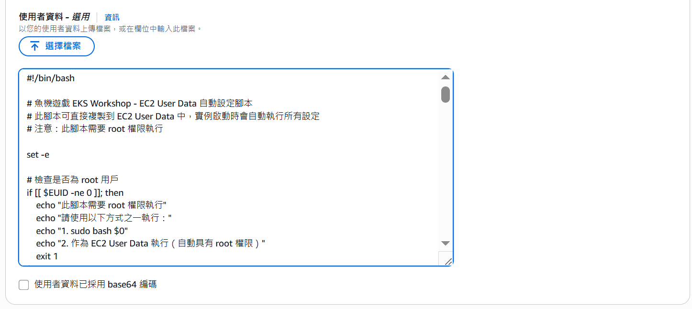
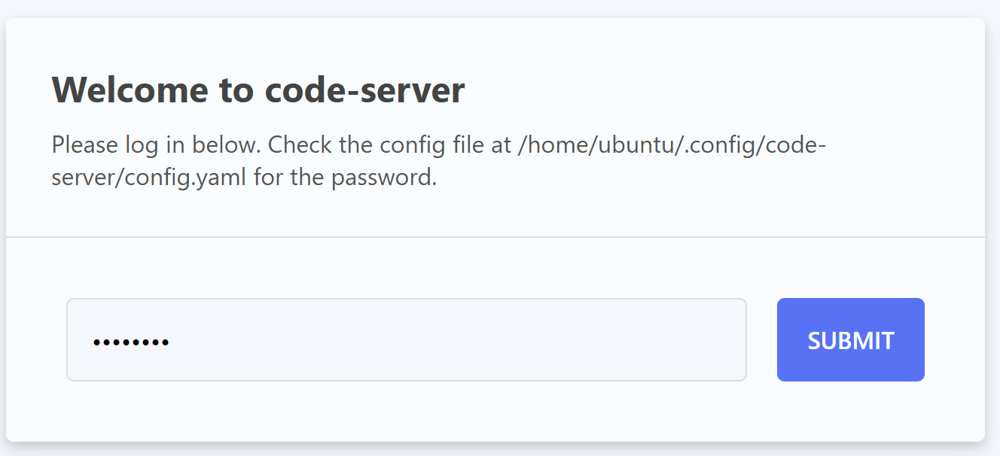

# 第零章： 開發環境設定

## 概述

本章節提供一個完整的 EC2 User Data 腳本，可以在 EC2 實例啟動時自動完成所有開發環境設定，包含 VS Code Server、Docker、AWS CLI、kubectl 等必要工具。

## 🚀 EC2 實例建立步驟指南

### 步驟 1: 啟動 EC2 實例建立流程

1. 登入 AWS 控制台，進入 EC2 服務
2. 點擊「Launch Instance」按鈕



### 步驟 2: 開始建立實例

點擊「Launch instance」開始建立新的 EC2 實例



### 步驟 3: 設定實例名稱和作業系統

**實例配置建議：**

- **名稱**: `fish-game-workshop` 或你喜歡的名稱
- **作業系統**: Ubuntu 22.04 LTS (推薦)
- **實例類型**: t3.medium (2 vCPU, 4GB RAM)



### 步驟 4: 網路設定

**重要網路配置：**

- ✅ **允許來自網際網路的 HTTPS 流量**
- ✅ **允許來自網際網路的 HTTP 流量**
- ✅ **允許 SSH 流量**
- 🔧 **編輯安全群組** - 需要額外開放端口 8080 (VS Code Server)



**安全群組端口設定：**

- 22 (SSH)
- 80 (HTTP)
- 443 (HTTPS)
- 8080 (VS Code Server)
- 8080-8083 (開發端口範圍)

### 步驟 5: 儲存空間配置

**建議儲存配置：**

- **大小**: 100GB (足夠容納所有工具和專案)
- **類型**: gp3 (較佳效能)



### 步驟 6: IAM 執行個體設定檔配置

為了讓 Workshop 參與者不需要手動配置 AWS credentials，我們需要為 EC2 實例設定 IAM Role：

#### 步驟 A: 建立 IAM Role

1. 展開 **Advanced details** 區段
2. 找到 **IAM 執行個體設定檔** 文字
3. 點擊 **建立新的 IAM 描述檔** 並開啟新分頁



我們將創建一個 EC2 Instance 角色：

1. 點擊 **建立角色**
2. 使用案例選擇 `EC2` ，並點擊 **下一步**
3. 勾選 `AdministratorAccess`，並點擊 **下一步**
4. 輸入角色名稱: `FishGameWorkshopRole`，並點擊 **建立角色**



#### 步驟 B: 選擇剛剛建立的角色

1. 回到先前 **建立 EC2 Instance** 分頁
2. 點擊 **重新整理 IAM 執行個體設定檔 Icon**
3. 選擇剛剛建立的 `FishGameWorkshopRole`



### 步驟 7: User Data 腳本設定

這是最關鍵的步驟！在「Advanced details」→「User data」中：

1. 展開「Advanced details」區段
2. 找到「User data」文字框
3. 複製 `ec2-userdata.sh` 的**完整內容**並貼上



**📋 User Data 腳本功能：**

- ✅ 自動安裝 Docker & Docker Compose
- ✅ 自動安裝 AWS CLI v2
- ✅ 自動安裝 kubectl, eksctl, Helm
- ✅ 自動安裝 VS Code Server (端口 8080)
- ✅ 自動 Clone 專案程式碼: `https://github.com/hoycdanny/fish-machine-workshop`
- ✅ 自動設定完整的開發環境

### 步驟 8: 啟動實例

1. 檢查所有設定無誤
2. 點擊「Launch instance」
3. 等待實例啟動（約 2-3 分鐘）
4. 等待 User Data 腳本執行完成（約 10-15 分鐘）

## 設定完成後的訪問方式

設定完成後（約 10-15 分鐘），你就可以透過瀏覽器訪問 VS Code Server：

- **VS Code Server**: `http://YOUR_EC2_PUBLIC_IP:8080`
- **預設密碼**: `password`
- **專案位置**: `/home/ubuntu/workshop/fish-game-eks-workshop`



成功登入後，你將看到完整的專案結構，包含所有從 GitHub 下載的微服務程式碼，可以立即開始進行開發和部署工作。

## 驗證檢查

設定完成後，請透過以下命令驗證所有工具都正常安裝：

### 🔧 工具版本檢查

**檢查 Docker 版本**

```bash
docker --version
```

> Docker version 28.5.1, build e180ab8

**檢查 Docker Compose 版本**

```bash
docker-compose --version
```

> Docker Compose version v2.40.0

**檢查 AWS CLI 版本**

```bash
aws --version
```

> aws-cli/2.31.13 Python/3.13.7 Linux/6.8.0-1035-aws exe/x86_64.ubuntu.22

**檢查 kubectl 版本**

```bash
kubectl version --client
```

> Client Version: v1.34.1  
> Kustomize Version: v5.7.1

**檢查 eksctl 版本**

```bash
eksctl version
```

> 0.215.0

**檢查 Helm 版本**

```bash
helm version
```

> version.BuildInfo{Version:"v3.19.0", GitCommit:"3d8990f0836691f0229297773f3524598f46bda6", GitTreeState:"clean", GoVersion:"go1.24.7"}

### 🔐 AWS 權限驗證

**檢查 AWS 身份**

```bash
aws sts get-caller-identity
```

> ```json
> {
>   "UserId": "AROA5YW5LRDK7P4DLTGRP:i-0***f49deb08bf***",
>   "Account": "9464*****461",
>   "Arn": "arn:aws:sts::9464*****461:assumed-role/FishGameWorkshopRole/i-0***f49deb08bf***"
> }
> ```

**檢查 AWS 配置**

```bash
aws configure list
```

> ```
>       NAME                    VALUE             TYPE    LOCATION
>       ----                    -----             ----    --------
>    profile                <not set>             None    None
> access_key     ****************D5CM         iam-role
> secret_key     ****************rgvq         iam-role
>     region           ap-northeast-2              env    ['AWS_REGION', 'AWS_DEFAULT_REGION']
> ```

**檢查預設區域**

```bash
aws configure get region
```

> ap-northeast-2

## 下一步

完成本章節後，請繼續到 Chapter 1: 服務驗證和 ECR 推送。
