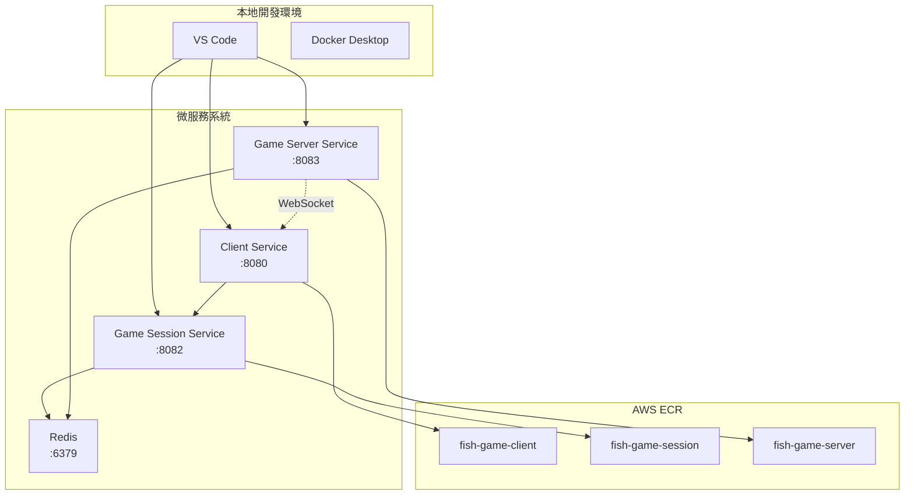

# 🐟 Chapter 1: 服務驗證和容器化

> **從本地開發到 Docker 容器化的完整實作指南**

本章節將指導你驗證現有的魚機遊戲微服務功能，並將它們容器化準備部署到 EKS。

## 🎯 學習目標

- 🔍 **服務驗證**：確保所有微服務功能正常
- 🐳 **Docker 容器化**：將服務打包成容器映像
- 📦 **ECR 推送**：準備映像推送到 AWS ECR
- 🧪 **整合測試**：驗證服務間通信正常

## 📋 前置需求

### 必要工具
- ✅ VS Code 已安裝
- ✅ Docker Desktop 已安裝並運行
- ✅ AWS CLI 已配置 (用於 ECR 推送)
- ✅ Node.js 18+ (可選，用於本地測試)

### 檢查工具版本
```bash
# 檢查 Docker 版本
docker --version
docker-compose --version

# 檢查 AWS CLI
aws --version

# 檢查 Node.js (可選)
node --version
```

## 🏗️ 微服務架構概覽



## 🚀 Step 1: 環境準備

### 1.1 打開專案
在 VS Code 中打開 `fish-game-microservices` 專案目錄。

### 1.2 檢查專案結構
```
fish-game-microservices/
├── services/
│   ├── client-service/          # 前端服務 (8080)
│   ├── game-session-service/    # 會話服務 (8082)
│   ├── game-server-service/     # 遊戲服務 (8083)
│   └── shared/                  # 共用模組
├── docker-compose.yml           # 容器編排配置
├── .env                         # 環境變數
└── README.md                    # 主要文檔
```

### 1.3 檢查環境變數
確認 `.env` 文件包含正確配置：

```env
# JWT 密鑰
JWT_SECRET=demo-jwt-secret-for-workshop

# Redis 配置
REDIS_HOST=redis
REDIS_PORT=6379

# 服務端口配置
CLIENT_SERVICE_PORT=8080
GAME_SESSION_SERVICE_PORT=8082
GAME_SERVER_SERVICE_PORT=8083

# 開發環境配置
NODE_ENV=development
```

## 🐳 Step 2: Docker Compose 啟動服務

### 2.1 構建所有服務
```bash
# 構建所有服務的 Docker 映像
docker-compose build
```

### 2.2 啟動所有服務
```bash
# 啟動所有服務 (後台運行)
docker-compose up -d
```

### 2.3 檢查服務狀態
```bash
# 查看所有服務狀態
docker-compose ps
```

**預期輸出：**
```
NAME                 SERVICE             STATUS              PORTS
fish-game-client     client-service      running             0.0.0.0:8080->8080/tcp
fish-game-redis      redis               running             0.0.0.0:6379->6379/tcp
fish-game-server     game-server-service running             0.0.0.0:8083->8083/tcp
fish-game-session    game-session-service running            0.0.0.0:8082->8082/tcp
```

### 2.4 查看服務日誌
```bash
# 查看所有服務日誌
docker-compose logs

# 查看特定服務日誌
docker-compose logs client-service
docker-compose logs game-session-service
docker-compose logs game-server-service
```

## ✅ Step 3: 服務驗證測試

### 3.1 健康檢查測試

#### Client Service (8080)
```bash
curl http://localhost:8080/health
```

**預期回應：**
```json
{
  "status": "healthy",
  "timestamp": "2024-01-01T00:00:00.000Z",
  "service": "client-service",
  "version": "1.0.0"
}
```

#### Game Session Service (8082)
```bash
curl http://localhost:8082/health
```

#### Game Server Service (8083)
```bash
curl http://localhost:8083/health
```

### 3.2 瀏覽器測試

在瀏覽器中訪問以下 URL：

| 服務 | URL | 說明 |
|------|-----|------|
| 🎮 遊戲客戶端 | http://localhost:8080 | 玩家遊戲界面 |
| 🎯 會話管理後台 | http://localhost:8082/admin | 用戶和房間管理 |
| 🎮 遊戲監控後台 | http://localhost:8083/admin | 遊戲統計和配置 |

### 3.3 API 功能測試

#### 用戶註冊測試
```bash
curl -X POST http://localhost:8082/api/v1/users/register \
  -H "Content-Type: application/json" \
  -d '{"username":"testuser","password":"test123"}'
```

#### 用戶登入測試
```bash
curl -X POST http://localhost:8082/api/v1/users/login \
  -H "Content-Type: application/json" \
  -d '{"username":"testuser","password":"test123"}'
```

#### 房間創建測試
```bash
curl -X POST http://localhost:8082/api/v1/lobby/rooms/create \
  -H "Content-Type: application/json" \
  -d '{"name":"測試房間","maxPlayers":4}'
```

#### 房間列表測試
```bash
curl http://localhost:8082/api/v1/lobby/rooms
```

### 3.4 WebSocket 連接測試

在瀏覽器開發者工具中測試：

```javascript
// 連接到遊戲服務器
const socket = io('http://localhost:8083');

socket.on('connect', () => {
  console.log('Connected to game server');
  
  // 加入測試房間
  socket.emit('join-room', {
    roomId: 'test_room_123',
    userId: 'test_user_123',
    username: 'tester',
    balance: 1000
  });
});

socket.on('joined-room', (data) => {
  console.log('Joined room:', data);
});
```

## 🔍 Step 4: 服務間通信驗證

### 4.1 完整流程測試

**1. 創建用戶**
```bash
curl -X POST http://localhost:8082/api/v1/users/register \
  -H "Content-Type: application/json" \
  -d '{"username":"player1","password":"pass123"}'
```

**2. 用戶登入**
```bash
curl -X POST http://localhost:8082/api/v1/users/login \
  -H "Content-Type: application/json" \
  -d '{"username":"player1","password":"pass123"}'
```

**3. 創建房間**
```bash
curl -X POST http://localhost:8082/api/v1/lobby/rooms/create \
  -H "Content-Type: application/json" \
  -d '{"name":"測試房間","maxPlayers":4}'
```

**4. 啟動遊戲**
```bash
curl -X POST http://localhost:8083/api/v1/game/start \
  -H "Content-Type: application/json" \
  -d '{"roomId":"room_123","userId":"user_123"}'
```

### 4.2 檢查服務日誌

觀察服務間的通信日誌：
```bash
# 實時查看所有服務日誌
docker-compose logs -f
```

## 📦 Step 5: ECR 準備和推送

### 5.1 AWS ECR 準備

#### 創建 ECR 倉庫
```bash
# 創建三個服務的 ECR 倉庫
aws ecr create-repository --repository-name fish-game-client --region ap-northeast-2
aws ecr create-repository --repository-name fish-game-session --region ap-northeast-2
aws ecr create-repository --repository-name fish-game-server --region ap-northeast-2
```

#### 獲取登入令牌
```bash
# 獲取 ECR 登入令牌
aws ecr get-login-password --region ap-northeast-2 | \
docker login --username AWS --password-stdin \
$(aws sts get-caller-identity --query Account --output text).dkr.ecr.ap-northeast-2.amazonaws.com
```

### 5.2 標籤和推送映像

#### 設定環境變數
```bash
export AWS_ACCOUNT_ID=$(aws sts get-caller-identity --query Account --output text)
export ECR_REGISTRY=${AWS_ACCOUNT_ID}.dkr.ecr.ap-northeast-2.amazonaws.com
export IMAGE_TAG=v1.0.0
```

#### 標籤映像
```bash
# 標籤 client-service
docker tag fish-game-microservices-client-service:latest \
  ${ECR_REGISTRY}/fish-game-client:${IMAGE_TAG}
docker tag fish-game-microservices-client-service:latest \
  ${ECR_REGISTRY}/fish-game-client:latest

# 標籤 game-session-service
docker tag fish-game-microservices-game-session-service:latest \
  ${ECR_REGISTRY}/fish-game-session:${IMAGE_TAG}
docker tag fish-game-microservices-game-session-service:latest \
  ${ECR_REGISTRY}/fish-game-session:latest

# 標籤 game-server-service
docker tag fish-game-microservices-game-server-service:latest \
  ${ECR_REGISTRY}/fish-game-server:${IMAGE_TAG}
docker tag fish-game-microservices-game-server-service:latest \
  ${ECR_REGISTRY}/fish-game-server:latest
```

#### 推送映像
```bash
# 推送所有映像
docker push ${ECR_REGISTRY}/fish-game-client:${IMAGE_TAG}
docker push ${ECR_REGISTRY}/fish-game-client:latest

docker push ${ECR_REGISTRY}/fish-game-session:${IMAGE_TAG}
docker push ${ECR_REGISTRY}/fish-game-session:latest

docker push ${ECR_REGISTRY}/fish-game-server:${IMAGE_TAG}
docker push ${ECR_REGISTRY}/fish-game-server:latest
```

### 5.3 驗證 ECR 映像
```bash
# 列出 ECR 中的映像
aws ecr list-images --repository-name fish-game-client --region ap-northeast-2
aws ecr list-images --repository-name fish-game-session --region ap-northeast-2
aws ecr list-images --repository-name fish-game-server --region ap-northeast-2
```

## 🛠️ 故障排除

### 常見問題

#### 問題 1: 端口被占用
```bash
# 檢查端口使用情況
netstat -tulpn | grep :8080
netstat -tulpn | grep :8082
netstat -tulpn | grep :8083

# Windows 用戶使用
netstat -ano | findstr :8080
```

#### 問題 2: Docker 容器無法啟動
```bash
# 檢查容器狀態
docker ps -a

# 查看容器日誌
docker logs <container_name>

# 重新構建容器
docker-compose build --no-cache
```

#### 問題 3: 服務間無法通信
```bash
# 檢查 Docker 網路
docker network ls
docker network inspect fish-game-network

# 測試容器間連通性
docker-compose exec client-service ping game-session-service
```

#### 問題 4: ECR 推送失敗
```bash
# 檢查 AWS 憑證
aws sts get-caller-identity

# 重新登入 ECR
aws ecr get-login-password --region ap-northeast-2 | \
docker login --username AWS --password-stdin \
$(aws sts get-caller-identity --query Account --output text).dkr.ecr.ap-northeast-2.amazonaws.com
```

### 重置環境

如果遇到問題，可以重置整個環境：
```bash
# 停止所有服務
docker-compose down

# 清理所有容器和映像
docker-compose down --rmi all --volumes --remove-orphans

# 重新構建和啟動
docker-compose build
docker-compose up -d
```

## 📊 驗證檢查清單

### 基本功能驗證
- [ ] 所有服務健康檢查通過
- [ ] 瀏覽器可以訪問所有管理後台
- [ ] Redis 連接正常

### API 功能驗證
- [ ] 用戶註冊和登入成功
- [ ] 房間創建和管理正常
- [ ] 遊戲邏輯 API 響應正常

### WebSocket 功能驗證
- [ ] WebSocket 連接成功
- [ ] 房間加入和離開正常
- [ ] 實時通信功能正常

### 容器化驗證
- [ ] 所有服務成功容器化
- [ ] Docker Compose 編排正常
- [ ] 服務間通信正常

### ECR 推送驗證
- [ ] ECR 倉庫創建成功
- [ ] 映像標籤正確
- [ ] 映像推送成功
- [ ] 映像可以從 ECR 拉取

## 🎉 完成確認

當所有檢查項目都通過後，你已經成功：

1. ✅ **驗證了微服務功能** - 所有服務正常運行
2. ✅ **完成了容器化** - 服務已打包成 Docker 映像
3. ✅ **推送到了 ECR** - 映像已準備好部署到 EKS
4. ✅ **測試了整合功能** - 服務間通信正常

## 🔗 相關文檔

- [Client Service 詳細說明](../services/client-service/README.md)
- [Game Session Service 詳細說明](../services/game-session-service/README.md)
- [Game Server Service 詳細說明](../services/game-server-service/README.md)

## 📚 下一步

完成本章後，你可以進入：
- **Chapter 2: EKS 集群建立** - 建立 Kubernetes 集群
- **Chapter 3: 服務部署到 EKS** - 將容器部署到雲端
- **Chapter 4: 負載均衡和網路配置** - 配置 ALB/NLB
- **Chapter 5: 監控和維運** - 設定監控和日誌

---

**🎮 準備好進入雲端部署了嗎？**