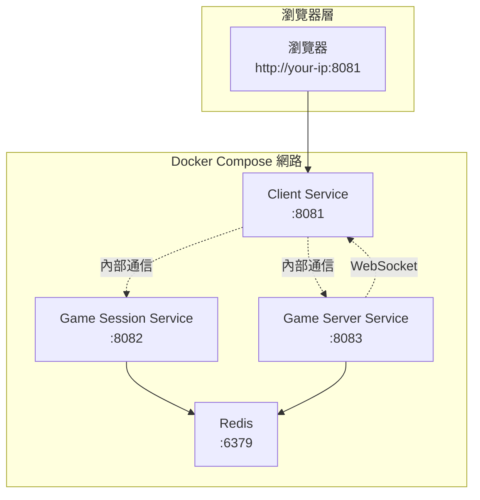
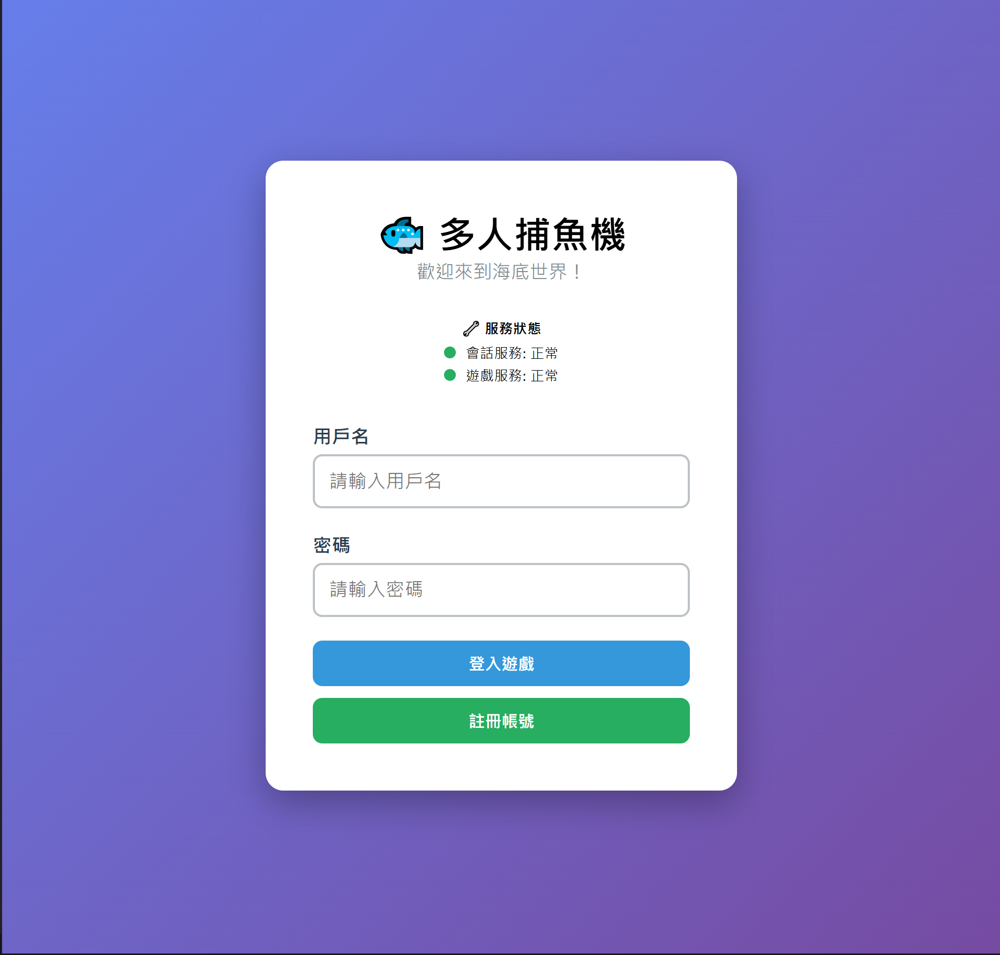
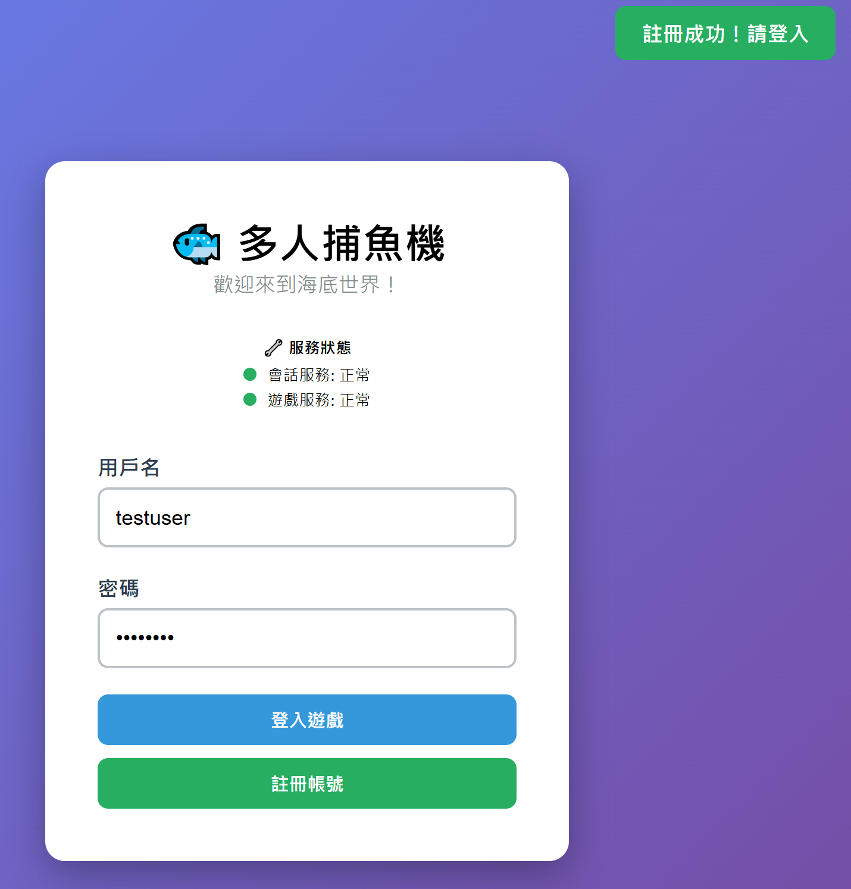
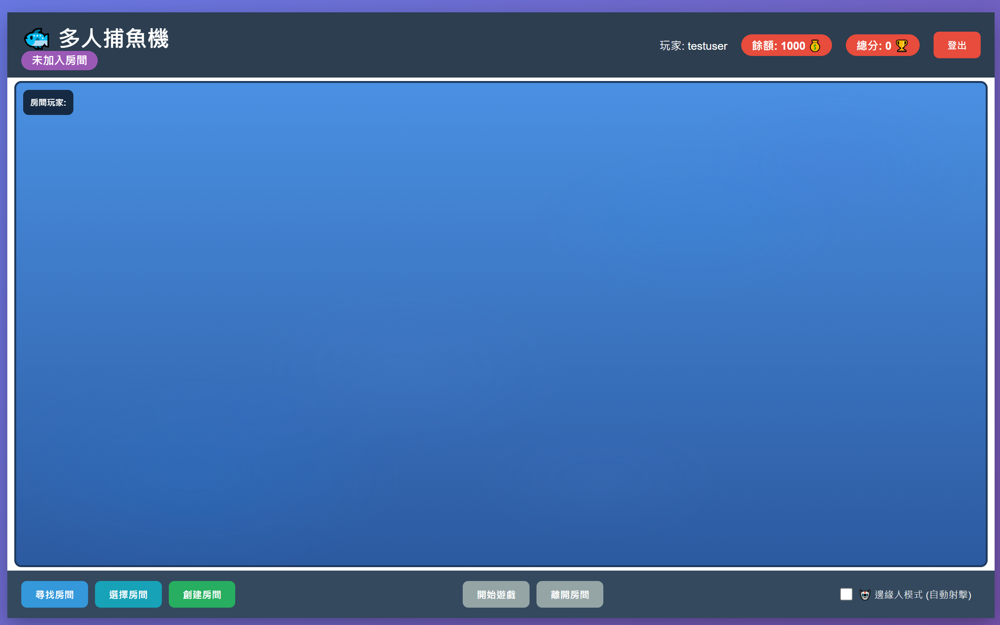
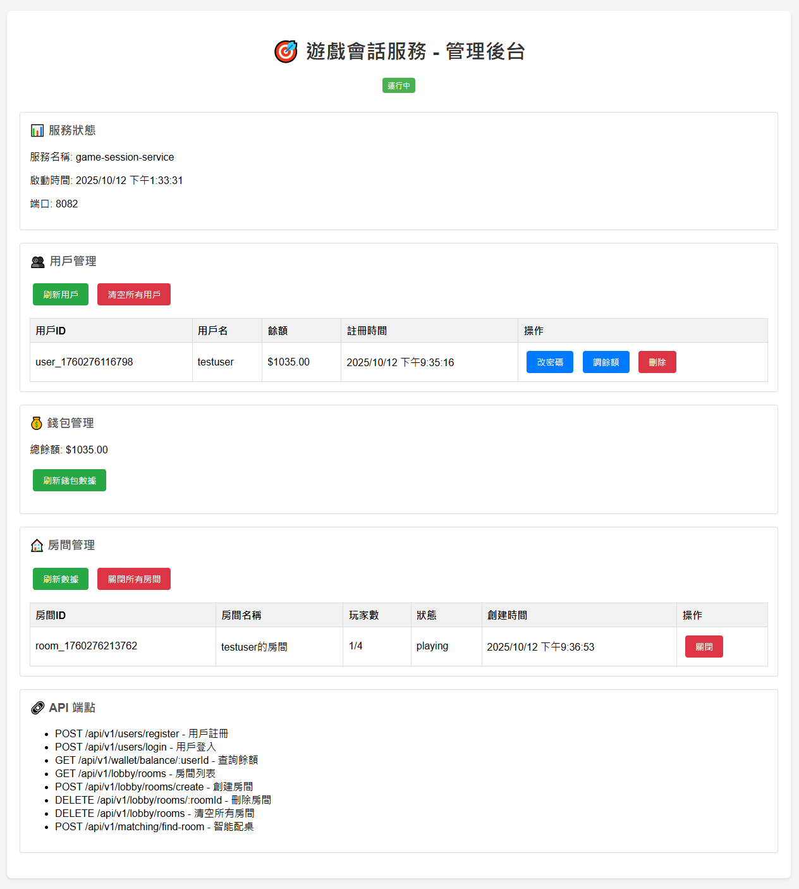
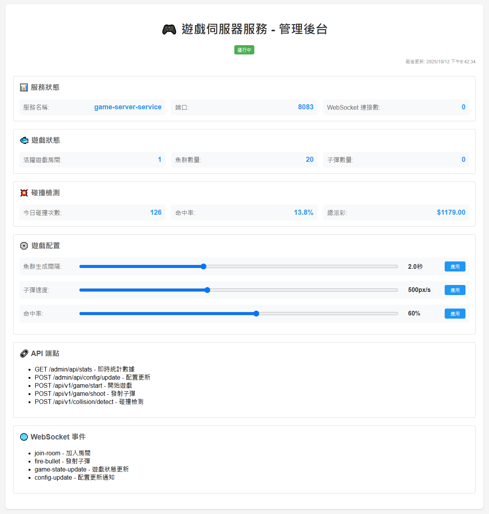
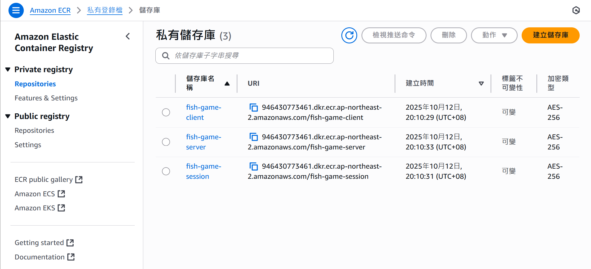

# 第一章： 服務驗證和容器化

> **微服務架構設計 + Docker 容器化 + EKS 無縫遷移**

本章節實現了魚機遊戲微服務的完整容器化，並設計了可無縫遷移到 EKS 的架構。

## 🎯 核心特色

- ✅ **微服務架構**：三個獨立服務 + Redis
- ✅ **容器間通信**：使用 Docker Compose 服務名稱
- ✅ **動態配置**：自動適配開發/生產環境
- ✅ **EKS 就緒**：無需修改代碼即可部署到 Kubernetes
- ✅ **DevOps Agent Demo 模式**：真實記憶體消耗展示問題分析能力

## 🏗️ 系統架構



## 📦 服務配置架構

每個服務的 `app.js` 第一段都有統一的配置區塊：

### Client Service 配置
```javascript
// ===== 服務配置 (EKS 部署時只需修改這部分) =====
const CONFIG = {
  SERVICE_PORT: process.env.SERVICE_PORT || 8081,
  
  // 後端服務內部通信 (容器間/Pod間使用服務名稱)
  GAME_SESSION_SERVICE: {
    HOST: process.env.GAME_SESSION_SERVICE_HOST || 'game-session-service',
    PORT: process.env.GAME_SESSION_SERVICE_PORT || 8082
  },
  
  // 前端瀏覽器訪問配置 (EKS 上改為 Ingress/ALB URL)
  FRONTEND_API: {
    SESSION_URL: process.env.FRONTEND_SESSION_URL || null,
    GAME_URL: process.env.FRONTEND_GAME_URL || null
  }
};
```

### Game Session/Server Service 配置
```javascript
// ===== 服務配置 (EKS 部署時只需修改這部分) =====
const CONFIG = {
  SERVICE_PORT: process.env.SERVICE_PORT || 8082,
  
  // 其他服務通信配置 (使用服務名稱)
  GAME_SERVER_SERVICE: {
    HOST: process.env.GAME_SERVER_SERVICE_HOST || 'game-server-service',
    PORT: process.env.GAME_SERVER_SERVICE_PORT || 8083
  },
  
  // 數據庫配置
  REDIS: {
    HOST: process.env.REDIS_HOST || 'redis',
    PORT: process.env.REDIS_PORT || 6379
  }
};
```

## 🚀 快速啟動

### 1. 環境準備
```bash
# 確認工具版本
docker --version
docker-compose --version
```

### 2. 啟動所有服務
```bash
# 構建並啟動
docker-compose build
docker-compose up -d

# 檢查服務狀態
docker-compose ps
```

### 3. 驗證服務
```bash
# 健康檢查
curl http://localhost:8081/health  # Client Service
curl http://localhost:8082/health  # Game Session Service  
curl http://localhost:8083/health  # Game Server Service

# 瀏覽器訪問
open http://localhost:8081
```

## 🔧 服務通信架構

### 開發環境 (Docker Compose)
- **容器間通信**：`game-session-service:8082`, `game-server-service:8083`
- **瀏覽器訪問**：自動使用當前 IP + 端口 (如 `http://3.34.3.151:8082`)

### 生產環境 (EKS)
- **Pod 間通信**：繼續使用服務名稱 (無需修改)
- **瀏覽器訪問**：通過環境變數指定 ALB/Ingress URL

## 🎮 功能測試

### API 測試
```bash
# 用戶註冊
curl -X POST http://localhost:8082/api/v1/users/register \
  -H "Content-Type: application/json" \
  -d '{"username":"testuser","password":"test123"}'

# 用戶登入
curl -X POST http://localhost:8082/api/v1/users/login \
  -H "Content-Type: application/json" \
  -d '{"username":"testuser","password":"test123"}'

# 房間管理
curl -X POST http://localhost:8082/api/v1/lobby/rooms/create \
  -H "Content-Type: application/json" \
  -d '{"name":"測試房間","maxPlayers":4}'
```

### 瀏覽器測試
| 功能 | URL | 說明 |
|------|-----|------|
| 🎮 遊戲客戶端 | http://your-ip:8081 | 玩家遊戲界面 |
| 🎯 會話管理 | http://your-ip:8082/admin | 用戶和房間管理 |
| 📊 遊戲監控 | http://your-ip:8083/admin | 遊戲統計和配置 |

## 🎮 遊戲介面展示

### 用戶註冊和登入

**遊戲登入介面**


**用戶註冊介面**


### 遊戲主界面

**遊戲儀表板**


**遊戲進行中**


### 服務管理介面

**會話服務管理**


**遊戲服務監控**


## 🚢 推送到 ECR (準備 EKS 部署)

### 驗證服務正常後推送映像
```bash
# 1. 確保 Docker Compose 服務運行正常
docker-compose ps
curl http://localhost:8081/health

# 2. 推送映像到 ECR (使用 latest 標籤)
chmod +x build-and-push.sh
./build-and-push.sh

# 3. 使用特定標籤 (用於 DevOps Agent Demo)
./build-and-push.sh v1.0.0
./build-and-push.sh v1.1.0
./build-and-push.sh dev
./build-and-push.sh staging
./build-and-push.sh production
```

### 🏷️ 標籤策略 (DevOps Agent Demo)

本專案使用統一的標籤策略，與第0章設定的 AWS 資源標籤保持一致：

**AWS 資源標籤**（EC2、IAM Role、Security Group）：
- `Project: fish-machine-workshop`
- `Workshop: fish-machine-workshop`
- `ManagedBy: UserData`

**ECR 倉庫標籤**（自動添加）：
- `Project: fish-machine-workshop`
- `Workshop: fish-machine-workshop`
- `ManagedBy: build-script`

**Docker 映像標籤**（版本管理）：

| 標籤類型 | 範例 | 用途 | 說明 |
|---------|------|------|------|
| **latest** | `latest` | 開發環境 | 最新的開發版本，自動更新 |
| **版本號** | `v1.0.0`, `v1.1.0` | 生產環境 | 語義化版本，穩定發布 |
| **環境標籤** | `dev`, `staging`, `production` | 環境隔離 | 不同環境使用不同標籤 |
| **功能分支** | `feature-login`, `bugfix-123` | 功能測試 | 特定功能的測試版本 |

**DevOps Agent 使用範例：**
```bash
# 開發環境：使用 latest 標籤
./build-and-push.sh latest

# 測試環境：使用 staging 標籤
./build-and-push.sh staging

# 生產環境：使用版本號標籤
./build-and-push.sh v1.0.0
```

### ECR 推送流程
1. **自動創建 ECR 倉庫**：fish-game-client, fish-game-session, fish-game-server
2. **構建映像**：使用現有 Dockerfile
3. **推送到 ECR**：標記並推送映像（支援多標籤）
4. **驗證推送**：確認映像存在於 ECR

### 推送完成後
映像將可用於 EKS 部署（支援多標籤）：
- `{account-id}.dkr.ecr.us-east-1.amazonaws.com/fish-game-client:latest`
- `{account-id}.dkr.ecr.us-east-1.amazonaws.com/fish-game-client:v1.0.0`
- `{account-id}.dkr.ecr.us-east-1.amazonaws.com/fish-game-client:staging`
- `{account-id}.dkr.ecr.us-east-1.amazonaws.com/fish-game-session:latest`
- `{account-id}.dkr.ecr.us-east-1.amazonaws.com/fish-game-server:latest`

**ECR 倉庫管理介面**


### 🤖 DevOps Agent 整合

本專案的標籤策略設計用於與 DevOps Agent 無縫整合：

**自動化部署流程：**
1. **開發階段**：推送 `latest` 標籤，觸發開發環境自動部署
2. **測試階段**：推送 `staging` 標籤，觸發測試環境部署
3. **生產發布**：推送版本號標籤（如 `v1.0.0`），觸發生產環境部署

**DevOps Agent 可以：**
- 監控 ECR 標籤變化
- 根據標籤自動選擇部署環境
- 執行自動化測試和驗證
- 管理多環境部署策略

## 🚢 EKS 遷移指南

### 無需修改代碼，只需設定環境變數：

```yaml
# client-service deployment
apiVersion: apps/v1
kind: Deployment
metadata:
  name: client-service
spec:
  template:
    spec:
      containers:
      - name: client-service
        image: your-ecr/fish-game-client:latest
        env:
        # 🔥 只需添加這兩個環境變數
        - name: FRONTEND_SESSION_URL
          value: "https://your-domain.com/api/session"
        - name: FRONTEND_GAME_URL
          value: "https://your-domain.com/api/game"
```

### 其他服務無需任何修改
- `game-session-service` 和 `game-server-service` 可直接部署
- 服務間通信自動使用 Kubernetes Service 名稱
- Redis 連接配置保持不變

## 📊 服務狀態監控

### 健康檢查端點
```bash
# 所有服務都提供統一的健康檢查
GET /health

# 回應格式
{
  "status": "healthy",
  "timestamp": "2024-01-01T00:00:00.000Z",
  "service": "client-service",
  "version": "1.0.0"
}
```

### Docker 健康檢查
```yaml
# docker-compose.yml 中的健康檢查配置
healthcheck:
  test: ["CMD", "curl", "-f", "http://localhost:8081/health"]
  interval: 30s
  timeout: 10s
  retries: 3
```

## 🛠️ 故障排除

### 常見問題

#### 1. 服務無法啟動
```bash
# 檢查日誌
docker-compose logs service-name

# 重新構建
docker-compose build --no-cache
docker-compose up -d
```

#### 2. 服務間通信失敗
```bash
# 檢查網路連通性
docker-compose exec client-service ping game-session-service

# 檢查服務狀態
docker-compose ps
```

#### 3. 前端無法訪問後端
```bash
# 檢查前端配置
curl -s http://localhost:8081 | grep "GAME_CONFIG" -A 3

# 應該看到正確的 API 端點配置
```

### 重置環境
```bash
# 完全重置
docker-compose down --rmi all --volumes --remove-orphans
docker-compose build
docker-compose up -d
```

## 📋 部署檢查清單

### 開發環境驗證
- [ ] 所有服務健康檢查通過
- [ ] 瀏覽器可以訪問遊戲界面
- [ ] 用戶註冊/登入功能正常
- [ ] WebSocket 連接正常
- [ ] 服務間通信正常

### EKS 準備檢查
- [ ] 所有服務配置使用 CONFIG 物件
- [ ] 容器間通信使用服務名稱
- [ ] 前端支援環境變數覆蓋
- [ ] Docker 映像構建成功
- [ ] 健康檢查端點正常

## 🔗 相關文檔

- [Client Service 詳細說明](./services/client-service/README.md)
- [Game Session Service 詳細說明](./services/game-session-service/README.md)
- [Game Server Service 詳細說明](./services/game-server-service/README.md)

## 🎯 DevOps Agent Demo 模式

### 功能說明

Demo 模式用於展示 AWS DevOps Agent 的問題分析能力，通過**真實消耗容器記憶體**來模擬生產環境的記憶體壓力問題。

### 核心機制

**記憶體氣球技術（Memory Balloon）**：
- 每條魚生成時分配 20MB 真實記憶體（Buffer.alloc）
- 填充隨機數據確保記憶體真實被使用
- 魚被打掉時釋放對應的 Buffer
- 容器記憶體會真實上升，可被 Kubernetes 和 CloudWatch 監控

### 使用方式

1. **啟用 Demo 模式**
   - 訪問管理後台：`http://localhost:8083/admin`
   - 找到「🎯 DevOps Agent Demo 模式」區塊
   - 啟用開關

2. **觀察記憶體消耗**
   - 前端右上角顯示記憶體面板
   - Demo 模式：顯示魚數量和真實記憶體使用
   - 每條魚約消耗 20MB 記憶體
   - 容器記憶體限制：512MB（固定，不會自動增加）

3. **觸發記憶體限制**
   - 不打魚，讓魚數量自然增加
   - 達到 15 條魚時（約 300MB）
   - 停止生成新魚，發出 Error Log

4. **驗證真實記憶體消耗**
   ```bash
   # 查看容器記憶體使用
   docker stats game-server-service
   
   # 應該看到：
   # - MEM USAGE 真實上升
   # - MEM LIMIT 固定在 512MB
   # - 15 條魚 ≈ 300MB 記憶體
   ```

### 資源配置

Docker Compose 已配置固定資源限制：

```yaml
deploy:
  resources:
    limits:
      cpus: '1.0'
      memory: 512M      # 最大 512MB（固定）
    reservations:
      cpus: '0.5'
      memory: 256M      # 保證 256MB
```

這確保：
- 容器記憶體不會自動增加
- Demo 模式可以真實觸發記憶體限制
- 模擬真實生產環境的資源約束

### 日誌格式

所有事件以 JSON 格式記錄到 CloudWatch：

```json
{
  "level": "info",
  "message": "game_event",
  "eventType": "game_event",
  "event": "fish_spawned",
  "fishId": "fish_123",
  "fishCount": 15,
  "memoryUsage": 65,
  "heapUsedMB": 350,
  "demoMode": true,
  "timestamp": "2026-02-04 10:30:45",
  "service": "game-server-service"
}
```

### DevOps Agent 分析預期

當 Demo 模式觸發記憶體問題時，DevOps Agent 應該能夠：

1. **檢測問題**：發現 `fish_spawn_blocked` 錯誤事件
2. **關聯分析**：關聯 `fish_spawned` 事件與記憶體上升
3. **根因分析**：識別出魚數量過多導致記憶體消耗
4. **建議方案**：調整生成間隔、限制魚數量、增加 Pod memory limit

## 📚 下一步

完成本章後，你的微服務已經：
- ✅ **容器化完成** - 所有服務打包成 Docker 映像
- ✅ **架構就緒** - 支援 Docker Compose 和 Kubernetes
- ✅ **配置統一** - 環境變數集中管理
- ✅ **測試通過** - 功能驗證完整

**準備進入 Chapter 2: EKS 集群建立** 🚀

---

**🎮 你的微服務已經準備好征服雲端了！**
