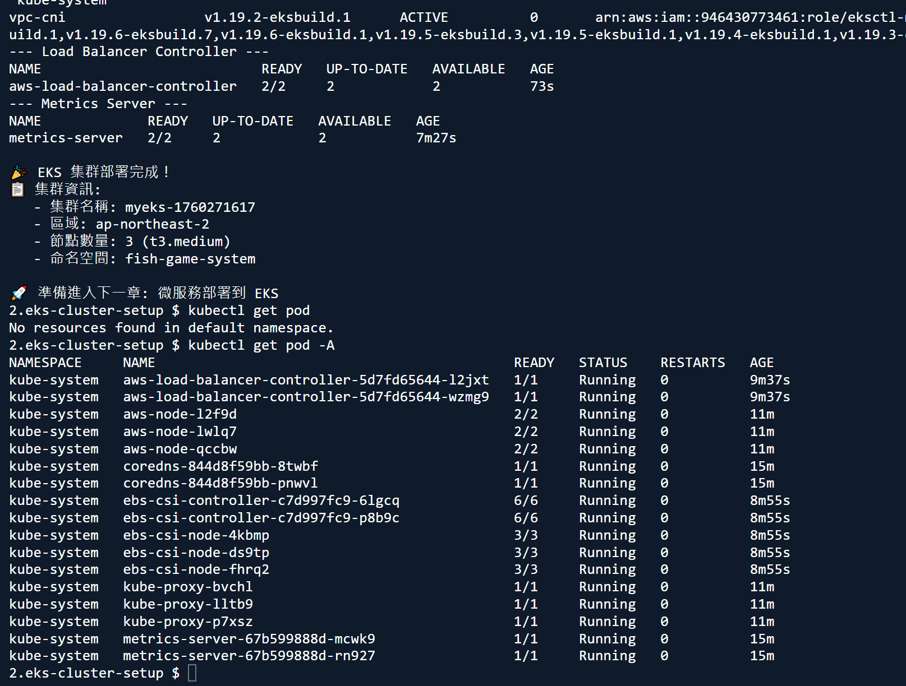
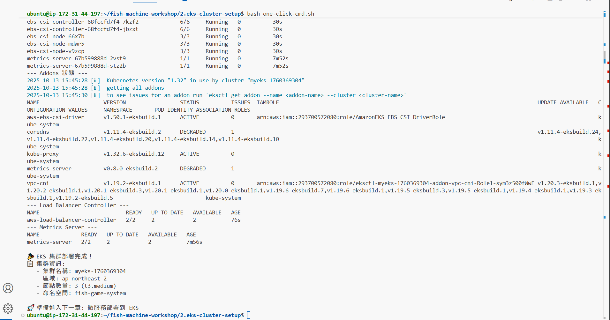

# 第二章：EKS 叢集設置

> **使用 eksctl 一鍵創建 EKS 集群，並自動配置所有必要組件**

本章節將創建一個完整的 EKS 集群，包含 AWS Load Balancer Controller、EBS CSI Driver 和其他必要組件。

## 🎯 核心特色

- ✅ **一鍵部署**：自動創建 EKS 集群和所有必要組件
- ✅ **自動標籤**：所有資源自動添加專案標籤
- ✅ **完整配置**：包含 ALB Controller、EBS CSI Driver、Metrics Server
- ✅ **生產就緒**：3 個 t3.medium 節點，支援自動擴展

## 📋 前置條件

- ✅ AWS CLI 已配置（第0章完成）
- ✅ kubectl 已安裝
- ✅ eksctl 已安裝
- ✅ Docker 映像已推送到 ECR（第1章完成）

## 🏗️ 服務架構

基於第1章的容器化服務，我們將部署以下服務到 EKS：

- **client-service** (Port 8081): 遊戲客戶端服務
- **game-session-service** (Port 8082): 遊戲會話管理服務  
- **game-server-service** (Port 8083): 遊戲伺服器服務
- **redis** (Port 6379): Redis 數據庫

## 🏷️ 資源標籤策略

本章創建的所有資源都會自動添加以下標籤：

```bash
Project=fish-machine-workshop
Workshop=fish-machine-workshop
ManagedBy=2.eks-cluster-setup/one-click-cmd.sh
```

### 標記的資源

1. **EKS 集群**：`fish-game-cluster`
2. **Node Group**：`standard-workers`
3. **IAM 政策**：`AWSLoadBalancerControllerIAMPolicy`
4. **IAM 角色**：
   - `AmazonEKSLoadBalancerControllerRole`
   - `AmazonEKS_EBS_CSI_DriverRole`
5. **VPC 和網路資源**：由 eksctl 自動創建並標記

## 🚀 使用方法

### 步驟 1：執行一鍵部署腳本

```bash
cd 2.eks-cluster-setup
chmod +x one-click-cmd.sh
./one-click-cmd.sh
```

腳本會自動完成以下操作：

1. ✅ 檢查 AWS 身份和權限
2. ✅ 安裝/更新 kubectl 和 eksctl
3. ✅ 創建 EKS 集群（3個 t3.medium 節點）
4. ✅ 為所有資源添加標籤
5. ✅ 安裝 AWS Load Balancer Controller
6. ✅ 安裝 EBS CSI Driver
7. ✅ 安裝 Metrics Server
8. ✅ 創建應用命名空間 `fish-game-system`

**預計時間**：15-20 分鐘


*圖 2.1：EKS 集群創建過程，顯示 eksctl 創建集群的詳細步驟*

### 步驟 2：驗證集群狀態

```bash
# 檢查節點
kubectl get nodes

# 檢查系統 Pods
kubectl get pods -n kube-system

# 檢查 Load Balancer Controller
kubectl get deployment -n kube-system aws-load-balancer-controller

# 檢查 Metrics Server
kubectl get deployment -n kube-system metrics-server
```


*圖 2.3：EKS 部署完成驗證，顯示所有服務和 Pod 的運行狀態*

### 步驟 3：驗證資源標籤

```bash
# 驗證 EKS 集群標籤
aws eks describe-cluster \
  --name fish-game-cluster \
  --region us-east-1 \
  --query 'cluster.tags'

# 預期輸出
{
  "Project": "fish-machine-workshop",
  "Workshop": "fish-machine-workshop",
  "ManagedBy": "2.eks-cluster-setup/one-click-cmd.sh"
}

# 查看所有相關資源
aws resourcegroupstaggingapi get-resources \
  --tag-filters Key=Project,Values=fish-machine-workshop \
  --resource-type-filters eks \
  --query 'ResourceTagMappingList[].[ResourceARN,Tags]' \
  --output table
```

## 📊 集群配置詳情

### EKS 集群規格

| 項目 | 配置 |
|------|------|
| **集群名稱** | `fish-game-cluster` |
| **區域** | `us-east-1` (Seoul) |
| **Kubernetes 版本** | 最新穩定版 |
| **節點類型** | t3.medium (2 vCPU, 4GB RAM) |
| **節點數量** | 3 (最小 1，最大 4) |
| **Node Group** | `standard-workers` (Managed) |

### 安裝的組件

| 組件 | 版本 | 用途 |
|------|------|------|
| **AWS Load Balancer Controller** | v2.7.2 | 管理 ALB/NLB |
| **EBS CSI Driver** | 最新 | 管理 EBS 卷 |
| **Metrics Server** | 最新 | 資源監控 |
| **CloudWatch Container Insights** | 最新 | Pod 日誌和指標收集 |
| **CoreDNS** | 最新 | DNS 服務 |
| **kube-proxy** | 最新 | 網路代理 |
| **VPC CNI** | 最新 | 網路插件 |

### CloudWatch 日誌收集

集群會自動將 Pod 日誌發送到 CloudWatch Logs：

| 日誌群組 | 內容 |
|---------|------|
| `/aws/containerinsights/fish-game-cluster/application` | 應用容器日誌 |
| `/aws/containerinsights/fish-game-cluster/host` | 節點系統日誌 |
| `/aws/containerinsights/fish-game-cluster/dataplane` | Kubernetes 數據平面日誌 |

**查看日誌**：
```bash
# 列出日誌群組
aws logs describe-log-groups \
  --log-group-name-prefix /aws/containerinsights/fish-game-cluster \
  --region us-east-1

# 查看應用日誌
aws logs tail /aws/containerinsights/fish-game-cluster/application \
  --follow \
  --region us-east-1
```

## 🔍 故障排除

### 集群創建失敗

```bash
# 檢查 eksctl 日誌
eksctl utils describe-stacks --cluster fish-game-cluster --region us-east-1

# 刪除失敗的集群
eksctl delete cluster --name fish-game-cluster --region us-east-1
```

### Load Balancer Controller 未運行

```bash
# 檢查 Controller 日誌
kubectl logs -n kube-system deployment/aws-load-balancer-controller

# 重新安裝
helm uninstall aws-load-balancer-controller -n kube-system
# 然後重新執行 one-click-cmd.sh
```

### 節點未就緒

```bash
# 檢查節點狀態
kubectl describe nodes

# 檢查節點日誌
kubectl get events --all-namespaces --sort-by='.lastTimestamp'
```

### CloudWatch 日誌未出現

```bash
# 檢查 Fluent Bit 狀態
kubectl get pods -n amazon-cloudwatch
kubectl logs -n amazon-cloudwatch -l k8s-app=fluent-bit --tail=50

# 檢查 CloudWatch Agent 狀態
kubectl logs -n amazon-cloudwatch -l name=cloudwatch-agent --tail=50

# 檢查 Service Account 權限
kubectl get serviceaccount fluent-bit -n amazon-cloudwatch -o yaml
kubectl get serviceaccount cloudwatch-agent -n amazon-cloudwatch -o yaml

# 驗證日誌收集（等待 5-10 分鐘後）
aws logs describe-log-groups \
  --log-group-name-prefix /aws/containerinsights/fish-game-cluster \
  --region us-east-1

# 查看實時日誌
aws logs tail /aws/containerinsights/fish-game-cluster/application \
  --follow \
  --region us-east-1
```

## 🧹 清理資源

如果需要刪除集群：

```bash
# 刪除 EKS 集群（會自動刪除所有相關資源）
eksctl delete cluster --name fish-game-cluster --region us-east-1

# 手動刪除 IAM 政策（如果需要）
aws iam delete-policy \
  --policy-arn arn:aws:iam::$(aws sts get-caller-identity --query Account --output text):policy/AWSLoadBalancerControllerIAMPolicy
```

## 📋 完成檢查清單

- [ ] EKS 集群創建成功
- [ ] 3 個節點都處於 Ready 狀態
- [ ] AWS Load Balancer Controller 運行正常
- [ ] EBS CSI Driver 安裝成功
- [ ] Metrics Server 運行正常
- [ ] 命名空間 `fish-game-system` 已創建
- [ ] 所有資源都有正確的標籤
- [ ] kubectl 可以正常訪問集群

## 📚 下一步

完成本章後，你的 EKS 集群已經準備好部署應用了！

**準備進入第3章：EKS 服務部署** 🚀

