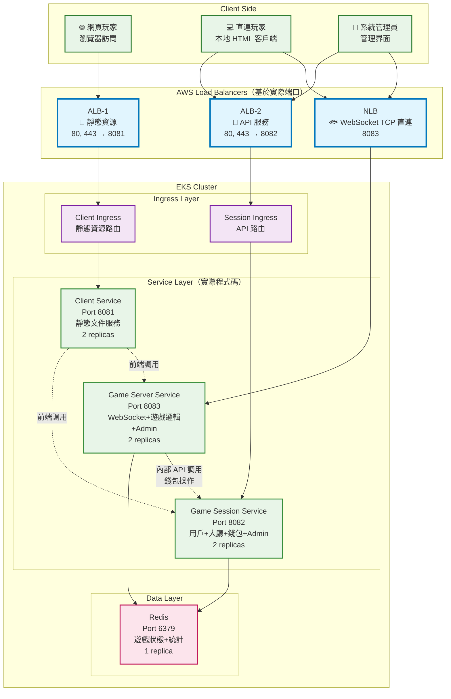

# 第三章：EKS 服務部署

本章節將第1章完成的 Docker 映像部署到第2章創建的 EKS 叢集中，實現完整的微服務架構部署。

## 系統架構

### 整體架構圖



### 服務詳細說明

| 服務名稱 | 端口 | 副本數 | 功能描述 | 資源配置 |
|---------|------|--------|----------|----------|
| **client-service** | 8081 | 2 | 靜態文件服務，處理前端資源和用戶界面 | CPU: 250m-500m, Memory: 256Mi-512Mi |
| **game-session-service** | 8082 | 2 | 用戶+大廳+錢包+Admin，處理會話管理 | CPU: 500m-1000m, Memory: 512Mi-1Gi |
| **game-server-service** | 8083 | 2 | WebSocket+遊戲邏輯+Admin，處理遊戲核心功能 | CPU: 500m-1000m, Memory: 512Mi-1Gi |
| **redis** | 6379 | 1 | 遊戲狀態+統計，數據緩存和會話存儲 | CPU: 250m-500m, Memory: 256Mi-512Mi |

### 網路路由配置

**ALB-1 (靜態資源)** 路由規則：
- `/` → client-service (遊戲主頁面)
- `/admin/*` → client-service (管理界面)

**ALB-2 (API 服務)** 路由規則：
- `/api/*` → game-session-service (會話管理 API)
- `/game/*` → game-server-service (遊戲邏輯 API)

**NLB (WebSocket TCP 直連)**：
- `8083` → game-server-service (WebSocket 遊戲連接)

## 前置條件

1. **EKS 叢集**: 確保第2章的 EKS 叢集已創建完成
2. **ECR 映像**: 確保第1章的 Docker 映像已推送到 ECR
3. **AWS CLI**: 已配置並具有適當權限
4. **kubectl**: 已安裝並配置

## 步驟一：配置 kubectl 連接 EKS

### 1.1 更新 kubeconfig

```bash
# 替換為你的叢集名稱和區域
aws eks update-kubeconfig --region ap-northeast-2 --name fish-game-cluster
```

### 1.2 驗證連接

```bash
# 檢查叢集連接
kubectl get nodes

# 檢查叢集資訊
kubectl cluster-info

# 檢查當前 context
kubectl config current-context
```

預期輸出：
```
NAME                                               STATUS   ROLES    AGE   VERSION
ip-192-168-1-100.ap-northeast-2.compute.internal   Ready    <none>   1h    v1.28.3-eks-4f4795d
ip-192-168-2-200.ap-northeast-2.compute.internal   Ready    <none>   1h    v1.28.3-eks-4f4795d
```

## 步驟二：準備 ECR 映像配置

### 2.1 獲取 ECR 登入資訊

```bash
# 自動獲取帳戶 ID 和使用環境變數
export AWS_ACCOUNT_ID=$(aws sts get-caller-identity --query Account --output text)
export AWS_REGION=${AWS_REGION:-ap-northeast-2}

# 獲取 ECR 登入令牌
aws ecr get-login-password --region $AWS_REGION | docker login --username AWS --password-stdin $AWS_ACCOUNT_ID.dkr.ecr.$AWS_REGION.amazonaws.com

echo "✅ 已登入 ECR: $AWS_ACCOUNT_ID.dkr.ecr.$AWS_REGION.amazonaws.com"
```

### 2.2 查看可用映像

```bash
# 使用環境變數查看 ECR 倉庫
export AWS_REGION=${AWS_REGION:-ap-northeast-2}

# 列出 ECR 倉庫
aws ecr describe-repositories --region $AWS_REGION

# 查看特定倉庫的映像標籤
aws ecr describe-images --repository-name fish-game-client --region $AWS_REGION
aws ecr describe-images --repository-name fish-game-session --region $AWS_REGION
aws ecr describe-images --repository-name fish-game-server --region $AWS_REGION
```

### 2.3 更新 YAML 配置中的映像 URI

編輯以下文件，將 `YOUR_ECR_REGISTRY` 替換為實際的 ECR URI：

```bash
# 範例：將 YOUR_ECR_REGISTRY 替換為實際值
# 原始：YOUR_ECR_REGISTRY/fish-game-client:latest
# 替換為：123456789012.dkr.ecr.ap-northeast-2.amazonaws.com/fish-game-client:latest

# 需要更新的文件：
# - k8s-manifests/4.client-deployment.yaml
# - k8s-manifests/5.session-deployment.yaml  
# - k8s-manifests/6.server-deployment.yaml
```

## 步驟三：部署 Kubernetes 資源

### 3.1 Kubernetes 配置文件說明

本章節包含8個按順序編號的 YAML 配置文件：

| 文件 | 資源類型 | 說明 |
|------|----------|------|
| `1.namespace.yaml` | Namespace | 創建 fish-game-system 命名空間 |
| `2.configmap.yaml` | ConfigMap | 配置環境變數和服務發現 |
| `3.redis-deployment.yaml` | Deployment + Service | Redis 數據庫部署 |
| `4.client-deployment.yaml` | Deployment | 客戶端服務部署 |
| `5.session-deployment.yaml` | Deployment | 會話管理服務部署 |
| `6.server-deployment.yaml` | Deployment | 遊戲伺服器服務部署 |
| `7.services.yaml` | Service | 所有應用服務的 Service 定義 |
| `8.nlb.yaml` | Service (LoadBalancer) | NLB WebSocket TCP 直連配置 |
| `9.ingress.yaml` | Ingress | ALB1 (靜態資源) + ALB2 (API 服務) 配置 |

> **⚠️ 重要提醒**: `9.ingress.yaml` 已更新為使用現代的 `spec.ingressClassName: alb` 格式，移除了已棄用的 `kubernetes.io/ingress.class` 註解，避免部署時的警告訊息。

### 3.2 手動部署步驟

按照以下順序手動部署所有 Kubernetes 資源：

```bash
# 1. 創建命名空間
kubectl apply -f k8s-manifests/1.namespace.yaml

# 2. 創建配置映射
kubectl apply -f k8s-manifests/2.configmap.yaml

# 3. 部署 Redis
kubectl apply -f k8s-manifests/3.redis-deployment.yaml

# 4. 部署應用服務
kubectl apply -f k8s-manifests/4.client-deployment.yaml
kubectl apply -f k8s-manifests/5.session-deployment.yaml
kubectl apply -f k8s-manifests/6.server-deployment.yaml

# 5. 創建服務
kubectl apply -f k8s-manifests/7.services.yaml

# 6. 創建 NLB 和 Ingress
kubectl apply -f k8s-manifests/8.nlb.yaml
kubectl apply -f k8s-manifests/9.ingress.yaml

# 7. 檢查部署狀態
kubectl get pods -n fish-game-system
kubectl get services -n fish-game-system
kubectl get ingress -n fish-game-system
```

## 步驟四：驗證部署

### 4.1 檢查部署狀態

部署完成後，讓我們逐步驗證每個組件是否正常運行：

#### 檢查 Pod 狀態
```bash
# 查看所有 Pod
kubectl get pods -n fish-game-system

# 查看 Pod 詳細資訊
kubectl describe pods -n fish-game-system

# 查看 Pod 日誌
kubectl logs -l app=client-service -n fish-game-system
kubectl logs -l app=game-session-service -n fish-game-system
kubectl logs -l app=game-server-service -n fish-game-system
```

#### 檢查服務狀態
```bash
# 查看服務
kubectl get services -n fish-game-system

# 測試服務連通性
kubectl port-forward service/client-service 8081:8081 -n fish-game-system
kubectl port-forward service/game-session-service 8082:8082 -n fish-game-system
kubectl port-forward service/game-server-service 8083:8083 -n fish-game-system
```

#### 檢查 Ingress 和 ALB
```bash
# 查看 Ingress 狀態
kubectl get ingress -n fish-game-system

# 獲取 ALB 地址
kubectl get ingress client-ingress -n fish-game-system -o jsonpath='{.status.loadBalancer.ingress[0].hostname}'
kubectl get ingress api-ingress -n fish-game-system -o jsonpath='{.status.loadBalancer.ingress[0].hostname}'

# 檢查 ALB 目標群組
aws elbv2 describe-target-groups --region ap-northeast-2
```

### 4.3 健康檢查測試

```bash
# 測試各服務健康檢查端點
CLIENT_ALB=$(kubectl get ingress client-ingress -n fish-game-system -o jsonpath='{.status.loadBalancer.ingress[0].hostname}')
API_ALB=$(kubectl get ingress api-ingress -n fish-game-system -o jsonpath='{.status.loadBalancer.ingress[0].hostname}')

# 測試客戶端服務
curl -f http://$CLIENT_ALB/health

# 測試會話服務  
curl -f http://$API_ALB/api/health

# 測試遊戲服務
curl -f http://$API_ALB/game/health
```

## 步驟五：訪問應用程式

### 5.1 獲取訪問地址

```bash
# 獲取 ALB 地址
CLIENT_ALB=$(kubectl get ingress client-ingress -n fish-game-system -o jsonpath='{.status.loadBalancer.ingress[0].hostname}')
API_ALB=$(kubectl get ingress api-ingress -n fish-game-system -o jsonpath='{.status.loadBalancer.ingress[0].hostname}')
NLB_ADDRESS=$(kubectl get service game-server-nlb -n fish-game-system -o jsonpath='{.status.loadBalancer.ingress[0].hostname}')

echo "🎮 魚機遊戲地址:"
echo "   靜態資源: http://$CLIENT_ALB"
echo "   API 服務: http://$API_ALB"
echo "   WebSocket: $NLB_ADDRESS:8083"
```

### 5.2 訪問端點

| 路徑 | 服務 | 說明 |
|------|------|------|
| `http://$CLIENT_ALB/` | client-service | 遊戲主頁面 |
| `http://$CLIENT_ALB/admin/` | client-service | 管理界面 |
| `http://$API_ALB/api/` | game-session-service | 會話管理 API |
| `http://$API_ALB/game/` | game-server-service | 遊戲邏輯 API |
| `$NLB_ADDRESS:8083` | game-server-service | WebSocket 遊戲連接 |

## 故障排除

### 常見問題

#### Pod 無法啟動
```bash
# 檢查 Pod 事件
kubectl describe pod <pod-name> -n fish-game-system

# 檢查映像拉取問題
kubectl get events -n fish-game-system --sort-by='.lastTimestamp'
```

#### 服務無法訪問
```bash
# 檢查服務端點
kubectl get endpoints -n fish-game-system

# 檢查網路策略
kubectl get networkpolicies -n fish-game-system
```

#### ALB 無法創建
```bash
# 檢查 AWS Load Balancer Controller
kubectl get pods -n kube-system -l app.kubernetes.io/name=aws-load-balancer-controller

# 檢查 Ingress 註解
kubectl describe ingress fish-game-ingress -n fish-game-system
```

### 清理資源

如需清理所有部署的資源：

```bash
# 刪除命名空間（會刪除所有相關資源）
kubectl delete namespace fish-game-system

# 或者逐個刪除資源
kubectl delete -f k8s-manifests/ --recursive
```

## 步驟六：開始遊戲

### 6.1 通過瀏覽器訪問遊戲

部署完成後，你可以通過以下方式訪問魚機遊戲：

```bash
# 獲取 ALB 地址
CLIENT_ALB=$(kubectl get ingress client-ingress -n fish-game-system -o jsonpath='{.status.loadBalancer.ingress[0].hostname}')
API_ALB=$(kubectl get ingress api-ingress -n fish-game-system -o jsonpath='{.status.loadBalancer.ingress[0].hostname}')
echo "🎮 魚機遊戲地址:"
echo "   靜態資源: http://$CLIENT_ALB"
echo "   API 服務: http://$API_ALB"
```

### 6.2 遊戲訪問方式

| 訪問方式 | 地址 | 說明 |
|---------|------|------|
| **網頁遊戲** | `http://$CLIENT_ALB/` | 直接在瀏覽器中開始遊戲 |
| **管理界面** | `http://$CLIENT_ALB/admin/` | 系統管理和監控 |
| **API 文檔** | `http://$API_ALB/api/docs` | 查看 API 文檔 |

### 6.3 遊戲功能測試

1. **用戶註冊/登入**: 訪問主頁面進行用戶註冊
2. **進入遊戲大廳**: 選擇遊戲房間
3. **開始遊戲**: 體驗魚機遊戲功能
4. **錢包功能**: 測試充值和提現功能

## 文件結構

```
3.eks-service-deployment/
├── README.md                    # 本文件 - 完整部署指南
└── k8s-manifests/               # Kubernetes 配置文件目錄
    ├── 1.namespace.yaml         # 命名空間配置
    ├── 2.configmap.yaml         # 環境變數配置
    ├── 3.redis-deployment.yaml  # Redis 數據庫部署
    ├── 4.client-deployment.yaml # 客戶端服務部署
    ├── 5.session-deployment.yaml# 會話服務部署
    ├── 6.server-deployment.yaml # 伺服器服務部署
    ├── 7.services.yaml          # 服務發現配置
    └── 8.ingress.yaml           # ALB Ingress 配置
```

## 部署總結

完成本章節後，你將擁有：

✅ **完整的微服務架構** - 在 EKS 上運行的魚機遊戲系統  
✅ **高可用性部署** - 多副本服務確保系統穩定性  
✅ **負載均衡** - ALB 和 NLB 提供流量分發  
✅ **可擴展性** - Kubernetes 自動管理容器生命週期  
✅ **監控和日誌** - 完整的觀測性支持  

🎮 **現在你可以邀請用戶通過瀏覽器訪問你的魚機遊戲了！**