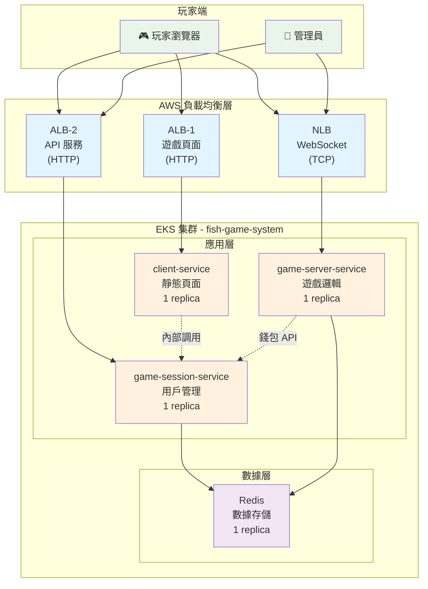

# 第三章：EKS 服務部署 Workshop

> **從第二章銜接**：你已經有了 EKS 集群和 Docker 鏡像，現在我們要一步步學習如何把應用部署到 EKS 上！

## 🎯 本章學習目標

通過本章學習，你將掌握：

- 📦 **Kubernetes 資源管理**：理解 Namespace, ConfigMap, Deployment, Service
- 🔗 **服務發現機制**：學習 Kubernetes 內部服務如何互相通信
- 🌐 **負載均衡配置**：掌握 ALB 和 NLB 的使用場景和配置方法
- 🔧 **故障排除技能**：學會使用 kubectl 命令診斷和解決問題
- 🎮 **端到端部署**：完成從容器到可訪問應用的完整流程

## 📋 前置條件檢查

在開始之前，讓我們確保環境準備就緒：

```bash
# ✅ 檢查 EKS 集群連接
kubectl get nodes
# 預期輸出：3 個 Ready 狀態的節點

# ✅ 檢查 AWS Load Balancer Controller
kubectl get deployment -n kube-system aws-load-balancer-controller
# 預期輸出：READY 2/2

# ✅ 檢查當前部署狀況
kubectl get pods -n fish-game-system
kubectl get services -n fish-game-system
kubectl get ingress -n fish-game-system

# ✅ 檢查 ECR 鏡像
export AWS_ACCOUNT_ID=$(aws sts get-caller-identity --query Account --output text)
aws ecr describe-repositories --region ap-northeast-2

# 檢查各倉庫的鏡像
aws ecr list-images --repository-name fish-game-client --region ap-northeast-2
aws ecr list-images --repository-name fish-game-session --region ap-northeast-2 2>/dev/null || echo "fish-game-session 倉庫不存在"
aws ecr list-images --repository-name fish-game-server --region ap-northeast-2 2>/dev/null || echo "fish-game-server 倉庫不存在"

echo "✅ 環境檢查完成！"
```

## 🔍 **你的當前環境狀況**

根據檢查，你的環境已經有以下資源：

### ✅ **已部署的資源**
- **Pods**: 4 個服務正在運行（各 1 個副本）
- **Services**: 包含 NLB 和內部服務
- **Ingress**: 2 個 ALB 已創建並可訪問
- **訪問地址**:
  - 遊戲頁面: `<CLIENT-ALB-ADDRESS>`
  - API 服務: `<API-ALB-ADDRESS>`
  - WebSocket: `<NLB-ADDRESS>:8083`

### ⚠️ **需要補充的部分**
- **ECR 鏡像**: 已有 `fish-game-client` 倉庫，可能需要創建其他倉庫並推送鏡像

## 📚 理解 Kubernetes 配置文件

在開始部署之前，讓我們先了解每個配置文件的作用：

```bash
# 查看配置文件結構
ls -la k8s-manifests/

# 文件說明（對應部署步驟）：
# Step 1:  1.namespace.yaml      - 創建獨立的命名空間
# Step 2:  2.configmap.yaml      - 配置環境變數和服務發現
# Step 3:  3.redis-deployment.yaml - 部署 Redis 數據庫
# Step 4:  4.client-deployment.yaml - 部署前端服務
# Step 5:  5.session-deployment.yaml - 部署會話管理服務  
# Step 6:  6.server-deployment.yaml - 部署遊戲邏輯服務
# Step 7:  7.services.yaml       - 創建 Kubernetes Service
# Step 8:  8.nlb.yaml           - 創建網絡負載均衡器 (WebSocket)
# Step 9:  9.ingress.yaml       - 創建應用負載均衡器 (HTTP)
# Step 10: 驗證負載均衡器並獲取地址
# Step 11: 更新 ConfigMap 前端配置
# Step 12: 驗證完整部署
```

## 🏗️ 補充 ECR 鏡像

你已經有部分 ECR 倉庫，讓我們檢查並補充缺失的部分：

### Step 1: 檢查並創建缺失的 ECR 倉庫

```bash
# 設置環境變數
export AWS_ACCOUNT_ID=$(aws sts get-caller-identity --query Account --output text)
export AWS_REGION=ap-northeast-2
export ECR_REGISTRY=${AWS_ACCOUNT_ID}.dkr.ecr.${AWS_REGION}.amazonaws.com

# 檢查現有倉庫
aws ecr describe-repositories --region ${AWS_REGION}

# 創建缺失的 ECR 倉庫（如果不存在）
aws ecr create-repository --repository-name fish-game-session --region ${AWS_REGION} 2>/dev/null || echo "fish-game-session 倉庫已存在"
aws ecr create-repository --repository-name fish-game-server --region ${AWS_REGION} 2>/dev/null || echo "fish-game-server 倉庫已存在"

# 獲取 ECR 登入令牌
aws ecr get-login-password --region ${AWS_REGION} | docker login --username AWS --password-stdin ${ECR_REGISTRY}

echo "✅ ECR 倉庫檢查完成"
```

### Step 2: 構建並推送 Docker 鏡像

```bash
# 確保你在專案根目錄
cd /path/to/fish-game-microservices

# 構建並推送 client-service
cd services/client-service
docker build -t fish-game-client .
docker tag fish-game-client:latest ${ECR_REGISTRY}/fish-game-client:latest
docker push ${ECR_REGISTRY}/fish-game-client:latest

# 構建並推送 game-session-service
cd ../game-session-service
docker build -t fish-game-session .
docker tag fish-game-session:latest ${ECR_REGISTRY}/fish-game-session:latest
docker push ${ECR_REGISTRY}/fish-game-session:latest

# 構建並推送 game-server-service
cd ../game-server-service
docker build -t fish-game-server .
docker tag fish-game-server:latest ${ECR_REGISTRY}/fish-game-server:latest
docker push ${ECR_REGISTRY}/fish-game-server:latest

cd ../../
echo "✅ 所有鏡像推送完成"
```

### Step 3: 更新 Deployment 使用 ECR 鏡像

```bash
# 更新 client-service 使用 ECR 鏡像
kubectl set image deployment/client-service client-service=${ECR_REGISTRY}/fish-game-client:latest -n fish-game-system

# 更新 game-session-service 使用 ECR 鏡像  
kubectl set image deployment/game-session-service game-session-service=${ECR_REGISTRY}/fish-game-session:latest -n fish-game-system

# 更新 game-server-service 使用 ECR 鏡像
kubectl set image deployment/game-server-service game-server-service=${ECR_REGISTRY}/fish-game-server:latest -n fish-game-system

# 檢查更新狀態
kubectl rollout status deployment/client-service -n fish-game-system
kubectl rollout status deployment/game-session-service -n fish-game-system
kubectl rollout status deployment/game-server-service -n fish-game-system

echo "✅ 所有服務已更新為使用 ECR 鏡像"
```

## 🏗️ 完整部署流程（按文件順序）

按照 k8s-manifests 目錄中的文件順序進行部署：

### Step 1: 部署 1.namespace.yaml - 創建命名空間

**🎓 學習重點**：命名空間提供資源隔離和權限管理

```bash
# 查看命名空間配置
cat k8s-manifests/1.namespace.yaml

# 部署命名空間
kubectl apply -f k8s-manifests/1.namespace.yaml

# 驗證創建結果
kubectl get namespaces | grep fish-game-system

# 💡 思考：為什麼需要命名空間？
# - 資源隔離：避免與其他應用衝突
# - 權限管理：可以針對命名空間設置 RBAC
# - 資源配額：可以限制命名空間的資源使用量
```

### Step 2: 部署 2.configmap.yaml - 配置環境變數

**🎓 學習重點**：ConfigMap 實現配置與代碼分離

```bash
# 查看 ConfigMap 配置
cat k8s-manifests/2.configmap.yaml

# 部署 ConfigMap
kubectl apply -f k8s-manifests/2.configmap.yaml

# 查看配置內容
kubectl get configmap fish-game-config -n fish-game-system -o yaml

# 💡 思考：ConfigMap 的優勢
# - 集中管理：所有配置在一個地方
# - 動態更新：修改配置不需要重新構建鏡像
# - 環境分離：不同環境使用不同的 ConfigMap
```

**🔍 深入理解**：ConfigMap 中的關鍵配置

```yaml
# 服務發現配置（內部服務間通信）
REDIS_HOST: "redis-service"              # Redis 服務名稱
GAME_SESSION_SERVICE_HOST: "game-session-service"  # 會話服務名稱
GAME_SERVER_SERVICE_HOST: "game-server-service"    # 遊戲服務名稱

# 前端配置（初始為空，部署後填入實際地址）
FRONTEND_SESSION_URL: ""                 # 前端 API 調用地址（ALB）
FRONTEND_GAME_URL: ""                    # 前端 WebSocket 地址（NLB）
```

**💡 為什麼前端配置初始為空？**
- ALB/NLB 地址在創建前是未知的
- 需要等負載均衡器創建完成後才能獲取實際地址
- 通過動態更新 ConfigMap 來填入正確的地址

### Step 3: 部署 3.redis-deployment.yaml - Redis 數據庫

**🎓 學習重點**：理解有狀態服務的部署和依賴關係

```bash
# 查看 Redis 配置
cat k8s-manifests/3.redis-deployment.yaml

# 部署 Redis
kubectl apply -f k8s-manifests/3.redis-deployment.yaml

# 等待 Pod 啟動
kubectl wait --for=condition=ready pod -l app=redis -n fish-game-system --timeout=60s

# 檢查 Redis 狀態
kubectl get pods -n fish-game-system -l app=redis
kubectl logs -l app=redis -n fish-game-system --tail=5

# 測試 Redis 連接
kubectl exec -n fish-game-system deployment/redis -- redis-cli ping
```

**🔍 深入理解**：為什麼先部署 Redis？

```bash
# 💡 依賴關係分析
echo "應用服務 → Redis"
echo "- game-session-service 需要 Redis 存儲用戶會話"
echo "- game-server-service 需要 Redis 存儲遊戲狀態"
echo "- 如果 Redis 不可用，應用服務會啟動失敗"
```

### Step 4: 部署 4.client-deployment.yaml - 前端服務

**🎓 學習重點**：理解 Deployment 配置和容器編排

```bash
# 查看 client-service 配置
cat k8s-manifests/4.client-deployment.yaml

# 💡 配置解析
echo "重要配置項："
echo "- replicas: 1          # 單副本部署"
echo "- image: ECR鏡像地址   # 來自第二章構建的鏡像"
echo "- envFrom: ConfigMap   # 引用環境變數配置"
echo "- resources: 資源限制  # 防止資源濫用"

# 部署 client-service
kubectl apply -f k8s-manifests/4.client-deployment.yaml

# 等待 Pod 啟動
kubectl wait --for=condition=ready pod -l app=client-service -n fish-game-system --timeout=120s

# 檢查部署狀態
kubectl get pods -n fish-game-system -l app=client-service
kubectl describe deployment client-service -n fish-game-system
```

### Step 5: 部署 5.session-deployment.yaml - 會話管理服務

```bash
# 部署會話管理服務
kubectl apply -f k8s-manifests/5.session-deployment.yaml
kubectl wait --for=condition=ready pod -l app=game-session-service -n fish-game-system --timeout=120s

# 檢查服務日誌
kubectl logs -l app=game-session-service -n fish-game-system --tail=10

# 測試健康檢查
kubectl exec -n fish-game-system deployment/game-session-service -- curl -s http://localhost:8082/health
```

### Step 6: 部署 6.server-deployment.yaml - 遊戲邏輯服務

```bash
# 部署遊戲邏輯服務
kubectl apply -f k8s-manifests/6.server-deployment.yaml
kubectl wait --for=condition=ready pod -l app=game-server-service -n fish-game-system --timeout=120s

# 檢查所有應用 Pod
kubectl get pods -n fish-game-system

# 💡 觀察 Pod 狀態
kubectl get pods -n fish-game-system -o wide
echo "注意：每個服務運行 1 個副本，適合開發和測試環境"
```

### Step 7: 部署 7.services.yaml - 創建服務發現

**🎓 學習重點**：理解 Kubernetes 服務發現和內部負載均衡

```bash
# 查看服務配置
cat k8s-manifests/7.services.yaml

# 部署服務
kubectl apply -f k8s-manifests/7.services.yaml

# 查看創建的服務
kubectl get services -n fish-game-system

# 💡 理解服務類型
echo "ClusterIP 服務："
echo "- redis-service: 6379        # 內部數據庫訪問"
echo "- client-service: 8081       # 前端服務"
echo "- game-session-service: 8082 # 會話管理"
echo "- game-server-service: 8083  # 遊戲邏輯"
```

**🔍 測試服務連通性**

```bash
# 測試服務間通信
echo "🔍 測試服務發現..."

# Client → Session Service
kubectl exec -n fish-game-system deployment/client-service -- \
  curl -s http://game-session-service:8082/health

# Session → Redis
kubectl exec -n fish-game-system deployment/game-session-service -- \
  curl -s http://redis-service:6379 || echo "Redis 不支持 HTTP，這是正常的"

# Server → Session (內部 API 調用)
kubectl exec -n fish-game-system deployment/game-server-service -- \
  curl -s http://game-session-service:8082/health

echo "✅ 服務發現測試完成"
```

### Step 8: 部署 8.nlb.yaml - 創建網絡負載均衡器

**🎓 學習重點**：理解 NLB 的使用場景和 WebSocket 支持

```bash
# 查看 NLB 配置
cat k8s-manifests/8.nlb.yaml

# 💡 為什麼使用 NLB？
echo "NLB 適用場景："
echo "- TCP/UDP 協議支持"
echo "- 極低延遲（微秒級）"
echo "- WebSocket 長連接支持"
echo "- 保持客戶端真實 IP"

# 部署 NLB
kubectl apply -f k8s-manifests/8.nlb.yaml

# 等待 NLB 創建（需要 2-3 分鐘）
echo "⏳ 等待 NLB 創建，這需要 2-3 分鐘..."
kubectl get service game-server-nlb -n fish-game-system -w
# 按 Ctrl+C 停止監控

# 獲取 NLB 地址
NLB_ADDRESS=$(kubectl get service game-server-nlb -n fish-game-system -o jsonpath='{.status.loadBalancer.ingress[0].hostname}')
echo "🌐 NLB 地址: ${NLB_ADDRESS}:8083"

# 測試 NLB 連接
curl -f http://${NLB_ADDRESS}:8083/health || echo "等待 NLB 完全就緒..."
```

### Step 9: 部署 9.ingress.yaml - 創建應用負載均衡器

**🎓 學習重點**：理解 ALB 的路徑路由和 Ingress 配置

```bash
# 查看 Ingress 配置
cat k8s-manifests/9.ingress.yaml

# 💡 ALB vs NLB 對比
echo "ALB 特點："
echo "- HTTP/HTTPS 協議優化"
echo "- 基於路徑的路由"
echo "- SSL/TLS 終止"
echo "- WAF 集成支持"

# 部署 Ingress
kubectl apply -f k8s-manifests/9.ingress.yaml

# 等待 ALB 創建（需要 2-3 分鐘）
echo "⏳ 等待 ALB 創建，這需要 2-3 分鐘..."
kubectl get ingress -n fish-game-system -w
# 按 Ctrl+C 停止監控

# 獲取 ALB 地址
CLIENT_ALB=$(kubectl get ingress client-ingress -n fish-game-system -o jsonpath='{.status.loadBalancer.ingress[0].hostname}')
API_ALB=$(kubectl get ingress api-ingress -n fish-game-system -o jsonpath='{.status.loadBalancer.ingress[0].hostname}')

echo "🎮 遊戲頁面: http://${CLIENT_ALB}"
echo "🔧 API 服務: http://${API_ALB}"
```

**🔍 理解 Ingress 路由規則**

```bash
# 💡 路由規則解析
echo "Client ALB 路由："
echo "- / → client-service (遊戲主頁面)"
echo ""
echo "API ALB 路由："
echo "- /api/* → game-session-service (用戶管理 API)"
echo "- /admin → game-session-service (管理界面)"
```

### Step 10: 驗證負載均衡器並獲取地址

**🎓 學習重點**：確認 ALB 和 NLB 已成功創建並獲取地址

```bash
# 檢查 Ingress 和 NLB 狀態
kubectl get ingress -n fish-game-system
kubectl get service game-server-nlb -n fish-game-system

# 等待負載均衡器完全就緒
echo "⏳ 等待負載均衡器完全就緒..."
kubectl wait --for=jsonpath='{.status.loadBalancer.ingress}' ingress/client-ingress -n fish-game-system --timeout=300s
kubectl wait --for=jsonpath='{.status.loadBalancer.ingress}' ingress/api-ingress -n fish-game-system --timeout=300s
kubectl wait --for=jsonpath='{.status.loadBalancer.ingress}' service/game-server-nlb -n fish-game-system --timeout=300s

# 獲取負載均衡器地址
CLIENT_ALB=$(kubectl get ingress client-ingress -n fish-game-system -o jsonpath='{.status.loadBalancer.ingress[0].hostname}')
API_ALB=$(kubectl get ingress api-ingress -n fish-game-system -o jsonpath='{.status.loadBalancer.ingress[0].hostname}')
NLB_ADDRESS=$(kubectl get service game-server-nlb -n fish-game-system -o jsonpath='{.status.loadBalancer.ingress[0].hostname}')

echo "🌐 負載均衡器地址："
echo "  Client ALB: ${CLIENT_ALB}"
echo "  API ALB: ${API_ALB}"
echo "  NLB: ${NLB_ADDRESS}"
```

### Step 11: 更新 ConfigMap 前端配置

**🎓 學習重點**：動態更新配置並重啟服務使配置生效

```bash
# 更新 ConfigMap 中的前端 URL 配置
kubectl patch configmap fish-game-config -n fish-game-system --patch "
data:
  FRONTEND_SESSION_URL: \"http://${API_ALB}/api\"
  FRONTEND_GAME_URL: \"http://${NLB_ADDRESS}:8083\"
"

# 驗證 ConfigMap 更新
kubectl get configmap fish-game-config -n fish-game-system -o yaml | grep FRONTEND

# 💡 為什麼需要更新前端配置？
echo "前端配置更新原因："
echo "- 前端 JavaScript 需要知道 API 服務的實際地址"
echo "- WebSocket 連接需要 NLB 的實際地址"
echo "- 這些地址在負載均衡器創建前是未知的"

# 重啟服務使新配置生效
echo "🔄 重啟服務以載入新配置..."
kubectl rollout restart deployment/client-service -n fish-game-system
kubectl rollout restart deployment/game-session-service -n fish-game-system
kubectl rollout restart deployment/game-server-service -n fish-game-system

# 等待重啟完成
kubectl rollout status deployment/client-service -n fish-game-system
kubectl rollout status deployment/game-session-service -n fish-game-system
kubectl rollout status deployment/game-server-service -n fish-game-system

echo "✅ 所有服務已重啟並載入新配置"
```

### Step 12: 驗證完整部署

**🎓 學習重點**：掌握部署驗證和故障排除方法

```bash
# 檢查所有資源狀態
echo "📊 檢查部署狀態..."
kubectl get all -n fish-game-system

# 檢查 Pod 健康狀態
echo "🏥 檢查 Pod 健康狀態..."
kubectl get pods -n fish-game-system -o wide

# 測試外部訪問
echo "🌐 測試外部訪問..."
curl -I http://${CLIENT_ALB}/ || echo "❌ Client ALB 訪問失敗"
curl -I http://${API_ALB}/api/health || echo "❌ API ALB 訪問失敗"
curl -I http://${NLB_ADDRESS}:8083/health || echo "❌ NLB 訪問失敗"

# 測試前端配置是否正確
echo "🔍 測試前端配置..."
kubectl exec -n fish-game-system deployment/client-service -- env | grep FRONTEND

# 檢查事件日誌
echo "📋 檢查最近事件..."
kubectl get events -n fish-game-system --sort-by='.lastTimestamp' | tail -10

echo "🎉 部署驗證完成！"
```

## 🎮 訪問你的遊戲

你的遊戲已經部署並可以訪問：

| 功能 | 地址 | 說明 |
|------|------|------|
| 🎮 **遊戲主頁** | `http://<CLIENT-ALB-ADDRESS>` | 玩家遊戲界面 |
| 🎯 **API 服務** | `http://<API-ALB-ADDRESS>` | API 和管理界面 |
| 🎮 **WebSocket** | `http://<NLB-ADDRESS>:8083` | 遊戲 WebSocket |

### 快速測試

```bash
# 測試遊戲頁面
curl -I http://${CLIENT_ALB}/

# 測試 API 健康檢查
curl -I http://${API_ALB}/health

# 測試 WebSocket 服務
curl -I http://${NLB_ADDRESS}:8083/health
```

## 📊 理解部署架構

### 完整架構圖



### 網絡流量分析

```bash
# 💡 流量路徑分析
echo "🌐 網絡流量路徑："
echo ""
echo "1. 遊戲頁面訪問："
echo "   玩家瀏覽器 → ALB-1 → client-service → 返回 HTML/CSS/JS"
echo ""
echo "2. API 調用："
echo "   前端 JS → ALB-2 → game-session-service → Redis → 返回數據"
echo ""
echo "3. WebSocket 遊戲："
echo "   前端 JS → NLB → game-server-service → Redis → 實時遊戲數據"
echo ""
echo "4. 服務間通信："
echo "   game-server-service → game-session-service (錢包操作)"
```

## 🔧 故障排除指南

### 常見問題診斷

#### 1. Pod 無法啟動

```bash
# 檢查 Pod 狀態
kubectl get pods -n fish-game-system

# 查看 Pod 詳細信息
kubectl describe pod <pod-name> -n fish-game-system

# 查看 Pod 日誌
kubectl logs <pod-name> -n fish-game-system

# 常見問題：
# - ImagePullBackOff: ECR 權限問題或鏡像不存在
# - CrashLoopBackOff: 應用啟動失敗，檢查日誌
# - Pending: 資源不足或調度問題
```

#### 2. 服務無法訪問

```bash
# 檢查服務端點
kubectl get endpoints -n fish-game-system

# 檢查服務配置
kubectl describe service <service-name> -n fish-game-system

# 測試內部連通性
kubectl exec -n fish-game-system deployment/<source> -- curl <target-service>:<port>/health
```

#### 3. 負載均衡器問題

```bash
# 檢查 Ingress 狀態
kubectl describe ingress <ingress-name> -n fish-game-system

# 檢查 AWS Load Balancer Controller 日誌
kubectl logs -n kube-system -l app.kubernetes.io/name=aws-load-balancer-controller

# 檢查 AWS 控制台中的負載均衡器狀態
aws elbv2 describe-load-balancers --region ap-northeast-2
```

### 實用診斷命令

```bash
# 一鍵健康檢查
echo "🏥 執行健康檢查..."
kubectl get pods -n fish-game-system | grep -v Running && echo "❌ 有 Pod 未正常運行" || echo "✅ 所有 Pod 正常"
kubectl get svc -n fish-game-system | grep -v ClusterIP && echo "ℹ️  外部服務狀態正常"
kubectl get ingress -n fish-game-system | grep -v ADDRESS && echo "⏳ 負載均衡器還在創建中"

# 查看資源使用情況
kubectl top pods -n fish-game-system 2>/dev/null || echo "ℹ️  Metrics Server 可能未就緒"

# 查看最近事件
kubectl get events -n fish-game-system --sort-by='.lastTimestamp' | tail -5
```

## 🎯 學習總結

完成本章後，你已經掌握了：

✅ **Kubernetes 核心概念**
- Namespace: 資源隔離
- ConfigMap: 配置管理  
- Deployment: 應用部署
- Service: 服務發現
- Ingress: 外部訪問

✅ **AWS 負載均衡器**
- ALB: HTTP/HTTPS 流量處理
- NLB: TCP/UDP 和 WebSocket 支持
- 路由規則和健康檢查

✅ **故障排除技能**
- kubectl 命令使用
- 日誌查看和分析
- 網絡連通性測試

✅ **生產環境部署**
- 高可用性配置
- 資源限制和監控
- 安全最佳實踐

## 🚀 下一步學習

在下一章中，我們將學習：

- 🔍 **監控和日誌**：設置 Prometheus 和 Grafana
- 📈 **自動擴展**：配置 HPA 和 Cluster Autoscaler  
- 🔒 **安全加固**：RBAC、Network Policy、Pod Security
- 🔄 **CI/CD 流水線**：自動化部署和更新

---

**🎮 恭喜！你已經成功將魚機遊戲部署到 AWS EKS 生產環境！**

現在你可以邀請朋友通過瀏覽器訪問你的遊戲，體驗雲原生微服務架構的強大功能！