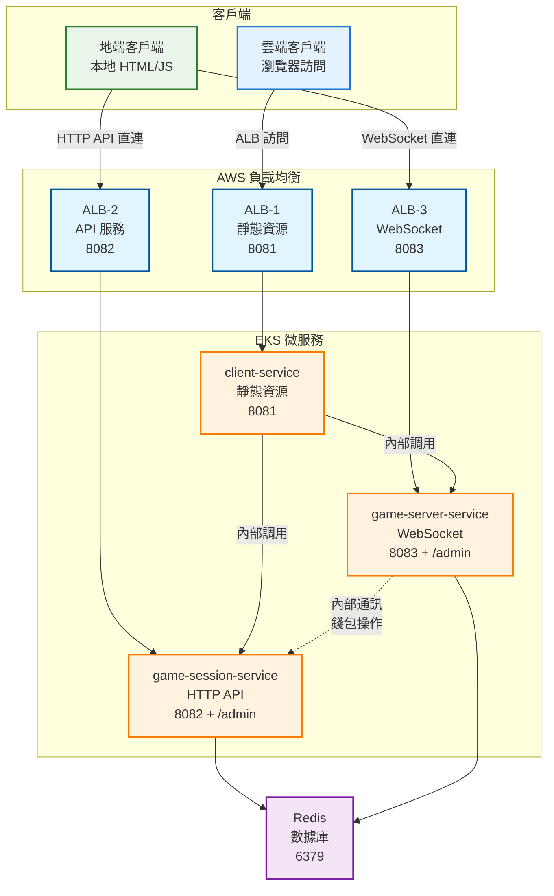

# 🐟 微服務捕魚遊戲 Workshop

> **從 Docker Compose 到 Amazon EKS 的完整微服務實戰教學**

這是一個完整的微服務架構實戰 Workshop，通過構建一個即時多人捕魚遊戲，學習現代微服務開發、容器化部署和 Kubernetes 運維的最佳實踐。

## 🎯 Workshop 學習目標

- 🏗️ **微服務架構設計**：理解服務拆分、通信模式和數據一致性
- 🐳 **容器化最佳實踐**：Docker 多階段構建、健康檢查和資源優化
- 🔄 **服務發現與通信**：環境變數驅動配置、服務間調用模式
- ☸️ **Kubernetes 部署**：從 Docker Compose 遷移到 EKS 的完整流程
- 🌐 **負載均衡策略**：WebSocket 應用的 ALB vs NLB 選擇
- 📊 **可觀測性**：日誌、監控和故障排除

## 🏗️ 雙模式客戶端架構

### 架構概覽



### 核心服務

- **client-service** (8081): 前端界面和靜態資源服務
- **game-session-service** (8082): 用戶管理、錢包系統、大廳管理 + /admin
- **game-server-service** (8083): 遊戲邏輯、WebSocket 通訊 + /admin
- **Redis** (6379): 統一數據存儲和緩存

## 🚀 快速開始

### 本地開發環境

```bash
# 1. 克隆專案
git clone <repository-url>
cd fish-game-microservices

# 2. 啟動所有服務
docker-compose up -d

# 3. 驗證服務狀態
docker-compose ps

# 4. 訪問應用
# 遊戲界面: http://localhost:8081
# 會話管理: http://localhost:8082/admin  
# 遊戲監控: http://localhost:8083/admin
```

### EKS 生產環境

```bash
# 1. 一鍵部署 EKS 集群（預計 15-20 分鐘）
chmod +x infrastructure/eks/one-click-cmd.sh
./infrastructure/eks/one-click-cmd.sh

# 2. 構建並推送 Docker 鏡像到 ECR
chmod +x infrastructure/build-and-push.sh
./infrastructure/build-and-push.sh

# 3. 部署應用到 EKS（詳見第四章）
# 跟隨 Step 8.5 和 Step 9 的詳細步驟
```

**主要步驟概覽**：
- 🔧 安裝必要工具 (kubectl, eksctl, helm)
- ☸️ 建立 EKS 集群
- 🔌 安裝必要 Add-ons
- 📦 **構建並推送 Docker 鏡像到 ECR**
- 🚀 **部署微服務應用到 EKS**
- 🌐 配置負載均衡器
- 🔒 設定 SSL 證書

## 📚 Workshop 章節

### [第一章：微服務架構設計](#第一章微服務架構設計)
- 服務拆分原則與邊界劃分
- 數據庫設計與狀態管理
- 通信模式選擇

### [第二章：Docker 容器化](#第二章docker-容器化)
- 多階段構建優化
- 健康檢查配置
- 環境變數管理

### [第三章：Docker Compose 本地開發](#第三章docker-compose-本地開發)
- 服務發現與網絡配置
- 開發環境搭建
- 調試與故障排除

### [第四章：Amazon EKS 部署](#第四章amazon-eks-部署)
- 🚀 **一鍵部署 EKS 集群**
- 📋 **Step by Step Workshop**
- 🔧 **必要 Add-ons 說明**
- 🎯 **服務遷移策略**

### [第五章：負載均衡與網絡](#第五章負載均衡與網絡)
- ALB vs NLB 選擇策略
- WebSocket 負載均衡
- SSL/TLS 配置

---

## 第一章：微服務架構設計

### 🎯 為什麼選擇微服務架構？

在這個捕魚遊戲中，我們面臨以下挑戰：
- **高並發需求**：多人即時遊戲需要處理大量 WebSocket 連接
- **不同的擴展需求**：遊戲邏輯 vs 用戶管理有不同的負載特性
- **技術棧靈活性**：前端靜態資源 vs 後端 API vs 即時通信
- **獨立部署**：遊戲功能更新不應影響用戶管理

### 🏗️ 服務拆分策略

#### 1. Client Service (前端服務)
```
職責：靜態資源服務 + 配置注入
為什麼獨立：
✅ 可以使用 CDN 加速
✅ 支持多環境配置注入
✅ 前後端完全解耦
```

#### 2. Game Session Service (會話服務)
```
職責：用戶管理 + 房間管理 + 錢包系統
為什麼獨立：
✅ 用戶數據的一致性要求高
✅ 可以獨立擴展用戶管理功能
✅ 錢包操作需要事務保證
```

#### 3. Game Server Service (遊戲服務)
```
職責：遊戲邏輯 + WebSocket 通信 + 碰撞檢測
為什麼獨立：
✅ CPU 密集型計算可以獨立擴展
✅ WebSocket 連接需要會話保持
✅ 遊戲邏輯更新頻繁
```

---

## 第二章：Docker 容器化

### 🐳 為什麼使用 Docker？

- **環境一致性**：開發、測試、生產環境完全一致
- **資源隔離**：每個服務獨立運行，互不干擾
- **快速部署**：秒級啟動，支持滾動更新
- **易於擴展**：水平擴展變得簡單

### 📦 Dockerfile 最佳實踐

```dockerfile
# 多階段構建範例
FROM node:18-alpine AS builder
WORKDIR /app
COPY package*.json ./
RUN npm ci --only=production && npm cache clean --force

FROM node:18-alpine AS runtime
WORKDIR /app
RUN addgroup -g 1001 -S nodejs && adduser -S nodejs -u 1001
COPY --from=builder /app/node_modules ./node_modules
COPY --chown=nodejs:nodejs . .
USER nodejs
EXPOSE 8081
HEALTHCHECK --interval=30s --timeout=3s --start-period=5s --retries=3 \
  CMD curl -f http://localhost:8081/health || exit 1
CMD ["node", "app.js"]
```

### 🏗️ 構建和推送到 ECR

#### ECR 倉庫準備

```bash
# 1. 創建 ECR 倉庫
aws ecr create-repository --repository-name fish-game-client --region ap-northeast-2
aws ecr create-repository --repository-name fish-game-session --region ap-northeast-2
aws ecr create-repository --repository-name fish-game-server --region ap-northeast-2

# 2. 獲取登入令牌
aws ecr get-login-password --region ap-northeast-2 | docker login --username AWS --password-stdin $(aws sts get-caller-identity --query Account --output text).dkr.ecr.ap-northeast-2.amazonaws.com
```

#### 構建和推送腳本

```bash
#!/bin/bash
# build-and-push.sh

# 設定變數
export AWS_ACCOUNT_ID=$(aws sts get-caller-identity --query Account --output text)
export ECR_REGISTRY=${AWS_ACCOUNT_ID}.dkr.ecr.ap-northeast-2.amazonaws.com
export IMAGE_TAG=${1:-latest}

# 構建並推送 client-service
echo "Building and pushing client-service..."
cd services/client-service
docker build -t fish-game-client:${IMAGE_TAG} .
docker tag fish-game-client:${IMAGE_TAG} ${ECR_REGISTRY}/fish-game-client:${IMAGE_TAG}
docker push ${ECR_REGISTRY}/fish-game-client:${IMAGE_TAG}

# 構建並推送 game-session-service
echo "Building and pushing game-session-service..."
cd ../game-session-service
docker build -t fish-game-session:${IMAGE_TAG} .
docker tag fish-game-session:${IMAGE_TAG} ${ECR_REGISTRY}/fish-game-session:${IMAGE_TAG}
docker push ${ECR_REGISTRY}/fish-game-session:${IMAGE_TAG}

# 構建並推送 game-server-service
echo "Building and pushing game-server-service..."
cd ../game-server-service
docker build -t fish-game-server:${IMAGE_TAG} .
docker tag fish-game-server:${IMAGE_TAG} ${ECR_REGISTRY}/fish-game-server:${IMAGE_TAG}
docker push ${ECR_REGISTRY}/fish-game-server:${IMAGE_TAG}

cd ../../
echo "All images pushed successfully!"
```

#### 使用方式

```bash
# 給予執行權限
chmod +x infrastructure/build-and-push.sh

# 推送 latest 標籤
./infrastructure/build-and-push.sh

# 推送特定版本標籤
./infrastructure/build-and-push.sh v1.0.0
```

---

## 第三章：Docker Compose 本地開發

### 🔄 服務發現機制

Docker Compose 自動為每個服務創建 DNS 記錄，服務間可以通過服務名稱互相訪問。

### 🚀 快速開始

```bash
# 1. 克隆項目
git clone <repository-url>
cd fish-game-microservices

# 2. 檢查環境變數
cat .env

# 3. 構建所有服務
docker-compose build

# 4. 啟動服務
docker-compose up -d

# 5. 檢查服務狀態
docker-compose ps
```

### 📱 服務訪問

| 服務 | 地址 | 管理後台 | 說明 |
|------|------|----------|------|
| 🎮 遊戲客戶端 | http://localhost:8081 | - | 玩家遊戲界面 |
| 🎯 遊戲會話服務 | http://localhost:8082 | http://localhost:8082/admin | 用戶管理、錢包管理 |
| 🎮 遊戲伺服器 | http://localhost:8083 | http://localhost:8083/admin | 遊戲邏輯、即時通訊 |
| 💾 Redis 數據庫 | localhost:6379 | - | 內存數據存儲 |

---

## 第四章：Amazon EKS 部署

### ☸️ 為什麼選擇 EKS？

- **託管 Kubernetes**：AWS 管理控制平面，減少運維負擔
- **原生整合**：與 AWS 服務深度整合（ALB、NLB、IAM、CloudWatch）
- **自動擴展**：支持 HPA、VPA 和 Cluster Autoscaler
- **安全性**：整合 AWS IAM 和 VPC 安全組

### 🚀 快速部署選項

如果你想快速部署而不想逐步操作，可以使用我們提供的一鍵腳本：

```bash
# 一鍵部署 EKS 集群（預計 15-20 分鐘）
chmod +x infrastructure/eks/one-click-cmd.sh
./infrastructure/eks/one-click-cmd.sh
```

### 📋 詳細部署步驟

**推薦跟隨以下步驟進行部署，這樣你可以了解每個步驟的作用：**

#### 前置需求

1. **AWS 帳戶** 並配置好 AWS CLI
```bash
# 配置 AWS 憑證
aws configure
# 或使用 AWS SSO
aws sso login

# 驗證憑證
aws sts get-caller-identity
```

2. **必要權限**
- EKS 集群管理權限
- IAM 角色建立權限
- VPC 和 EC2 管理權限

3. **Linux/macOS 環境** (Windows 用戶請使用 WSL)

#### Step 1: 安裝必要工具

```bash
# 1.1 安裝 kubectl v1.32.9
sudo curl -o /usr/local/bin/kubectl https://s3.us-west-2.amazonaws.com/amazon-eks/1.32.9/2025-09-19/bin/linux/amd64/kubectl
sudo chmod +x /usr/local/bin/kubectl

# 驗證安裝
kubectl version --client

# 1.2 安裝 eksctl
curl --location "https://github.com/eksctl-io/eksctl/releases/latest/download/eksctl_$(uname -s)_amd64.tar.gz" | tar xz -C /tmp
sudo mv -v /tmp/eksctl /usr/local/bin

# 驗證安裝
eksctl version

# 1.3 安裝 Helm
curl https://raw.githubusercontent.com/helm/helm/main/scripts/get-helm-3 | bash

# 驗證安裝
helm version
```

#### Step 2: 建立 EKS 集群

```bash
# 2.1 設定 AWS 區域
export AWS_REGION=ap-northeast-2

# 2.2 建立 EKS 集群（約需 15-20 分鐘）
eksctl create cluster \
  --name myeks \
  --version 1.32 \
  --region ${AWS_REGION} \
  --nodegroup-name standard-workers \
  --node-type t3.medium \
  --nodes 3 \
  --nodes-min 1 \
  --nodes-max 4 \
  --managed

# 2.3 驗證集群建立成功
kubectl get nodes
```

**預期輸出**：
```
NAME                                               STATUS   ROLES    AGE   VERSION
ip-192-168-xx-xx.ap-northeast-2.compute.internal   Ready    <none>   2m    v1.32.x
ip-192-168-xx-xx.ap-northeast-2.compute.internal   Ready    <none>   2m    v1.32.x
ip-192-168-xx-xx.ap-northeast-2.compute.internal   Ready    <none>   2m    v1.32.x
```

#### Step 3: 安裝 AWS Load Balancer Controller

```bash
# 3.1 下載 IAM 政策文件
curl -O https://raw.githubusercontent.com/kubernetes-sigs/aws-load-balancer-controller/v2.7.2/docs/install/iam_policy.json

# 3.2 建立 IAM 政策
aws iam create-policy \
  --policy-name AWSLoadBalancerControllerIAMPolicy \
  --policy-document file://iam_policy.json

# 3.3 關聯 OIDC 提供者
eksctl utils associate-iam-oidc-provider \
  --region=ap-northeast-2 \
  --cluster=myeks \
  --approve

# 3.4 建立 IAM 服務帳戶
eksctl create iamserviceaccount \
  --cluster=myeks \
  --namespace=kube-system \
  --name=aws-load-balancer-controller \
  --role-name AmazonEKSLoadBalancerControllerRole \
  --attach-policy-arn=arn:aws:iam::$(aws sts get-caller-identity --query Account --output text):policy/AWSLoadBalancerControllerIAMPolicy \
  --approve

# 3.5 添加 EKS Helm 倉庫
helm repo add eks https://aws.github.io/eks-charts
helm repo update

# 3.6 安裝 AWS Load Balancer Controller
helm install aws-load-balancer-controller eks/aws-load-balancer-controller \
  -n kube-system \
  --set clusterName=myeks \
  --set serviceAccount.create=false \
  --set serviceAccount.name=aws-load-balancer-controller

# 3.7 驗證安裝
kubectl get deployment -n kube-system aws-load-balancer-controller
```

**預期輸出**：
```
NAME                           READY   UP-TO-DATE   AVAILABLE   AGE
aws-load-balancer-controller   2/2     2            2           2m
```

#### Step 4: 安裝其他必要 Add-ons

```bash
# 4.1 安裝 EBS CSI Driver
# 建立 IAM 服務帳戶
eksctl create iamserviceaccount \
  --name ebs-csi-controller-sa \
  --namespace kube-system \
  --cluster myeks \
  --role-name AmazonEKS_EBS_CSI_DriverRole \
  --attach-policy-arn arn:aws:iam::aws:policy/service-role/AmazonEBSCSIDriverPolicy \
  --approve

# 安裝 EBS CSI Driver add-on
eksctl create addon \
  --name aws-ebs-csi-driver \
  --cluster myeks \
  --service-account-role-arn arn:aws:iam::$(aws sts get-caller-identity --query Account --output text):role/AmazonEKS_EBS_CSI_DriverRole \
  --force

# 4.2 安裝基礎 add-ons
eksctl create addon --name coredns --cluster myeks --force
eksctl create addon --name kube-proxy --cluster myeks --force
eksctl create addon --name vpc-cni --cluster myeks --force

# 4.3 安裝 Metrics Server
kubectl apply -f https://github.com/kubernetes-sigs/metrics-server/releases/latest/download/components.yaml

# 4.4 驗證所有 add-ons
eksctl get addons --cluster myeks
```

**預期輸出**：
```
NAME            VERSION         STATUS  ISSUES  IAMROLE
aws-ebs-csi-driver  v1.x.x-eksbuild.x   ACTIVE  0
coredns         v1.x.x-eksbuild.x   ACTIVE  0
kube-proxy      v1.x.x-eksbuild.x   ACTIVE  0
vpc-cni         v1.x.x-eksbuild.x   ACTIVE  0
```

#### Step 5: 建立應用命名空間

```bash
# 5.1 建立魚機遊戲專用命名空間
kubectl create namespace fish-game-system

# 5.2 驗證命名空間建立
kubectl get namespaces

# 5.3 設定預設命名空間（可選）
kubectl config set-context --current --namespace=fish-game-system
```

**預期輸出**：
```
NAME              STATUS   AGE
default           Active   20m
fish-game-system  Active   10s
kube-node-lease   Active   20m
kube-public       Active   20m
kube-system       Active   20m
```

#### Step 6: 驗證集群狀態

```bash
# 6.1 檢查節點狀態
kubectl get nodes
```
**預期輸出**：所有節點都應該是 `Ready` 狀態

```bash
# 6.2 檢查所有 add-ons 狀態
eksctl get addons --cluster myeks
```
**預期輸出**：所有 add-ons 都應該是 `ACTIVE` 狀態

```bash
# 6.3 檢查 AWS Load Balancer Controller
kubectl get deployment -n kube-system aws-load-balancer-controller
```
**預期輸出**：`READY 2/2`

```bash
# 6.4 檢查 Metrics Server
kubectl get deployment metrics-server -n kube-system
```
**預期輸出**：`READY 2/2`

```bash
# 6.5 檢查所有系統 Pod
kubectl get pods -n kube-system
```
**預期輸出**：所有 Pod 都應該是 `Running` 狀態

```bash
# 6.6 檢查命名空間
kubectl get namespace fish-game-system
```
**預期輸出**：應該看到 `fish-game-system` 命名空間

#### Step 7: 建立 ConfigMap 和 Secret

```bash
# 7.1 建立 ConfigMap
cat <<EOF | kubectl apply -f -
apiVersion: v1
kind: ConfigMap
metadata:
  name: fish-game-config
  namespace: fish-game-system
data:
  # Redis 配置
  REDIS_HOST: "redis-service"
  REDIS_PORT: "6379"
  
  # 服務間通信配置
  GAME_SESSION_SERVICE_HOST: "game-session-service"
  GAME_SESSION_SERVICE_PORT: "8082"
  GAME_SERVER_SERVICE_HOST: "game-server-service"
  GAME_SERVER_SERVICE_PORT: "8083"
  CLIENT_SERVICE_PORT: "8081"
  
  # 遊戲配置
  GAME_ROOM_MAX_PLAYERS: "4"
  GAME_FISH_SPAWN_INTERVAL: "2000"
  NODE_ENV: "production"
EOF

# 7.2 建立 Secret（請替換為實際的 JWT 密鑰）
kubectl create secret generic fish-game-secret \
  --from-literal=JWT_SECRET=your-super-secret-jwt-key-here \
  -n fish-game-system

# 7.3 驗證 ConfigMap 和 Secret
kubectl get configmap -n fish-game-system
kubectl get secret -n fish-game-system
```

#### Step 8: 部署 Redis

```bash
# 8.1 部署 Redis
cat <<EOF | kubectl apply -f -
apiVersion: apps/v1
kind: Deployment
metadata:
  name: redis
  namespace: fish-game-system
spec:
  replicas: 1
  selector:
    matchLabels:
      app: redis
  template:
    metadata:
      labels:
        app: redis
    spec:
      containers:
      - name: redis
        image: redis:7-alpine
        ports:
        - containerPort: 6379
        command: ["redis-server", "--save", "", "--appendonly", "no"]
        resources:
          requests:
            memory: "256Mi"
            cpu: "250m"
          limits:
            memory: "512Mi"
            cpu: "500m"
        livenessProbe:
          exec:
            command:
            - redis-cli
            - ping
          initialDelaySeconds: 30
          periodSeconds: 10
        readinessProbe:
          exec:
            command:
            - redis-cli
            - ping
          initialDelaySeconds: 5
          periodSeconds: 5
---
apiVersion: v1
kind: Service
metadata:
  name: redis-service
  namespace: fish-game-system
spec:
  selector:
    app: redis
  ports:
    - port: 6379
      targetPort: 6379
  type: ClusterIP
EOF

# 8.2 驗證 Redis 部署
kubectl get pods -n fish-game-system -l app=redis
kubectl get service -n fish-game-system redis-service
```

#### Step 8.5: 構建並推送 Docker 鏡像到 ECR

```bash
# 8.5.1 創建 ECR 倉庫
aws ecr create-repository --repository-name fish-game-client --region ap-northeast-2
aws ecr create-repository --repository-name fish-game-session --region ap-northeast-2
aws ecr create-repository --repository-name fish-game-server --region ap-northeast-2

# 8.5.2 獲取 ECR 登入令牌
aws ecr get-login-password --region ap-northeast-2 | docker login --username AWS --password-stdin $(aws sts get-caller-identity --query Account --output text).dkr.ecr.ap-northeast-2.amazonaws.com

# 8.5.3 設定環境變數
export AWS_ACCOUNT_ID=$(aws sts get-caller-identity --query Account --output text)
export ECR_REGISTRY=${AWS_ACCOUNT_ID}.dkr.ecr.ap-northeast-2.amazonaws.com

# 8.5.4 構建並推送 client-service
cd services/client-service
docker build -t fish-game-client .
docker tag fish-game-client:latest ${ECR_REGISTRY}/fish-game-client:latest
docker push ${ECR_REGISTRY}/fish-game-client:latest

# 8.5.5 構建並推送 game-session-service
cd ../game-session-service
docker build -t fish-game-session .
docker tag fish-game-session:latest ${ECR_REGISTRY}/fish-game-session:latest
docker push ${ECR_REGISTRY}/fish-game-session:latest

# 8.5.6 構建並推送 game-server-service
cd ../game-server-service
docker build -t fish-game-server .
docker tag fish-game-server:latest ${ECR_REGISTRY}/fish-game-server:latest
docker push ${ECR_REGISTRY}/fish-game-server:latest

# 8.5.7 驗證鏡像推送成功
aws ecr list-images --repository-name fish-game-client --region ap-northeast-2
aws ecr list-images --repository-name fish-game-session --region ap-northeast-2
aws ecr list-images --repository-name fish-game-server --region ap-northeast-2

# 8.5.8 回到專案根目錄
cd ../../
```

#### Step 9: 部署微服務應用

```bash
# 9.1 設定 ECR 環境變數（如果還沒設定）
export AWS_ACCOUNT_ID=$(aws sts get-caller-identity --query Account --output text)
export ECR_REGISTRY=${AWS_ACCOUNT_ID}.dkr.ecr.ap-northeast-2.amazonaws.com

# 9.2 部署 Game Session Service
cat <<EOF | kubectl apply -f -
apiVersion: apps/v1
kind: Deployment
metadata:
  name: game-session-service
  namespace: fish-game-system
spec:
  replicas: 2
  selector:
    matchLabels:
      app: game-session-service
  template:
    metadata:
      labels:
        app: game-session-service
    spec:
      containers:
      - name: game-session-service
        image: ${ECR_REGISTRY}/fish-game-session:latest
        ports:
        - containerPort: 8082
        envFrom:
        - configMapRef:
            name: fish-game-config
        - secretRef:
            name: fish-game-secret
        resources:
          requests:
            memory: "512Mi"
            cpu: "500m"
          limits:
            memory: "1Gi"
            cpu: "1000m"
        livenessProbe:
          httpGet:
            path: /health
            port: 8082
          initialDelaySeconds: 30
          periodSeconds: 10
        readinessProbe:
          httpGet:
            path: /health
            port: 8082
          initialDelaySeconds: 5
          periodSeconds: 5
---
apiVersion: v1
kind: Service
metadata:
  name: game-session-service
  namespace: fish-game-system
spec:
  selector:
    app: game-session-service
  ports:
    - port: 8082
      targetPort: 8082
  type: ClusterIP
EOF

# 9.3 部署 Game Server Service
cat <<EOF | kubectl apply -f -
apiVersion: apps/v1
kind: Deployment
metadata:
  name: game-server-service
  namespace: fish-game-system
spec:
  replicas: 2
  selector:
    matchLabels:
      app: game-server-service
  template:
    metadata:
      labels:
        app: game-server-service
    spec:
      containers:
      - name: game-server-service
        image: ${ECR_REGISTRY}/fish-game-server:latest
        ports:
        - containerPort: 8083
        envFrom:
        - configMapRef:
            name: fish-game-config
        - secretRef:
            name: fish-game-secret
        resources:
          requests:
            memory: "512Mi"
            cpu: "500m"
          limits:
            memory: "1Gi"
            cpu: "1000m"
        livenessProbe:
          httpGet:
            path: /health
            port: 8083
          initialDelaySeconds: 30
          periodSeconds: 10
        readinessProbe:
          httpGet:
            path: /health
            port: 8083
          initialDelaySeconds: 5
          periodSeconds: 5
---
apiVersion: v1
kind: Service
metadata:
  name: game-server-service
  namespace: fish-game-system
spec:
  selector:
    app: game-server-service
  ports:
    - port: 8083
      targetPort: 8083
  type: ClusterIP
EOF

# 9.4 部署 Client Service
cat <<EOF | kubectl apply -f -
apiVersion: apps/v1
kind: Deployment
metadata:
  name: client-service
  namespace: fish-game-system
spec:
  replicas: 2
  selector:
    matchLabels:
      app: client-service
  template:
    metadata:
      labels:
        app: client-service
    spec:
      containers:
      - name: client-service
        image: ${ECR_REGISTRY}/fish-game-client:latest
        ports:
        - containerPort: 8081
        envFrom:
        - configMapRef:
            name: fish-game-config
        resources:
          requests:
            memory: "256Mi"
            cpu: "250m"
          limits:
            memory: "512Mi"
            cpu: "500m"
        livenessProbe:
          httpGet:
            path: /health
            port: 8081
          initialDelaySeconds: 30
          periodSeconds: 10
        readinessProbe:
          httpGet:
            path: /health
            port: 8081
          initialDelaySeconds: 5
          periodSeconds: 5
---
apiVersion: v1
kind: Service
metadata:
  name: client-service
  namespace: fish-game-system
spec:
  selector:
    app: client-service
  ports:
    - port: 8081
      targetPort: 8081
  type: ClusterIP
EOF

# 9.4 驗證所有服務部署
kubectl get pods -n fish-game-system
kubectl get services -n fish-game-system
```

#### Step 10: 建立 ALB Ingress

```bash
# 10.1 建立 ALB Ingress
cat <<EOF | kubectl apply -f -
apiVersion: networking.k8s.io/v1
kind: Ingress
metadata:
  name: fish-game-alb
  namespace: fish-game-system
  annotations:
    kubernetes.io/ingress.class: alb
    alb.ingress.kubernetes.io/scheme: internet-facing
    alb.ingress.kubernetes.io/target-type: ip
    alb.ingress.kubernetes.io/ssl-redirect: '443'
    # 如果你有 SSL 證書，請取消註解並替換證書 ARN
    # alb.ingress.kubernetes.io/certificate-arn: arn:aws:acm:region:account:certificate/cert-id
spec:
  rules:
  - host: fishgame.example.com  # 請替換為你的域名
    http:
      paths:
      - path: /
        pathType: Prefix
        backend:
          service:
            name: client-service
            port:
              number: 8081
      - path: /api
        pathType: Prefix
        backend:
          service:
            name: game-session-service
            port:
              number: 8082
      - path: /socket.io
        pathType: Prefix
        backend:
          service:
            name: game-server-service
            port:
              number: 8083
EOF

# 10.2 檢查 Ingress 狀態
kubectl get ingress -n fish-game-system

# 10.3 獲取 ALB 地址（需要等待幾分鐘）
kubectl get ingress fish-game-alb -n fish-game-system -o jsonpath='{.status.loadBalancer.ingress[0].hostname}'
```

#### Step 11: 配置域名和 SSL（可選）

```bash
# 11.1 獲取 ALB 地址
ALB_HOSTNAME=$(kubectl get ingress fish-game-alb -n fish-game-system -o jsonpath='{.status.loadBalancer.ingress[0].hostname}')
echo "ALB Hostname: $ALB_HOSTNAME"

# 11.2 在 Route 53 中建立 DNS 記錄
# 將 fishgame.example.com 指向 $ALB_HOSTNAME

# 11.3 申請 SSL 證書（如果需要 HTTPS）
aws acm request-certificate \
  --domain-name fishgame.example.com \
  --validation-method DNS \
  --region ap-northeast-2

# 11.4 更新 Ingress 以使用 SSL 證書
# 取消註解 Ingress 中的 certificate-arn 註解並填入證書 ARN
```

#### Step 12: 測試應用

```bash
# 12.1 測試服務健康狀態
kubectl get pods -n fish-game-system

# 12.2 測試內部服務連通性
kubectl exec -it deployment/client-service -n fish-game-system -- curl http://game-session-service:8082/health
kubectl exec -it deployment/client-service -n fish-game-system -- curl http://game-server-service:8083/health

# 12.3 測試外部訪問（替換為你的域名或 ALB 地址）
curl http://fishgame.example.com/
curl http://fishgame.example.com/api/health
curl http://fishgame.example.com/socket.io/health

# 12.4 檢查應用日誌
kubectl logs -f deployment/game-session-service -n fish-game-system
kubectl logs -f deployment/game-server-service -n fish-game-system
kubectl logs -f deployment/client-service -n fish-game-system
```

### 🔧 必要 Add-ons 說明

#### ⭐ **AWS Load Balancer Controller** (最重要)
- **用途**: 支援 ALB 和 NLB 負載均衡器
- **為什麼需要**: 魚機系統需要 3 個 ALB (靜態資源:8081、API:8082、WebSocket:8083)
- **驗證**: `kubectl get deployment -n kube-system aws-load-balancer-controller`

#### ⭐ **EBS CSI Driver** (重要)
- **用途**: 提供持久化存儲支援
- **為什麼需要**: Redis 數據持久化、應用日誌存儲
- **驗證**: `eksctl get addons --cluster myeks | grep ebs-csi-driver`

#### ⭐ **CoreDNS** (必要)
- **用途**: 集群內 DNS 解析
- **為什麼需要**: 服務發現 (game-session-service ↔ game-server-service)
- **驗證**: `kubectl get pods -n kube-system -l k8s-app=kube-dns`

#### ⭐ **Metrics Server** (重要)
- **用途**: 提供 CPU/記憶體指標
- **為什麼需要**: HPA 自動擴展、監控
- **驗證**: `kubectl top nodes`

### 故障排除

#### 常見問題

1. **集群建立失敗**
```bash
# 檢查 AWS 憑證
aws sts get-caller-identity

# 檢查區域設定
echo $AWS_REGION
```

2. **Add-on 安裝失敗**
```bash
# 檢查 OIDC 提供者
eksctl utils associate-iam-oidc-provider --region=ap-northeast-2 --cluster=myeks --approve

# 重新安裝 AWS Load Balancer Controller
helm uninstall aws-load-balancer-controller -n kube-system
# 然後重新執行安裝步驟
```

3. **Pod 無法啟動**
```bash
# 檢查 Pod 狀態
kubectl get pods -n fish-game-system

# 檢查 Pod 日誌
kubectl logs <pod-name> -n fish-game-system

# 檢查事件
kubectl describe pod <pod-name> -n fish-game-system
```

### 清理資源

```bash
# 刪除應用
kubectl delete namespace fish-game-system

# 刪除 EKS 集群
eksctl delete cluster --name myeks --region ap-northeast-2
```

---

## 第五章：負載均衡與網絡

### 🔄 ALB vs NLB 選擇策略

#### Application Load Balancer (ALB) - 適用場景

```yaml
# 適用於：HTTP/HTTPS 流量、路徑路由、SSL 終止
apiVersion: networking.k8s.io/v1
kind: Ingress
metadata:
  name: fish-game-alb
  namespace: fish-game
  annotations:
    kubernetes.io/ingress.class: alb
    alb.ingress.kubernetes.io/scheme: internet-facing
    alb.ingress.kubernetes.io/target-type: ip
    alb.ingress.kubernetes.io/ssl-redirect: '443'
spec:
  rules:
  - host: fishgame.example.com
    http:
      paths:
      - path: /
        pathType: Prefix
        backend:
          service:
            name: client-service
            port:
              number: 8081
      - path: /api
        pathType: Prefix
        backend:
          service:
            name: game-session-service
            port:
              number: 8082
```

**ALB 優勢：**
- ✅ 支持 HTTP/2 和 WebSocket
- ✅ 基於路徑的路由
- ✅ SSL/TLS 終止
- ✅ WAF 整合
- ✅ 成本較低

#### Network Load Balancer (NLB) - 適用場景

```yaml
# 適用於：TCP/UDP 流量、極低延遲、高吞吐量
apiVersion: v1
kind: Service
metadata:
  name: game-server-nlb
  namespace: fish-game
  annotations:
    service.beta.kubernetes.io/aws-load-balancer-type: "nlb"
    service.beta.kubernetes.io/aws-load-balancer-scheme: "internet-facing"
spec:
  type: LoadBalancer
  selector:
    app: game-server-service
  ports:
  - port: 8083
    targetPort: 8083
    protocol: TCP
```

**NLB 優勢：**
- ✅ 極低延遲（微秒級）
- ✅ 高吞吐量（百萬級 RPS）
- ✅ 靜態 IP 地址
- ✅ 保持客戶端 IP
- ✅ 支持 UDP 協議

---

## 📚 API 文檔

### 遊戲會話服務 API (Port 8082)

#### 用戶管理
- `POST /api/v1/users/register` - 用戶註冊
- `POST /api/v1/users/login` - 用戶登入
- `GET /api/v1/users/profile` - 獲取用戶資料

#### 錢包管理
- `GET /api/v1/wallet/balance` - 查詢餘額
- `POST /api/v1/wallet/deposit` - 儲值
- `POST /api/v1/wallet/withdraw` - 提款
- `GET /api/v1/wallet/transactions` - 交易記錄

#### 大廳管理
- `GET /api/v1/lobby/rooms` - 房間列表
- `POST /api/v1/lobby/rooms` - 創建房間
- `POST /api/v1/lobby/rooms/{id}/join` - 加入房間
- `DELETE /api/v1/lobby/rooms/{id}/leave` - 離開房間

### 遊戲伺服器服務 WebSocket (Port 8083)

#### WebSocket 事件
- `connection` - 建立連接
- `fire-bullet` - 發射子彈
- `fish-spawn` - 魚群生成
- `hit-success` - 擊中成功
- `hit-miss` - 擊中失敗
- `game-state-update` - 遊戲狀態更新

---

## 🎯 項目結構

```
fish-game-microservices/
├── 📁 services/                    # 微服務目錄
│   ├── 📁 client-service/          # 前端服務
│   ├── 📁 game-session-service/    # 會話服務
│   ├── 📁 game-server-service/     # 遊戲服務
│   └── 📁 shared/                  # 共用工具
├── 📁 infrastructure/              # 基礎設施配置
│   ├── 📁 eks/                     # EKS 部署腳本
│   │   ├── 📄 one-click-cmd.sh     # EKS 一鍵部署腳本
│   │   ├── 📄 eks-setup-commands.sh # EKS 詳細設置腳本
│   │   └── 📄 eks-addons-guide.md  # EKS 插件說明
│   ├── 📁 k8s/                     # Kubernetes 配置
│   │   ├── 📄 configmap.yaml       # 配置映射
│   │   └── 📄 services.yaml        # 服務定義
│   └── 📄 build-and-push.sh        # Docker 鏡像構建腳本
├── 📁 scripts/                     # 開發腳本
│   ├── 📄 start-dev.sh             # 啟動開發環境
│   └── 📄 stop-dev.sh              # 停止開發環境
├── 📄 docker-compose.yml           # 本地開發配置
├── 📄 .env                         # 環境變數
└── 📄 README.md                    # 本文檔
```

---

## 🔧 故障排除

### 常見問題

#### 1. 服務無法啟動

```bash
# 檢查容器日誌
docker-compose logs service-name

# 檢查端口占用
netstat -tulpn | grep :8081

# 重新構建服務
docker-compose build --no-cache service-name
```

#### 2. 服務間通信失敗

```bash
# 測試網絡連通性
docker-compose exec game-server-service ping game-session-service

# 檢查環境變數
docker-compose exec game-server-service env | grep SERVICE
```

#### 3. WebSocket 連接問題

```bash
# 檢查防火牆設置
sudo ufw status

# 測試 WebSocket 連接
wscat -c ws://localhost:8083/socket.io/?EIO=4&transport=websocket
```

---

## 🚀 部署檢查清單

### Docker Compose 部署

- [ ] 檢查 `.env` 文件配置
- [ ] 構建所有服務鏡像
- [ ] 啟動服務並檢查健康狀態
- [ ] 測試服務間通信
- [ ] 驗證遊戲功能正常

### EKS 部署

- [ ] EKS 集群創建完成
- [ ] 必要插件安裝完成
- [ ] ConfigMap 和 Secret 配置
- [ ] 所有服務部署成功
- [ ] Ingress/LoadBalancer 配置
- [ ] SSL 證書配置
- [ ] 監控系統部署
- [ ] 備份策略配置

---

## 📚 延伸學習

### 推薦閱讀

- [Microservices Patterns](https://microservices.io/patterns/) - 微服務設計模式
- [Kubernetes Documentation](https://kubernetes.io/docs/) - Kubernetes 官方文檔
- [AWS EKS Best Practices](https://aws.github.io/aws-eks-best-practices/) - EKS 最佳實踐
- [Docker Best Practices](https://docs.docker.com/develop/dev-best-practices/) - Docker 最佳實踐

### 相關技術

- **服務網格**: Istio, Linkerd
- **監控系統**: Prometheus, Grafana, Jaeger
- **CI/CD**: GitHub Actions, GitLab CI, Jenkins
- **安全掃描**: Trivy, Snyk, OWASP ZAP

---

## 🤝 貢獻指南

歡迎提交 Issue 和 Pull Request 來改進這個 Workshop！

### 開發環境設置

```bash
# 1. Fork 這個倉庫
# 2. 克隆你的 fork
git clone https://github.com/your-username/fish-game-microservices.git

# 3. 創建功能分支
git checkout -b feature/your-feature-name

# 4. 提交更改
git commit -am 'Add some feature'

# 5. 推送到分支
git push origin feature/your-feature-name

# 6. 創建 Pull Request
```

---

## 📄 授權條款

本專案採用 MIT 授權條款 - 詳見 [LICENSE](LICENSE) 文件。

---

## 📞 聯絡方式

如有任何問題或建議，請通過以下方式聯絡：

- 📧 Email: your-email@example.com
- 💬 GitHub Issues: [提交問題](https://github.com/your-username/fish-game-microservices/issues)
- 📱 Discord: [加入討論](https://discord.gg/your-discord-server)

---

**🎮 開始你的微服務之旅吧！**