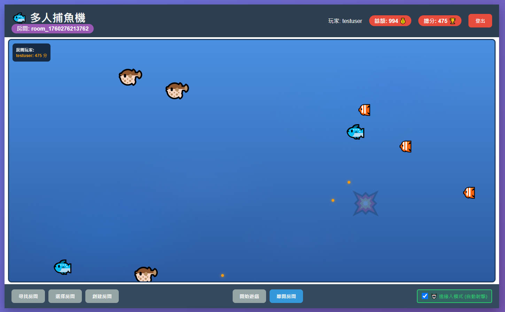
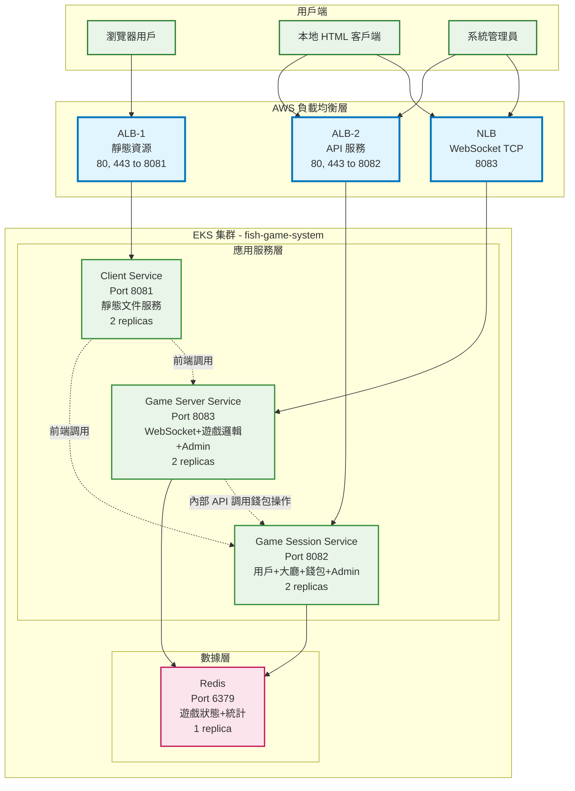

# 🐟 魚機遊戲微服務 Workshop

> **從本地開發到 AWS EKS 雲端部署的完整實戰教學**

這是一個完整的微服務架構實戰 Workshop，通過構建一個即時多人魚機遊戲，學習現代微服務開發、容器化部署和 Kubernetes 運維的最佳實踐。從 Docker Compose 本地開發環境開始，逐步遷移到 Amazon EKS 生產環境。

## 📋 目錄

- [🎮 遊戲展示](#-遊戲展示)
- [🎯 Workshop 學習目標](#-workshop-學習目標)
- [🏗️ 系統架構概覽](#️-系統架構概覽)
- [🏷️ 標籤策略](#️-標籤策略)
- [🚀 快速開始](#-快速開始)
- [📚 Workshop 章節](#-workshop-章節)
- [🎮 遊戲功能特色](#-遊戲功能特色)
- [🛠️ 技術棧](#️-技術棧)

## 🎮 遊戲展示

### 實際遊戲畫面

**🐟 體驗真實的魚機遊戲！**

這個 Workshop 不只是技術教學，更是一個完整可玩的魚機遊戲系統。玩家可以：
- 🎯 瞄準不同種類的魚類獲得分數
- 💰 管理遊戲金幣和錢包系統
- 🏆 體驗流暢的即時多人遊戲
- 📱 支持多平台瀏覽器訪問
- 🎮 完整的用戶註冊和大廳系統

> 💡 **立即體驗**: 完成第1章部署後，訪問 `http://localhost:8081` 就能開始遊戲！

## 🎯 Workshop 學習目標

- 🏗️ **微服務架構設計**：理解服務拆分、通信模式和數據一致性
- 🐳 **容器化最佳實踐**：Docker 多階段構建、健康檢查和資源優化
- 🔄 **服務發現與通信**：環境變數驅動配置、服務間調用模式
- ☸️ **Kubernetes 部署**：從 Docker Compose 遷移到 EKS 的完整流程
- 🌐 **負載均衡策略**：ALB 和 NLB 的實際應用場景
- 📊 **雲端運維實踐**：EKS 集群管理和應用部署

## 🏗️ 系統架構概覽

### 微服務架構設計

### 核心服務說明

| 服務名稱 | 端口 | 副本數 | 功能描述 | 資源配置 |
|---------|------|--------|----------|----------|
| **client-service** | 8081 | 2 | 靜態文件服務，處理前端資源和用戶界面 | CPU: 250m-500m, Memory: 256Mi-512Mi |
| **game-session-service** | 8082 | 2 | 用戶+大廳+錢包+Admin，處理會話管理 | CPU: 500m-1000m, Memory: 512Mi-1Gi |
| **game-server-service** | 8083 | 2 | WebSocket+遊戲邏輯+Admin，處理遊戲核心功能 | CPU: 500m-1000m, Memory: 512Mi-1Gi |
| **redis** | 6379 | 1 | 遊戲狀態+統計，數據緩存和會話存儲 | CPU: 250m-500m, Memory: 256Mi-512Mi |

## 🏷️ 標籤策略

本 Workshop 使用統一的標籤策略，方便資源管理、成本追蹤和自動化部署：

### AWS 資源標籤

所有 AWS 資源（EC2、ECR、EKS 等）都使用以下標籤：

| 標籤鍵 | 標籤值 | 用途 |
|--------|--------|------|
| `Project` | `fish-machine-workshop` | 專案識別 |
| `Workshop` | `fish-machine-workshop` | Workshop 識別 |
| `ManagedBy` | `https://github.com/hoycdanny/fish-machine-workshop` | 專案來源 |

### Docker 映像標籤

用於版本管理和環境區分：

| 標籤類型 | 範例 | 用途 | DevOps Agent |
|---------|------|------|--------------|
| **latest** | `latest` | 最新開發版本 | ✅ 可監控 |
| **版本號** | `v1.0.0`, `v1.1.0` | 語義化版本 | ✅ 可監控 |
| **環境** | `dev`, `staging`, `production` | 環境標識 | ✅ 可監控 |

**DevOps Agent 監控方式：**
- 🔍 **ECR API**：監控映像 digest 變化
- ⚡ **EventBridge**：即時接收 ECR 推送事件（推薦）
- 🔄 **輪詢檢查**：定期檢查映像標籤更新

**📖 [查看完整標籤策略文檔 →](TAGS-STRATEGY.md)**

## 🚀 快速開始

想要開始學習？請按順序完成各章節：

1. **第0章** - 設置 AWS 開發環境
2. **第1章** - 本地 Docker 環境驗證
3. **第2章** - 創建 EKS 集群
4. **第3章** - 部署到雲端生產環境

> 💡 **建議**: 先完成第1章本地部署，確保遊戲正常運行後再進行雲端部署

## 📚 Workshop 章節

### 🔧 [第0章：開發環境設置](0.dev-environment-setup/)
**⏱️ 預估時間：30-45 分鐘**

- ☁️ AWS EC2 開發環境配置
- 🛠️ 必要工具安裝 (Docker, kubectl, eksctl)
- 🔑 AWS CLI 配置和權限設置
- 📋 環境驗證檢查清單

**📖 [查看第0章詳細指南 →](0.dev-environment-setup/README.md)**

---

### 🐳 [第1章：服務驗證和容器化](1.service-verification-containerization/)
**⏱️ 預估時間：60-90 分鐘**

- 🎮 **完整的遊戲介面展示** (包含實際遊戲截圖)
- 🏗️ 微服務架構設計與實現
- 🐳 Docker 容器化最佳實踐
- 🔄 Docker Compose 本地開發環境
- 🌐 服務間通信和配置管理
- 📦 ECR 鏡像推送準備

**📖 [查看第1章詳細指南 →](1.service-verification-containerization/README.md)**

---

### ☸️ [第2章：EKS 集群設置](2.eks-cluster-setup/)
**⏱️ 預估時間：45-60 分鐘**

- 🚀 EKS 集群一鍵創建腳本
- 🔌 必要 Add-ons 安裝 (ALB Controller, EBS CSI Driver)
- ✅ 集群驗證和故障排除
- 🔍 集群狀態檢查

**📖 [查看第2章詳細指南 →](2.eks-cluster-setup/README.md)**

---

### 🚀 [第3章：EKS 服務部署](3.eks-service-deployment/)
**⏱️ 預估時間：90-120 分鐘**

- 📋 **完整的手動部署教學** (kubectl 設定到遊戲上線)
- 📄 Kubernetes 資源配置 (9個有序 YAML 文件)
- ⚖️ ALB 和 NLB 負載均衡配置
- 🔍 服務驗證和訪問測試
- 🛠️ 生產環境運維指南

**📖 [查看第3章詳細指南 →](3.eks-service-deployment/README.md)**

---

### 🤖 [第4章：AWS DevOps Agent 整合](4.aws-devops-agent-integration/)
**⏱️ 預估時間：60-90 分鐘**

- 🏷️ **Docker 映像標籤策略** (latest, v1.0.0, dev, staging, production)
- 🤖 **DevOps Agent 自動化部署**
- 🔄 **多環境部署管理** (開發、測試、生產)
- 📊 **部署監控和回滾策略**
- 🚀 **CI/CD 流程整合**

**📖 [查看第4章詳細指南 →](4.aws-devops-agent-integration/README.md)**

## 🎮 遊戲功能特色

### 用戶體驗
- **用戶註冊/登入系統** - 完整的用戶管理功能
- **遊戲大廳** - 多房間支持，實時玩家狀態
- **錢包系統** - 充值、提現、交易記錄
- **即時遊戲** - WebSocket 實時通信，流暢的遊戲體驗

### 管理功能
- **會話服務管理** - 用戶管理、房間監控、錢包操作
- **遊戲服務監控** - 遊戲統計、性能監控、配置管理
- **系統健康檢查** - 所有服務提供 `/health` 端點

### 技術特色
- **微服務架構** - 服務獨立部署、擴展和維護
- **容器化部署** - Docker 多階段構建、健康檢查
- **雲原生設計** - 支持 Kubernetes 自動擴展和故障恢復
- **負載均衡** - ALB 處理 HTTP 流量，NLB 處理 WebSocket 連接

## 🛠️ 技術棧

### 後端技術
- **Node.js** - 服務端運行環境
- **Express.js** - Web 框架
- **Socket.IO** - WebSocket 實時通信
- **Redis** - 數據緩存和會話存儲

### 容器化技術
- **Docker** - 容器化平台
- **Docker Compose** - 本地開發環境編排
- **Amazon ECR** - 容器鏡像倉庫

### 雲端技術
- **Amazon EKS** - 託管 Kubernetes 服務
- **AWS Application Load Balancer (ALB)** - HTTP/HTTPS 負載均衡
- **AWS Network Load Balancer (NLB)** - TCP 負載均衡

### 開發工具
- **kubectl** - Kubernetes 命令行工具
- **eksctl** - EKS 集群管理工具
- **AWS CLI** - AWS 服務管理工具

---

**🎮 開始你的微服務雲端之旅吧！**

從本地 Docker Compose 開發環境，到 AWS EKS 生產環境，這個 Workshop 將帶你完整體驗現代微服務架構的開發和部署流程。
